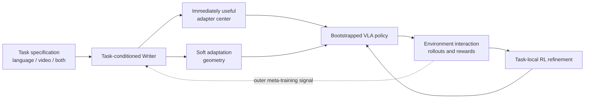

# EMBER

**Embodied Multimodal Bootstrapping via Experience Refinement**

EMBER is a research proposal for rapidly adapting a pretrained
Vision-Language-Action (VLA) policy to a new embodied task. Given a task
specification containing language, an action-free demonstration video, or both,
a task-conditioned Writer produces:

1. an initial low-rank policy update that should improve the task before any
   new-task reinforcement learning; and
2. a soft, low-dimensional adaptation geometry that guides subsequent
   reward-driven refinement.

The intended role of the Writer is not to create an expert policy in one pass.
It should move a base VLA from no useful task behavior to minimum viable
competence, so that sparse-reward interaction has a meaningful starting point.

## Central research question

Can a meta-trained Writer convert a multimodal task specification into a
parameter-space prior that both:

- yields measurable zero-interaction improvement on a held-out task; and
- makes subsequent VLA reinforcement-learning post-training more
  sample-efficient and stable than standard LoRA initialization or a fixed
  adaptation space?

## Current status

This repository contains a research concept and an expert-review package. It
does not yet contain an implementation or experimental results. Every novelty
claim is provisional until the closest-work audit and the proposed ablations are
completed.

## Repository map

- [`docs/concept.md`](docs/concept.md): formal problem statement, system design,
  and training/evaluation contract.
- [`docs/novelty_and_landscape.md`](docs/novelty_and_landscape.md): closest prior
  work, current VLA landscape, and the candidate contribution boundary.
- [`docs/decisions_and_open_questions.md`](docs/decisions_and_open_questions.md):
  settled design constraints, unresolved choices, and go/no-go gates.
- [`docs/expert_review_brief.md`](docs/expert_review_brief.md): requested output
  from an independent remote expert.
- [`AGENTS.md`](AGENTS.md): instructions for an AI coding or research agent
  entering the repository without conversation history.

## Proposed scope boundary

The first experiment should isolate the mechanism in simulation and within one
robot embodiment. Arbitrary internet instructional videos, cross-embodiment
transfer, tactile feedback, and real-robot online RL are follow-up directions,
not requirements for the first falsification experiment.

## Working name

**EMBER** uses the metaphor that a demonstration or instruction should ignite a
small but useful skill; environment experience then refines that skill into a
reliable policy. The expansion and project name remain working titles until a
final publication-level collision check.
