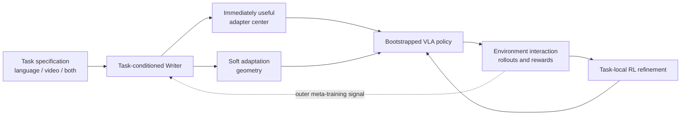

# EMBER

**Embodied Multimodal Bootstrapping via Experience Refinement**

EMBER is the embodied instantiation of a broader research thesis: a
meta-learned Writer should translate informative inputs that are not directly
usable as the base model's ordinary supervision into parameter updates that
improve downstream performance across a task distribution.

In EMBER, the base model is a pretrained Vision-Language-Action (VLA) policy.
Given a task specification containing language, an action-free demonstration
video, or both, a task-conditioned Writer produces:

1. an initial low-rank policy update that should improve the task before any
   new-task reinforcement learning; and
2. a soft, low-dimensional adaptation geometry that guides subsequent
   reward-driven refinement.

The intended role of the Writer is not to create an expert policy in one pass.
It should move a base VLA from no useful task behavior to minimum viable
competence, so that sparse-reward interaction has a meaningful starting point.

## Central research question

The general question is:

> Can a meta-learned optimizer transform information from a different input or
> supervision distribution into a beneficial parameter update on a held-out
> task, even when that information is not itself an action label, answer label,
> or ordinary training target?

EMBER asks one concrete version: can a Writer convert a multimodal embodied
task specification into a parameter-space prior that both:

- yields measurable zero-interaction improvement on a held-out task; and
- makes subsequent VLA reinforcement-learning post-training more
  sample-efficient and stable than standard LoRA initialization or a fixed
  adaptation space?

## Current status

The independent expert review is complete and the project is entering staged
execution. The repository does not yet contain an implementation or experimental
results. Every novelty claim remains provisional until the proposed controls and
matched-budget experiments are run.

The active execution ceiling is **4 x NVIDIA A100 80GB GPUs**. The expert plan
was originally written for an eight-GPU ceiling and is retained as research
advice; `docs/execution_brief.md` records the four-GPU execution contract and the
design corrections adopted before implementation.

## Repository map

- [`docs/origin_and_general_thesis.md`](docs/origin_and_general_thesis.md): the
  original cross-distribution meta-optimizer motivation and its exact relation
  to the embodied project.
- [`docs/concept.md`](docs/concept.md): formal problem statement, system design,
  and training/evaluation contract.
- [`docs/novelty_and_landscape.md`](docs/novelty_and_landscape.md): closest prior
  work, current VLA landscape, and the candidate contribution boundary.
- [`docs/decisions_and_open_questions.md`](docs/decisions_and_open_questions.md):
  settled design constraints, unresolved choices, and go/no-go gates.
- [`docs/expert_review_brief.md`](docs/expert_review_brief.md): requested output
  from an independent remote expert.
- [`docs/expert_plan.md`](docs/expert_plan.md): the independent expert's complete
  conditional-go assessment and staged research plan.
- [`docs/execution_brief.md`](docs/execution_brief.md): active execution
  decisions, corrections to the plan, four-GPU constraints, and the first work
  package.
- [`docs/prior_work_memllm_lessons.md`](docs/prior_work_memllm_lessons.md):
  verified lessons from the preceding Writer research program, separated into
  reusable principles and mechanisms that must not be copied blindly.
- [`AGENTS.md`](AGENTS.md): instructions for an AI coding or research agent
  entering the repository without conversation history.
- [`task_plan.md`](task_plan.md), [`findings.md`](findings.md), and
  [`progress.md`](progress.md): durable execution state for long-running and
  multi-session work.

## Proposed scope boundary

The first experiment should isolate the mechanism in simulation and within one
robot embodiment. Arbitrary internet instructional videos, cross-embodiment
transfer, tactile feedback, and real-robot online RL are follow-up directions,
not requirements for the first falsification experiment.

## Working name

**EMBER** uses the metaphor that a demonstration or instruction should ignite a
small but useful skill; environment experience then refines that skill into a
reliable policy. The expansion and project name remain working titles until a
final publication-level collision check.
