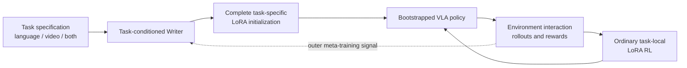

# EMBER

**Embodied Multimodal Bootstrapping via Experience Refinement**

EMBER is the embodied instantiation of a broader research thesis: a
meta-learned Writer should translate informative inputs that are not directly
usable as the base model's ordinary supervision into parameter updates that
improve downstream performance across a task distribution.

In EMBER, the base model is a pretrained Vision-Language-Action (VLA) policy.
Given a task specification containing language, an action-free demonstration
video, or both, a task-conditioned Writer produces the complete task-specific
LoRA parameters allowed by a predeclared target-layer/rank contract. That LoRA
should improve the task before any new-task reinforcement learning. Ordinary
task-local LoRA RL then updates the same parameters in place.

The intended role of the Writer is not to create an expert policy in one pass.
It should move a base VLA from no useful task behavior to minimum viable
competence, so that sparse-reward interaction has a meaningful starting point.

## Central research question

The general question is:

> Can a meta-learned optimizer transform information from a different input or
> supervision distribution into a beneficial parameter update on a held-out
> task, even when that information is not itself an action label, answer label,
> or ordinary training target?

EMBER asks one concrete version: can a Writer convert a multimodal embodied
task specification into a task-specific LoRA initialization that both:

- yields measurable zero-interaction improvement on a held-out task; and
- makes subsequent VLA reinforcement-learning post-training more
  sample-efficient and stable than standard LoRA initialization?

The only shared structural search space is the declared LoRA target/rank. The
Writer emits no bank, shared update subspace, basis, mask, metric, radius,
learning-rate object, soft geometry, or residual escape. Those were later
assistant/expert additions and are outside the current EMBER project and
long-term Goal. The shared base remains frozen during direct Writer and default
source reward/meta-RL experiments; model-side adaptation is task-local LoRA.

## Current status

The independent expert review is complete and staged execution is active. The
repository now contains a reproducible SmolVLA/LIBERO substrate. Gate -1 is
closed as **passed with residuals**: the immutable action-hidden-video recovery
reached 19/24 ordered and wrong-video accuracy and 15/24 paired correctness,
while the original 0.80 threshold and drop-last residual remain recorded. The
original invalid LIBERO-90 split is preserved and was replaced once by a sealed
specification-only 60/15/15 split before any LIBERO-90 policy outcome.

Gate 0 is **passed with limited coverage**. The current foundation-base Writer
has clear source utility (base/Writer/direct LoRA: 0/512, 55/512, 51/512 over
16 source tasks) but weak validation transfer (1/160 on the initial five-task
comparison, plus 4/256 on eight additional tasks). Task 22 is the clearest
localization: base 0/32, Writer 4/32, validation-action-supervised direct LoRA
12/32. The next scientific problem is improving Writer generalization from
language plus action-hidden video, not rerunning Gate 0 or adding a removed
shared-structure mechanism. Every novelty claim remains provisional until the
later staged and matched-budget experiments pass.

The active execution ceiling is **8 x NVIDIA A100 80GB GPUs**. Use all legally
free devices for useful work, with about 10GB average training headroom per
device; the historical expert plan remains advice, and its mandatory
canonical-bank/geometry route is superseded.
`docs/execution_brief.md` records the current eight-GPU direct-Writer execution contract.

## Repository map

- [`docs/origin_and_general_thesis.md`](docs/origin_and_general_thesis.md): the
  original cross-distribution meta-optimizer motivation and its exact relation
  to the embodied project.
- [`docs/concept.md`](docs/concept.md): formal problem statement, system design,
  and training/evaluation contract.
- [`docs/novelty_and_landscape.md`](docs/novelty_and_landscape.md): closest prior
  work, current VLA landscape, and the candidate contribution boundary.
- [`docs/decisions_and_open_questions.md`](docs/decisions_and_open_questions.md):
  settled design constraints, unresolved choices, and go/no-go gates.
- [`docs/expert_review_brief.md`](docs/expert_review_brief.md): requested output
  from an independent remote expert.
- [`docs/expert_plan.md`](docs/expert_plan.md): the independent expert's complete
  conditional-go assessment and staged research plan.
- [`docs/execution_brief.md`](docs/execution_brief.md): active execution
  decisions, corrections to the plan, active GPU constraints, and the first work
  package.
- [`docs/benchmark_validity_report.md`](docs/benchmark_validity_report.md): the
  current Gate -1 evidence, preserved split-validity failure, permanent
  specification-only reseal, and remaining evidence before Writer training.
- [`docs/prior_work_memllm_lessons.md`](docs/prior_work_memllm_lessons.md):
  verified lessons from the preceding Writer research program, separated into
  reusable principles and mechanisms that must not be copied blindly.
- [`AGENTS.md`](AGENTS.md): instructions for an AI coding or research agent
  entering the repository without conversation history.
- [`task_plan.md`](task_plan.md), [`findings.md`](findings.md), and
  [`progress.md`](progress.md): durable execution state for long-running and
  multi-session work.

## Proposed scope boundary

The first experiment should isolate the mechanism in simulation and within one
robot embodiment. Arbitrary internet instructional videos, cross-embodiment
transfer, tactile feedback, and real-robot online RL are follow-up directions,
not requirements for the first falsification experiment.

## Working name

**EMBER** uses the metaphor that a demonstration or instruction should ignite a
small but useful skill; environment experience then refines that skill into a
reliable policy. The expansion and project name remain working titles until a
final publication-level collision check.
