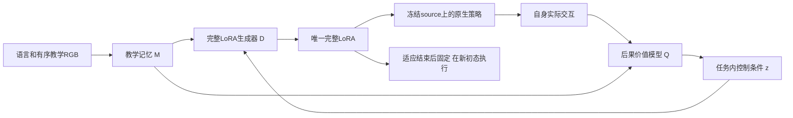

# 从当前实践重新推导完整方法：讨论稿

状态：Owner于2026-10-10要求先从头分析当前约束下的完整架构，再讨论；本稿不是active design、实现派发或启动合同。
主讨论已消费functional_revision_learning整批交付并接回tracked/Git窗口。当前无新计算；不自动续FM、加PG或修P后再测。
Owner随后要求复核该候选是否足够符合第一性原理、已尽可能解决旧问题。最新判断见§7：§3–6保留原提案，
但其适应几何、价值导数依据和共享训练目标尚未闭合，不能称为当前最合理或已排除明显设计问题的方案。
Owner继而要求重新构思、充分考虑各方面，并再次强调出发点是视频的指导价值。随后要求继续推导直到没有问题。
**最新推导和取舍见§9**：撤回§8可直接作为完整学习方案的地位，保留其完整过程信用的正确部分；
进一步给出以实际有益参数修订为共享训练监督的完整组织，以及不能由纸面推导消除的实证前提。
§3–8保留提案与反证历史。当前仍为科学讨论，没有新active design、实现、训练、数据构建或计算派发。

## 1. 要解决的完整问题

给定exact language L、action-hidden且内部有序的教学视频V及有预算的自身实践E，形成一套完整固定38-target LoRA，
在未参与该condition适应的新初态完成任务。最终source和图文prefix冻结，适应辅助全部退出。
第一阶段目标是明显超过强MT；视频须实际帮助形成控制能力，不能只作为额外任务内学习的形式输入。

必须保留：教学标签信息墙、合法共享训练任务allowlist、独立适应/最终初态、唯一完整LoRA、官方执行与正式paired400。
当前采用完整rank128，不把额外adapter留在部署；所有新增产物在data1。
必须排除：从恢复、合成、搜索或自身交互中准备动作轨迹，再拟合这些轨迹得到新condition的最终LoRA。
共享训练中使用合法动作监督仍允许。梯度、任务内状态更新、价值学习和参数生成本身并未一律禁止，须看实际目标和消费者。

不继承为硬约束：零初始化标量能量、固定P、16支撑点、固定经验槽数、只做FM、固定轮数、1024步、只在episode末修订、
新condition完全没有optimizer。这些都是旧方法或某批预算的选择。

## 2. 证据要求撤换什么，又不允许声称什么

| 已发生的完整比较 | 对新方法的约束 |
|---|---|
| T2340 correct161/400，other150，去视频公共支路103；后续相邻147/154/160/154/159 | 有限的视频条件能力正例仍在，不能宣布视频编译不可能；161也不是稳定大幅超过MT153。 |
| 经验条件Compiler135：真实E、递推Q、完整decoder、跨episode FM及真实终局PG已经共同学习 | “把经历接进递归网络、再接reward”不是新的充分原理。 |
| 参数条件Compiler127/130；同incoming的I/E+/E0各13/24，E+相对E0得5失5 | E能改变行为，但没学出稳定净收益；补参数入口、成功后更新和更多曝光不足以解释或修好整体。 |
| 最新功能修订143/400对MT153得16失26；train180为29/48、360为25/48，MT27 | 训练面板也无稳定净修订，不能只归因held迁移。能量头在学，但实际参数/动作作用很小；不唯一确诊根因，也未检验正式PG。 |
| PPW/local-field、control-calibrated及关系Writer的完整阴性；放大关系残差使12条件FM全差 | 正确坐标、真实导数、动作标签、准确关系或更大作用量，单独均不能替代完整控制学习。 |
| 共享SDE Writer161→154/158，训练域也无稳定增益；状态基线后续仅0更新诊断 | 不能把“加RL”当答案，也不能把未训练的actor-critic写成已否定。 |

原件入口：[最新完整结果](functional_revision_learning_20261010.md)、[经验Compiler](experience_conditioned_compiler_20261009.md)、
[参数Compiler完整读出](parameter_compiler_fullreadout_20261009.md)、[固定incoming诊断](parameter_edit_credit_diagnostic_20261009.md)、
[研究历史](../research_history.md)。历史记录中的数值和停止范围保持，不因本稿另立名称而清零。

这些证据共同降低两项主假说的优先级：

1. 把视频和经历编码好，共享编辑器就能主要依靠跨episode专家FM学出有益修订。
2. 在少量自身状态上获得可微的动作修正，再通过固定度量拉回参数，就足以形成新初态的完整能力。

FM并非无用；它已有T的正例并提供密集执行监督。但相同专家query对不同经历通常没有直接提供“这一次修订为什么有用”的比较标签。
策略导数给出参数怎样改变动作，也不给出哪种改变会提高成功率。当前要重建的是这种学习关系，不是先修大某个内部量。

## 3. 倾向讨论的完整候选

保留直接视频到完整LoRA的生成器；将任务内适应改为：学习真实执行后果的价值判断，并据此校准生成器的连续控制条件。
下面称该条件为z。z不是预先具备语义的“操作程序”，也不是task ID；其可控性和迁移性需要实证。

这不是把策略梯度改名为编译。核心仍须是D从教学提取并生成可用的控制方式；实践只校准这种生成，不能另造动作教师再吸收进LoRA。
如果最后收益主要来自与视频无关的通用任务内RL，EMBER的核心主张仍不成立。

### 3.1 教学提供什么实际特征

复用真实双相机RGB和exact language的冻结原生图文prefix，保留stride5的帧顺序与patch特征。
时间读出器处理相邻/跨帧特征及其位置，得到有序记忆M；不先把全片平均，也不要求从视频准确还原全部3D姿态。
教学侧不补造proprio、动作或动作query。源策略的动作知识在其对自身真实RGB/proprio的完整forward中发挥作用。

M希望承载对象对应、接触前后视觉变化、对象共动和操作顺序等信息，但这些只是待学习的解释，不能由槽位、注意力或差分定义直接保证。
自身状态、候选实际动作及z对M的交叉读取，使同一段教学在不同控制问题上有不同作用；没有人为写给held task的抓取/放置程序。

### 3.2 参数生成与最终控制

令Lambda(z)=D_psi(M,z)为76个完整A/B因子，38个target均可改变；D是共享的非线性生成器。
任务内不开放上千万个独立因子作为自由拟合变量，而更新远小于因子总量的z。z维数和具体decoder宽度尚未冻结。
D须容纳强MT工作点，输出形状与rank128执行合同一致；一个z对应一套完整策略，不是混合多个video LoRA或部署expert字典。

一个可计算的具体参数化是：每个target/rank位置用层位查询加W_z z读取M，得到u；分别经该层A行/B列head生成因子。
完整因子可写成Lambda_MT + H_psi(M,z) - H_psi(M,0)，使z=0精确代表MT；H对z的初始导数不能同时置零。
这只是明确输入如何成为每层因子的可行实现，尚非冻结的decoder选择；其与历史差分decoder的相似处必须保留。
新假说来自价值学习和任务内校准的组织变化，不能把这个参数化宣称为未经检验的新优势。

生成后的实际层作用仍是W h + (alpha/r) B(M,z) A(M,z) h；h来自最终策略自己的图像、state、flow latent和前层计算。
因此固定LoRA仍能对不同自身状态产生不同控制。z保存本condition的控制修订，不保存当前帧序号或当前物体绝对位置作为执行时外部阶段开关。

原生F保留完整50x32 latent及10步flow，环境执行前5x7后重新观测；所有信用经过这个真实F。
Q的动作坐标沿用冻结source normalization；记录的环境动作与F输出必须经过同一官方后处理/坐标转换对应，
不能用未经执行的尾部当成真实转移，也不假定饱和或离散执行方向具有准确可用的价值导数。
不能假设低维z必然包含改进方向。D若只有无效方向，或仅能改变当前初态，整个候选就失败。

### 3.3 实践不是只压缩为经验tokens：显式学习真实未来后果

自身实践记录x_t、合法policy输入o_t/s_t、实际前n步动作a_t、下一状态x_{t+n}、官方reward/terminal与剩余horizon。
x可包括自身已观测的机器人/对象相对位姿、夹爪和接触，按对象集合编码；这些是自身信息，绝不读取teacher配套state。
不能由仿真任务定义给出held的正确操作顺序，也不能把任意关系变化奖励当成真实成功。

价值模型Q_omega(x,a,M,z,h)的含义明确：先实际执行该动作块，再由当前同一套固定LoRA继续，剩余h步内成功的概率。
它评价的是最终将留下的原生策略，不是有搜索或外部阶段选择辅助的另一个控制器。
官方成功为终止事件，有限horizon可采用不折扣成功概率；实际预算截断与环境终止分开，不把被截断尾部标成确定失败。

其监督来自真实交互的r、x'和后续return，并用当前策略的Bellman目标传播：

    y = r + (1-terminal) E_noise[Q_target(x', F_Lambda(z)(o',s',noise)[:5,:7], M, z, h-n)]

学习action-value时必须包含真实动作输入，并覆盖当前生成策略附近的不同动作/策略及成功失败；不能只看静态专家成功片段。
准确拟合训练Q或降低TD loss不保证动作导数可用。Q的排序/改进预测须由真实策略试做核对，不能由网络自行认证。
合法non-held成功示范可在共享训练中提供初始正例，教学V与这些query保持跨episode；同时需要当前策略的真实失败覆盖。
共享Q的目标不能将示范未来成功错误归给当前策略的继续能力：可用真实r/x'做当前策略TD，完整示范return只说明其行为策略。

新condition共享D/Reader与价值特征保持固定，保留独立的小型价值校准参数副本b和z；b从共享价值模型初始化，
只用该condition自身的实际转移/结果更新。所有held局部副本独立，不反哺共享训练，也不读取最终评估反馈。
直接利用自身状态/contact是为了减少价值估计的状态混淆；它既不提供teacher的3D真值，也不制造缺失的奖励。

### 3.4 实际如何修订，边界在哪里

对当前实践分布中的自身状态，固定Q及其条件分支，沿实际动作的价值导数更新z：

    g_z = E[(d F_{D(M,z)} / dz)^T * d Q_b(x,a,M,stopgrad(z),h) / da]
    z_next = z + bounded_step(g_z)

Q的M/z条件分支在这一步停止梯度，Reader/decoder只经生成LoRA→真实F→动作这条路径接收策略信用，
防止通过改动评分条件而不是动作来提高预测值。Q估计当前完整策略的继续价值，不能把显式z导数重复计作同一动作的策略改进。
这仍含真实策略Jacobian，并没有消除优化困难；它改变的是动作信用的学习语义、任务内校准和可修改的控制条件。

单步范围根据实际函数变化和当前经验覆盖限制，主要约束critic外推；不把小步、成功锚点或软保持当作全局能力保持证明。
执行新Lambda后用真实结果重新校准，不能连续凭一个冻结critic无限爬升。实践次数由收益证据与预算产生，不预设固定轮数菜单。
首个实施可以在一段用于价值评价的rollout内固定LoRA，以明确其继续策略；这是可变的建模选择，不是Owner禁止中途修订。

这里不存在新condition的目标动作轨迹a_star，也不存在把成功动作、搜索动作或预测动作作为FM/BC目标来拟合最终LoRA。
自身动作只是实际转移中的因果输入；价值参数拟合真实回报，z优化生成策略的价值。若实现加入轨迹拟合后端，即越过方法边界，
即使优化变量名叫z、Writer或“解释”也不例外。

适应停止后物化最后确定的Lambda，D、M、Q、b、z优化和外部选择全部退出。最终新初态只运行冻结source加这一套LoRA。
适应期用于确认收益的重置也须计入实践预算，与最终评测完全隔离；一次实践成功不是跨初态能力保证。

## 4. 共享训练怎样使这条链可学

不能先把D/Q分别训成两个看似合理模块，再假定拼接有效。训练单位应包含教学、当前生成策略的实际尝试、价值校准、z修订及独立初态query。
保留当前36个审计meta任务及既定权重，不自行扩大数据或改变24/8/8协议。共享阶段允许的标签与用途分开：

| 标签/证据 | 真实消费者 | 所学关系 |
|---|---|---|
| 合法train/non-held跨episode动作query | 通过生成LoRA和真实FM回到D/Reader | 教学条件怎样形成可执行策略，提供密集控制基础 |
| 当前生成策略的自身状态、实际动作、转移和reward | 共享Q及任务内校准规则 | 在当前能力与访态下，动作怎样影响最终成功 |
| 适应后独立初态的真实query行为/return | Q校准、D/Reader的actor-critic更新，以及科学能力判断 | 局部修订是否形成能迁移的完整策略 |

策略更新可以采用经真实10-flow的reparameterized action-value梯度，与合法FM共同或交替训练；具体权重/课程尚未冻结，
但正式学习必须实际包含价值消费者和完整适应循环，不能再用仅FM阶段代替该机制的检验。
初版可采用交替一阶更新；不声称环境可微或已得到整个自适应数据分布的无偏高阶元梯度。
最终query返回的真实成功仍是裁决依据，-Q只是有近似误差的学习目标。

明确的一阶共享消费者是：固定局部校准后的z/b，在独立query状态上更新D/Reader以降低合法FM并提高Q对实际生成动作的评价；
Q的条件分支停止梯度，Q自身另用真实query转移更新。这里不假称梯度已经穿过历史实践的采样分布。
任务内首次z=0/MT可以作为稳妥起点，共享训练则须包含非零z的真实实践，否则差分参数化会使D/Reader永远没有条件学习信号。

特别要防止：对每个任意z都给同一专家FM目标，最容易教会D忽略z。FM应约束实际形成的条件策略，
并使真实尝试覆盖有不同功能的当前z；是否学到可用控制族由后续真实改进判断，不强迫无益的参数多样性。
如果D把所有z压回MT，不能宣布“训练稳定”或只调大z；这意味着本候选尚未提供可用适应自由度。

共享训练中D与Q会共同变化，Q必须评价当前D对应的继续策略并保留目标网络/数据来源；不能把旧D的Monte Carlo结果当成新D的无偏标签。
新condition的共享D固定，局部价值校准和z更新清楚分离。z不是未知task ID的贝叶斯后验：exact language已经说明目标，
此处实践主要识别当前策略的能力和错误，不能照搬“推断未知任务”就声称解决了控制。

此处的动作价值梯度有[DPG的基本依据](https://proceedings.mlr.press/v32/silver14.pdf)，但近似critic、生成策略族和少量适应不享有自动成功保证。
[FQL](https://arxiv.org/html/2502.02538v1)改用独立one-step actor以绕开迭代flow的部分优化困难，不能直接视为本候选的现成实现：
EMBER仍保留同一个10-flow原生策略和完整LoRA，须承担其真实反向成本与不稳定风险。

## 5. 为什么值得讨论，以及最可能失败在哪里

相对前向经验Compiler，关键改变是自身结果实际更新一个有可核对含义的任务内价值估计，再作用于生成条件；
不是要求冻结共享编辑器仅凭新E特征就已经知道正确更新。相对functional revision，Q由真实后果训练，
并评价同一最终策略；完整参数由D生成，不再把固定P的少量支撑点pullback当作足够的输出结构。
相对旧共享SDE RL，增加了当前condition的价值校准和策略改进，信用通过原有flow动作路径；不是把终局score乘到一次性Writer上。
相对被排除的轨迹路线，没有动作搜索教师、轨迹标签准备或新condition动作拟合后端。

这些区别改变了要检验的预测，但不是已经成立的优势。三个主要失败条件是：

1. **控制族无好方向。** Q即使判断正确，D也不能把z变成足够且可迁移的控制改变。
2. **价值导数不可信。** 稀疏成功、分布外动作或错误视频对应使Q更乐观而真实能力变差。共享经验和bootstrapping不能凭空创造成功信号。
3. **视频没有实质贡献。** 同样方法主要靠语言和额外实践就达到相同能力/成本，视频成为装饰。

少量自身成功也不能保证新初态保持；确切language可能令视频在某些任务上冗余；36个meta任务可能不足以学到通用控制族与价值迁移。
这些都是本候选的实质风险，不通过给latent命名、提高critic分数或延长训练来回避。

## 6. 讨论后若继续，验证应围绕完整预测

首批应包含完整的共享学习→合法视频→自身实践/价值校准→固定LoRA→独立初态读出，并保留强MT及未适应生成策略参照。
不能只交Q loss、动作差异或一两个梯度步骤。适量视频对照检查其是否改善尝试/学习效率；删视频掉分不是全部必要性证明。
先在non-held训练域看到有益修订且无广泛能力丢失，再根据真实缺口进入预注册held完整读出；内部正例不自动晋级。
最终仍须single-checkpoint paired400、相邻稳定、per-task/suite、得失与正式视频证据；不使用Test反哺设计。

若Q预报改善而真实闭环持续不改善，降低整套价值引导编译假说的支持，不开始critic系数/rank/LR菜单。
若训练域有效而held失效，才把任务间迁移作为主要矛盾；若同预算语言方法同样有效，不能把增益全归因教学编译。

本稿尚未指定新的计算批次。当前360批次14.26GPUh/5.13h仅是已有流程的成本锚，不能当新critic和任务内优化的ETA。
完整设计讨论确定后，需据复用组件、真实10-flow反向及交互吞吐给出首批wall-clock、GPUh、存储和停止合同；
不得默认为原1024步就够，也不能在未测前承诺更快或保证超过MT。

## 7. 再审结论：合法且有动机，但尚未解决核心学习缺口

这次是对上一稿的数学与历史复核，没有新实验或实现。不能以“任何方法都无法事先保证成功”回避具体设计问题；
也不能把下面的反例泛化成actor-critic不可能有效。上一稿对完整方法的优先判断过早，需要修正。

### 7.1 控制码没有消除旧写入几何，而是把它交给生成器学习

固定教学M，记T=∂Lambda/∂z、J_E=∂a_E/∂Lambda，a_E是自身支撑上实际十步flow生成并执行的前5动作。
若§3.4采用普通小步梯度上升，q=∂Q/∂a，则一阶有：

    δz = η Tᵀ J_Eᵀ q
    δLambda ≈ η T Tᵀ J_Eᵀ q
    δa_new ≈ η J_new T Tᵀ J_Eᵀ q

旧functional revision是δLambda=−P J_Eᵀq_old/N_E，N_E为支撑数。新方法把能量信用换为回报信用，把固定P换为隐含的可学习T Tᵀ；
若使用z空间预条件器B，则对应T B Tᵀ。它们不是同一方法，但有相同的局部回写结构，不能宣称已经绕开旧困难。
写入幅度、病态方向、当前状态与新初态的作用冲突仍然存在；低维z还使局部可改方向的秩不超过dim(z)。
这不是对整个非线性策略族全局维度/能力的断言，也不能与每个LoRA的rank128混为一谈。
对z换坐标可保持完全相同的策略族，却改变普通梯度的更新；因此“低维、连续、可学习”不等于良好优化几何。

真正的新假说必须是：共享学习将T学成实际可改进且可迁移的方向，同时自身回报能识别其中应走的方向。
旧PPW也曾学习L/R出口，因此“度量可学习”本身不是新的充分依据。T的非零梯度和D的函数拟合都不足以支持此假说。

### 7.2 回报语义正确，不代表动作导数得到足够监督

在观察到的a=0上，真实成功概率若为0.5，则Q_+(a)=sigmoid(ca)与Q_−(a)=sigmoid(−ca)都完全拟合该值，
但导数分别为+c/4与−c/4。准确的值标签无法独自识别未执行动作的反事实后果；有限高维动作覆盖下同类问题依然存在。
这是数学例子，不是本仓库已测到的critic表现。

在真实Q、合适访态分布、可用的原生动作导数等条件下，策略梯度有理论基础；随机flow可用重参数化处理，
参见[Stochastic Value Gradients](https://proceedings.neurips.cc/paper/2015/hash/148510031349642de5ca0c544f31b2ef-Abstract.html)。
但实际使用估计方向g_hat时，一阶收益取决于真实g与g_hat的内积，而不是Q loss低或g_hat的模长。
[TD3的原始研究](https://proceedings.mlr.press/v80/fujimoto18a.html)也分析了函数近似误差如何损害actor-critic；
双critic或保守估计不能被当成动作导数正确的证明。

自身state/contact减少状态混淆，不制造缺失的动作干预与成功信用。当前方案未具体说明，在有界实践内怎样取得
足够的策略变化、成功/失败覆盖及局部排序证据，使Q的方向可相信。共享正例可以帮助，但不能将专家后续成功归给当前策略。
全部试做失败也未必给出哪一小步可改进的信号；长任务可能需要多个协同改变，局部一阶方向可平坦。
这不是要求在实验前证明Q正确，而是学习组织不能把这一核心问题留给“加一个价值模型”自动完成。

### 7.3 原稿的一阶共享更新没有直接教会适应几何

§4建议把适应后的z/b当常量，更新D/Reader以提高最终策略的FM或Q评价。这能训练该点的输出，
但不等同于优化“从起点经历实践和更新后能否变好”。即使先固定已经取得的经验，真实适应后目标仍包含：

    d J(psi,z_J(psi)) / d psi = partial_psi J + partial_z J * d z_J / d psi

原稿保留第一项，未交代第二项由什么有效学习信号替代；完整采样分布还会带来额外统计信用问题。
不能把这种近似自动称为已训练好快速适应。MAML明确围绕适应后的目标训练初始化，
见[原始论文](https://proceedings.mlr.press/v70/finn17a.html)；这里并不要求照搬完整MAML或对环境求导。

一个可手算的反例说明缺项不仅是精度问题。令单步策略a_psi(z)=0.4+psi*(z−0.8z²)，z0=0，
局部合法动作区间内真实成功概率Q(a)=a。critic完全准确，内层一步梯度上升η=1得z1=psi。
适应后真实目标J(psi)=0.4+psi²−0.8psi³。在psi=1时J=0.6，真实导数为−0.4，
而固定z1计算的外层导数为+0.2。按原稿简化方向更新可降低重新适应后的收益，即使当次固定z上的动作变好。
此反例不证明所有交替一阶训练失败；它证明原稿尚不能以该更新保证所声称的学习关系。
若内层已对同一个外层目标达到驻点，使partial_z J=0，缺项可以消失；实际有限预算、近似Q与独立初态query并不提供这一条件。

应明确采用能评价真实修订收益的学习组织：可微更新部分的适应信用，或合法meta任务上真实修订结果的直接比较等。
哪一种成立还需完整设计；仅写“端到端”“元学习”“增加query return”不补上这个消费者。
历史经验Compiler已做递推阶段信用和真实终局PG，不能声称旧方法完全没有这类信用，再以一般元学习概念当新优势。

### 7.4 固定MT起点把首次教学作用推迟到一个尚未学好的更新器

原稿Lambda(M,z)=Lambda_MT+H(M,z)−H(M,0)，故在z=0时，对M和共享psi的输出导数均为0，
尽管对z的导数可以非零。首次执行策略严格不依赖视频，零点的FM也无法训练Reader/D；非零z才打开该路径。
Q可以从第一次更新开始读视频，因此不是整套系统永远忽略视频，但这使首次视频收益依赖尚未可信的Q方向与T几何。

MT可作为可表示的参照和能力锚，不能未经比较就永久规定所有condition先执行完全相同的MT。
若选择直接的视频条件初始LoRA，应明确其合法训练与保持关系；若保留MT先行，应明确怎样学会首次有视频因果作用的修订。
两者都是科学选择，尚未由当前证据选定，不自动采用旧T权重或恢复旧训练协议。
此外，exact language和自身reward足以让模型找到忽略视频的捷径；把M接入两个网络不证明读取了操作知识。
已有T的有限正例应保留，但不能由其少量正确/错误视频差异推断新decoder已具备同样因果联系。

### 7.5 当前取舍与下一份完整设计应回答的问题

保留的原则：教学直接进入完整LoRA生成；真实后果影响任务内学习；source冻结；自身特权信息只辅助适应；
最终唯一固定LoRA在新初态执行；新condition不准备动作轨迹作为策略拟合目标。这些合同可以同时成立。
价值学习也确实对准了FM与成功目标的差别，但其理论优势以正确价值方向、可用策略族和适当学习组织为条件。

需要重新决定的不是critic宽度、z维数或步长，而是完整的信用分配：教学怎样先形成可执行假说，自身哪些真实后果
足以比较修订，比较怎样训练下一次修订的方向/幅度，以及怎样使该修订改善独立初态而不只拟合当前访态。
直接参数空间的真实回报比较可避免依赖动作critic的局部斜率，却仍有稀疏、高方差和成本问题；
完全前向的经验编辑器减少任务内优化，却继承已观察到的修订信用困难。当前没有证据将任一路线宣布为胜者。

因此将§3–6的actor-critic加控制码方案保留为候选，撤回其已构成优先完整解的判断，不直接实现或用新一轮测试代替设计。
这不是因为RL这一名称，也不是等待万能证明，而是具体推导已发现旧困难的转移与目标缺项。
后续完整设计须给出实际特征、算子、标签、梯度消费者和独立初态作用的闭合解释，并继承本节负约束；
不能只补一个critic损失、几何归一化或元学习名词后恢复相同投入。当前仍没有新active design或新计算。

## 8. 完整重推：教学形成操作假说，真实实践教会如何修订整套策略

### 8.1 出发点、选择与没有被解决的问题

问题不是怎样给已有优化器添加视频输入，而是：教学展示的操作内容，能否帮助学习者形成正确的执行方式，
辨认自己实际执行中的偏差，并把这些认识留在一套能从新初态执行的LoRA里。语言说明目标和关注对象；
视频可能补充对象接近、共动、相对位置变化、操作次序及释放时机。视频未必包含精确动作、力或唯一正确路径，
自身实践的作用是辨认当前策略对这些内容的理解与实际后果，而不是另建动作轨迹教师。

本稿选择的完整假说是：**复用已有合法视频编译得到的策略作为操作假说；学习一个读取教学和真实实践史的修订策略，
由它选择实际执行中的修订位置、方向和幅度；共享训练直接用整段适应之后的新初态成功教会这些选择。**
修订方向通过当前原生策略的实际导数写入完整LoRA；导数只提供控制接口，不提供正确操作知识。
新condition的学习状态是实践史、修订决策及完整LoRA，最终留下其中一套，全部适应辅助退出。

这是一种编译过程层面的meta-RL。它不再依赖动作critic的局部导数，也不假设一个尚未学成的低维decoder已有良好控制坐标。
它保留了原生策略导数的局部可达性限制，真实回报也仍可能稀疏；不能称为已经解决所有旧问题或已有闭环优势。
此次改变的是教学、探索、修订和信用的完整组织。函数幅度校准是其中的执行安排，不是本稿单独要检验的科学假说。

### 8.2 为什么从已有视频策略开始

已有T2340与当前source、coverage 24/8/8及36个授权meta任务兼容，使用同一aligned source1000、38-target、rank128、
action offset1及冻结source normalization。它由合法的跨episode FM训练，教学条件只有exact language与双相机RGB；
不需要为了消除不存在的协议泄漏而重训。原合同和当前采样入口分别见
[原设计§8](../designs/operator_read_write_learning_design.md#8-完整比较的预注册与已完成cpu转换合同)
和`src/ember/operator_writer/data.py`。

T的实际读写不是任意视频向量加一个decoder。每条视频按stride5保序读取；在完整合法图文prefix和固定原生探针下，
获得各target的真实输入X_t及50×1024的suffix hidden H_t。公共A形成key，H及相邻变化参与value，
逐帧delta-rule更新M，最终给出公共A与B0+M构成的一套完整LoRA。探针不是teacher动作标签或teacher state。
这条联系接受过真实FM监督，也已有有限闭环/视频证据，适合作为当前可用起点。

具体先取Lambda0=T_frozen(V,L)。source和这版T均冻结，不将T的hidden任意扰动误称为现成可搜索控制流形。
T161/400、same-task-other150及public删除103保留原适用边界；其相邻点、得失及历史Test曝光也保留，
不能把选峰161当成稳定能力下界或由删除对照替代充分训练的language baseline。强MT153仍为强参照。
选择T，是保留已存在的教学作用和控制能力；它不是永久不可撤换的基础。当前也不新增Test使用。

已有旧decoder/free-code只提供有限privileged正例，随后code增量很小或专家功能严重丢失；当前四任务专家也非全面合格的恢复教师。
因此，本稿不以“先训练一个一定好用的低维控制族”作为未展开的前提。复用T也不意味着保护其所有表示或要求最后回到T。
当前提案明确为K=1；没有Dynamic-K主张，也不通过多个T输出平均来扩展到K>1。

### 8.3 视频怎样在修订时提供指导

修订器保留两个有顺序的记忆，而不是把教学和失败结果各平均成一个向量。

- **教学记忆**：真实双相机patch特征、T的合法原生H、帧位置及exact language。逐帧读取、时间编码后保留可查询的时序内容。
  这些特征来自已有控制训练，但“对象共动”“接触阶段”等语义仍是解释假说，不能从hidden差分直接宣称已经识别。
- **实践记忆**：每次真实重规划的自身RGB特征、实际flow hidden、8维proprio、真实执行的前n×7动作及mask、
  下一观测、官方reward/terminal，以及自身可获取的对象相对位姿和接触。保留episode边界、父LoRA、过去修订及其实际结果。
  task ID、文件名、teacher配套标签、held任务的正确程序及BDDL目标定义均不作为修订器输入。

对每个实际执行位置i，先以自身前后视觉/动作/接触及当前策略响应形成query，再对有序教学记忆做cross-attention，
形成“这个自身位置应当参照教学的哪些变化”的上下文c_i。全局教学上下文保留操作先后关系；
可计算的教学单元包含相邻采样时刻的真实patch、H及其变化和时间位置；它不是预先标注的抓取/放置类别。
因此query比较的是观测到的前后变化及其序列上下文，同时仍能访问具体图像内容，不只匹配静态终点或时间下标。
不按归一化时间硬对齐两条轨迹，不假定学习者不会回退、重试或从不同位置开始，也不提供人工phase标签。
从这些c_i和完整实践史，修订策略产生支撑位置概率以及该位置的参数修订决策分布。

例：语言要求把指定瓶子放进篮子。教学中可能看见接近指定物体、夹爪与物体共动、抬起、移至容器上方、下降与释放。
自身记录可能是抓了另一个物体，也可能是抓对后提前释放；两者都可能只有终局失败。视频与自身变化的对应提供区分这两类错误的候选依据，
使修订分别作用于早期接近位置或后期搬运/释放位置。这个例子解释所需学习关系，不是向held任务手写操作程序；
模型究竟能否建立这种对应，必须由真实修订结果检验。

**实际消费者明确如下**：共享修订策略的Reader、实践编码、cross-attention及决策head，均由§8.6的完整适应回报信用训练。
T提供已经接受密集功能监督的起点和特征，新增修订器没有被假定自带正确的错误分类知识。
当前没有额外的teacher动作恢复、视觉相似度奖励或人工阶段监督；若真实回报不足以学成这条对应，属于整个提案的主要失败条件。
有注意力、有视频梯度或输入置换导致输出变化，只能说明计算依赖，不能代替指导价值。

### 8.4 一次修订的实际控制接口

共享参数记theta。修订器不是直接输出千万维因子噪声，也不同时随机选择16×5×7个动作坐标。
每次决策从真实经历中选一个重规划观测和一个已执行的action offset k；该位置仍通过原生完整50×32 latent及10步flow计算。
随后采样一个7维q和一个有界函数半径rho。q使用冻结source规范中的7维连续动作坐标，是用于探测完整策略改变的方向，
不是从视频恢复的正确动作，不被保存为BC/FM目标。
一个具体的分布为：父策略/位置等离散选择用categorical，q用具有正方差的7维Gaussian；
半径由另一个一维Gaussian样本经固定sigmoid映射到预登记范围。计分原始样本，分布支撑不随theta移动；
各分布参数来自同一有教学/实践上下文的决策网络，不另外插入未计分的确定性参数decoder。

对所选父策略Lambda_p，在真实自身输入(o_i,s_i)、原策略noise epsilon_i上定义：

    a_i(Lambda) = F_Lambda(o_i,s_i,epsilon_i)[k,:7]
    J_i = partial a_i / partial Lambda
    d = P J_i^T q

这里J_i经过真实完整十步flow，并对38个target的76个A/B因子求导。P采用固定、正的canonical factor坐标尺度；
可沿用MT因子RMS平方及已登记floor作为单位约定，P不是另一个价值估计。若支撑来自其它父策略的真实经历，
仍在当前Lambda_p上重算F/J，不能把旧Jacobian直接冒充当前响应。所有支撑都是真实自身观测，没有fake image/state。

在当前实践史中取覆盖不同执行时段的固定校准集合C，并包含所选位置。用真实JVP估计该方向的函数大小：

    s(d)^2 = sum_{c in C} w_c ||J_c d||^2
    Lambda_candidate = Lambda_p + alpha d,    alpha initially proportional to rho / s(d)

随后通过同输入、同noise的完整F直接核对有限改变的实际幅度，必要时按固定规则回退alpha。
校准不是目标动作拟合：没有a_star，没有把试做轨迹变成回归标签，只有对当前完整策略扰动的幅度测量。
数值有限性、因子范围和真实函数幅度的边界须在执行设计登记；零/退化方向记为无效尝试，不能把未达到rho写作有效探索。
统一缩放P在理想线性归一化中会抵消，因而旧固定单位导致的整体极小写入不再直接决定尝试幅度；
P的各向异性、因子双线性及其它状态上的作用冲突仍然存在。

在局部线性且alpha>0时，q^T delta a_i = alpha q^T J_i P J_i^T q >= 0，
说明该接口在所选位置具有可解释的方向响应。这不是成功梯度，也不保证其它状态同向变好。
真实机器人接触、饱和及夹爪离散效应不通过这个导数得到正确物理预测；它们由实际有限尝试产生反馈。
若允许的函数半径始终跨不过必要的行为边界，提案便无法完成对应修订，不能把非零输出当成有效控制变化。

每步只有一处7维方向及幅度的连续探索，降低了一次回报必须识别的维数；离散位置选择和多次修订的信用仍需学习。
若在d维独立Gaussian方向上只有线性回报，即使用精确均值baseline，针对分布均值的单样本梯度误差也满足
E||g-Eg||²=(d+1)||Eg||²。这个手算例子解释为什么不从560维q或千万维LoRA噪声开始，
不声称7维后就有足够样本效率。多个不同位置的连续修订可改变不同控制部分，但可达性仍受实际Jacobian约束。

### 8.5 完整实践过程、保持与最终留下什么

初始完整LoRA由同一个教学condition生成。每次试做执行一套实际完整LoRA，记录真实结果，再决定继续修订、
重试某个候选以减少不确定性，或停止并选择一套。选择父策略、实际位置、q、rho及停止/末端选择的所有可学习决定，
都属于同一修订策略的联合概率；固定数值校准与官方环境执行则属于不带theta的转移。

本提案先在一个用于比较的rollout内固定LoRA，以便把真实结果归于一个完整策略；这属于方法选择，
不是Owner禁止episode中途修订。试做/重置受实际steps、计算与存储预算限制，观看和修订不预设固定轮数。
新condition不优化共享theta、不拟合目标动作轨迹；它通过实践史和后续LoRA选择进行任务内学习。

保留初始和必要中间候选供继续修订或最终选择。不能增加“每一步必须胜过父策略才保留”的隐藏门槛：
真实可改进路径可能先从能力0.6经过0.4，最终达到0.9；单调丢弃中间点会使后段永不可达。
保留较好候选供最后回退与允许较差候选继续探索可以并存。它们全是同一condition的实际修订状态，
不挑teacher、不平均LoRA、不融合checkpoint，也不在最终执行中部署多个策略。

小幅函数约束不是全局能力保护，少量实践择优也可能过拟合。保持的主要学习依据来自完整适应之后的独立初态回报，
以及跨训练样本中“局部试做变好却在query丢能力”的负信用。最终只选并固定一套完整Lambda；
Writer、视频、实践记忆、参数搜索和外部阶段选择全部退出。正式query反馈不允许再改变这个condition。

训练先以有界预算下的最终成功为主要目标。只有最终回报而没有成本目标时，不能声称模型会自然学会尽早停止；
预算会约束最长过程，较早停止可以是决策，但更少读取/计算的偏好须在能力相当时据真实成本选择，
或另行登记明确的成本目标。不能随意用一个计算惩罚把Owner优先要求的闭环能力换掉。

### 8.6 共享训练：把信用直接交给整段修订过程

训练单位是一次完整的“教学—试做—修订—选择—独立初态执行”，而不是一个E到专家FM的静态样本。
先沿现有36任务及既定权重组织完整共享训练。24+12不是永久任务数上限；更多已审计non-held任务是可登记的数据选择，
但不能把同任务更多episode冒充更多独立映射，也不在本稿中默默扩大当前允许集。
教学与query离线标签保持原跨episode边界；这里的新增主信用来自自身真实执行的官方成功。

给定教学c=(V,L)，完整适应轨迹记tau。修订决策u_j包含所有有学习参数的选择，H_j为作决定之前的真实历史。
初始T、Write、官方ODE与环境固定；theta仅通过已计分的决策分布改变实际过程，则：

    P_theta(tau | c) = product_j p_theta(u_j | H_j,c) K(H_{j+1} | H_j,u_j,c)

在最后Lambda_*选定后，从未参与此condition实践的query初态实际运行它。以相同query初态/env及policy RNG运行初始Lambda0，
可形成DeltaR=R(Lambda_*)-R(Lambda0)；这一减法不改变期望优化目标，因为Lambda0不依赖新增theta。
query随机域必须独立于Compiler决策采样。相同query噪声有助于比较，但只有回报正相关时才实际降低方差。

在固定支撑、可微密度、有限矩和有界决策数等通常条件下，完整目标的score信用为：

    grad_theta E[DeltaR]
      = E[ sum_j (DeltaR - b_j(H_j)) grad_theta log p_theta(u_j | H_j,c) ]

这不是沿动作critic斜率爬升。b仅预测当前历史下的回报以减小方差，不对动作或参数给出导数；
它在当前决策前确定，使用独立/滞后拟合，对actor停止梯度。即使b不准，上述方向的期望仍由真实query回报决定。
b采用独立参数或停止梯度的actor特征；baseline拟合不作为额外损失更新修订决策网络。
不能用已受早期决策影响的末端history baseline统一减在所有早期score上，也不能拟合当次回报后回填一个过拟合baseline。

这里同时包含早期探索如何改变后续观察、再次读视频和最终选择的统计信用，没有§7中固定z后漏掉适应依赖的同类缺项。
Reader/cross-attention/head经log概率获得信用；已有环境观察与已采样u作为样本固定，内部时序网络的theta路径正常反传。
源策略Jacobian用于Write，不再作为共享回报梯度前必乘的一串极小P/J因子。若方向无用或回报不变，学习仍然无信号，
不能把形式无偏误称为有效训练。

计算恒等式要求保持以下实际条件：

- 同一完整trial固定行为版本；不能把历史其它Compiler产生的轨迹直接当新版本on-policy样本反复更新。
- 原始随机u计分，包括校准后被裁剪、合并或无效的尝试；无需Write可逆或计算其推送密度。
  若拒绝后重采却只计接受样本的原Gaussian密度，会产生偏差，因此不得隐去这部分过程。
- 已采样u对score停止梯度，不能把`rsample`的重参数化路径混入`log_prob`而冒充似然比估计。
- 所有学到的parent/支撑/半径/停止/最终选择均须计分。Write若又读取一个未计分的theta输出，或初始T开始随theta变化，
  必须重新推导完整信用，不能靠detach掩盖真实分布依赖。
- 最后query只用于共享训练结束此trial后的更新；不得回填到当次history重新选择Lambda。held最终反馈始终隔离。

这种把学习过程本身当作策略训练的组织与[RL2](https://arxiv.org/abs/1611.02779)有关；
在较慢的控制器/参数决策上探索也与[PGPE](https://archive.air.in.tum.de/Main/Publications/Sehnke2010a.pdf)有关。
它们不提供EMBER成功保证；这里任务目标已由语言给定，学习的重点是如何利用教学和实践修正实际控制，
并且目标是退出Compiler后的一套固定LoRA，而非保留一个执行时RNN或最大化全部练习回报。

### 8.7 与旧失败的实质关系

| 已见问题 | 本提案实际改变 | 仍然保留的困难 |
|---|---|---|
| 精确MT起点取消首次视频作用 | 由已有合法T直接产生Lambda0，视频先影响真实尝试 | T可能看错或缺少相关技能，161不是稳定下界 |
| 专家FM不直接给一次修订的效用 | 以适应后独立初态的真实成功训练整段决策 | 回报稀疏，操作对应和修订规律可能学不动 |
| 拟合Q值不识别动作导数 | 不用Q动作导数；实际试验完整LoRA并计分Compiler决策 | 以更多真实交互换取较少的方向模型假设 |
| 固定z外层更新漏适应信用 | theta全部作用进入完整trial的决策概率 | 要完整计分并使用匹配行为版本，方差仍高 |
| 极小写入及极弱上游功能梯度 | 以实际函数幅度执行有限尝试；共享信用走决策score | 幅度不产生正确方向，病态/无效响应仍会失败 |
| 低维decoder被假定具有好控制族 | 使用真实已执行位置的原生7维接口和当前Jacobian | 写入仍受J限制；7维降低探索量也限制单步能力 |
| 保持损失或一次成功掩盖能力丢失 | 保留候选、允许回退，以独立初态成功训练最后选择 | 有限实践会误选，没有逐condition无退步保证 |
| 视频作为额外输入但作用不清 | 视频先形成策略，再与自身过程对应并条件化修订 | 接线和注意力不证明操作知识，必须有实际增量 |

旧PPW、local field已经说明导数接口本身不够；旧shared RL和经验Compiler也并非从未用过真实回报。
本提案不把这些历史清零。不同处是随机性与信用位于完整参数修订决策，而非更换native行动分布的SDE/Gaussian score，
且整个试做—再读—选择过程接受最终独立初态信用。它仍承担旧pullback可达方向不足的负证据。
如果实际位置的7维干预普遍无助于能力，正确结论应降低整套接口的优先级，不能连续改变P、radius、rank保护它。

### 8.8 视频价值、未知与完整验证的裁决

最先要判断的不是修订数值是否变大，而是：**有教学依据的修订，能否比同一起点更可靠地改善新初态执行，
且视频在选择或理解修订中具有实际作用。** 关键未知集中在三处：

1. 现有特征和meta任务是否足以把教学中的操作变化与自身失败对应起来；有限终局信用是否能教会这条联系。
2. 当前策略在真实访态上的少量7维方向，能否实现任务所需的协调改变，并把作用迁移到未参与实践的新初态。
3. 有界实践能否辨认更可靠的完整LoRA，保住原有能力；全部尝试失败时，模型是否只是在无依据探索。

硬条件也须承认：冻结source和唯一LoRA的策略类可能不包含某些必要行为；若不同控制情形被最终可见输入/特征混为一谈，
Compiler的额外知识无法在退出后补上不可见状态。action-hidden视频也可能无法区分某些物理机制。
更宽的允许信息不会自动产生缺失的因果证据；这些条件不能用模块更多、q非零或理论可表示来掩盖。

验证要围绕完整方法而非“模块通过就晋级”。在non-held域尽早运行实际完整学习及冻结LoRA的新初态读出，
同时比较未修订T和强MT，报告实际得失和成本。早期有限证据须包含视频的实际作用；不能先训练很久后才问它有没有用。
为区别“初始T已经用过视频”与“实践之后重新读视频有帮助”，可以在相同Lambda0、相同已发生history和相同剩余预算下，
干预修订器读取的教学，再实际执行后续修订与独立query。仅观察q变化不够；此干预也不等同于充分训练的language-only比较。
整套方法的最终教学主张仍需同预算强语言参照、same-task换视频和相应视频因果证据；不通过故意削弱语言制造视频必要性。
shuffled/reversed仍最后使用，不进入训练、checkpoint选择或架构修正。

若新初态收益来自额外任务内学习而视频无实际作用，EMBER目标仍未实现；若只有初始T的视频作用而再读无增量，
就应缩小主张或取消无益再读，而不是把它写成理解加深。若train有效而held失效，才据实际证据判断迁移不足。
正常的小幅能力交换与广泛能力丢失应分开；正式判断沿single-checkpoint paired400、相邻保持及per-task/suite合同，
不从小面板或候选union选出宣传结果。

此次只完成设计推导和历史/源码核对。旧批次14.26GPUh/5.13h不能当成新meta-RL的ETA；
新的主要成本将是完整trial数量乘以实际实践与独立query，再加完整F导数/幅度核对及视频读取。
可靠数值需由已有相似消费者的计时和所选完整trial预算共同估计；当前没有足够依据承诺几小时学成。
后续若进入实施，须先形成一个包含完整机制、适量视频证据、资源上限和整体停止条件的批次，
而不是一连串只改变局部量的探针。所有新增资产仍在data1，遵循现有quota/GPU/clean frozen commit合同。

## 9. 继续推导：先把有益修订变成可学习对象，不能让终局回报承担全部教学

### 9.1 本次结论与推导的边界

Owner要求继续推导，不能将§8留下的三个核心缺口再作为一句“交给实验”结束设计。进一步检查后，
不保留“一个实际位置的7维方向＋稀疏完整过程回报”作为当前优先方案。
应保留的是：教学先影响实际策略、自身经验必须对应真实参数、最终完整LoRA接受新初态检验、
不沿一个未经辨认的critic斜率修订，以及完整过程的概率信用不能漏项。

本次形成的实质取舍是：**先在合法non-held共享训练中构造并学习真实有益的完整参数修订，
让action-hidden视频和自身经历成为预测这种修订的依据；新condition只运行已学编译器并实际试做，
不从终局二值回报重新发现整个视觉解释和参数控制空间。**
这里的训练教师必须输出同一source、同一38-target/rank128空间中的实际参数修订，并接受真实闭环核对。
它不是假定已有的oracle；生成不了有用监督本身就是整个方法的失败条件。也不能将方法改名为“修订蒸馏”
后，把旧Native Correction的代理更新标签或旧专家decoder的局部正例视为已满足这个条件。

这一组织可以把信息来源、训练目标、梯度消费者、任务内过程和最终部署写成闭合合同。
它**不等于已经证明有效，当前也不够依据宣布为没有科学问题的成熟方案**。
可用修订的实际覆盖、从合法视频学习该修订的能力及新任务迁移，需要证据；这些不能由继续写公式变成事实。
以下将已消除的结构性缺项与这类必须实证的前提分开，避免再把可计算误写成可学成。

### 9.2 上一稿两个具体反例，以及三个不能直接采用的补法

**少量动作支撑会排除必要的协调修订。** 考虑两种自身状态下的动作分别为
`a1=w1`、`a2=w1+w2`。若当前只访问第一种状态，使用正对角P时，§8的一步只能写成
`delta_w=(p1*q,0)`。但“提高a1同时保持a2”需要`delta_w=(d,-d)`。
函数归一化能改变长度，不能补出第二个坐标。这个反例不是EMBER实际根因的证明，但足以否定
“用了完整LoRA的梯度，就没有实质控制方向限制”。扩充支撑只有在确实获得相应状态/独立方向时才有帮助。

**真实回报的无偏信用不产生未观察到的信息。** 如果正确修订必须协调k项选择，每项独立猜中的概率为p，
一个简单情形的成功概率就是`p^k`。全失败时，不同视频解释可能收到相同反馈。
更完整的score公式没有错，但不能凭它说明新增Reader、操作对应与写入已经有足够学习信号。
此外，同一可用V/L/H若对应两个尚未区分、却在未访问状态需要不同策略的情形，任何编译器都无法保证同时选对。
这是有限信息的界，不是对LIBERO已存在这种不可识别性的诊断，也不要求先证明不存在所有困难再开展有界研究。

以下补法经过检查，均不能单独闭合这条链：

1. **全因子随机搜索。** 放开全部参数可以去掉上述硬子空间，但将探索量转移到高维。
   §8的线性Gaussian例子已经显示方差随维数增长，缩小噪声不自动提高该例的信噪比。
   全支撑只表示非零概率，不表示实际预算内能找到协调的有效控制。
2. **视频进度奖励。** 对势函数塑形`r'_t=r_t+gamma*Phi(s_{t+1})-Phi(s_t)`，完整折扣回报的附加项为
   `-Phi(s0)+gamma^T*Phi(sT)`。终端势函数正确处理为零时，它不创造新的终局偏好；
   可能帮助具体估计器或探索，但不能由此宣称正确方向已得到监督。
   任意保留的视觉相似度奖励又改变了目标，可能偏向画面、时间或路径模仿，不能作为真实成功的替身。
3. **再加一个可学损失、梯度标签或专家动作头。** [DAML](https://arxiv.org/abs/1802.01557)确实说明
   可以用训练期动作教会一个部署期只读视频的适应目标，但不是EMBER的新证据。
   本仓库[Native Correction](../designs/native_correction_writer_design.md)已经让真实纠正标签进入实际参数出口，
   [功能监督复核](flow_supervision_history_20260926.md)也保留了learner-state专家查询、SEOD/GOMQ的正负结果。
   不能把这几项重新包装成尚未尝试的充分机制。

动作条件control variate也不能作为方差问题的纸面豁免。以连续编译决策u为例，
`(R-c(u))*grad log p(u) + grad_reparam c(u)`在相应条件下可保持真实目标的无偏信用，
与[LAX](https://arxiv.org/abs/1711.00123)一致；它避免单独相信c的导数，却不保证一个有限样本学到的c足够降方差。
因此本次不以新增critic、LAX或全参数噪声继续维护§8的主要学习假设。

### 9.3 视频必须教什么，以及哪些标签确实可以取得

视频的作用应当是提供**对象与操作之间的关系及其变化**，帮助辨认当前执行与教学的差别，
并影响下一套完整控制参数。不能只证明某个embedding不同、某个注意力位置变化，或者参数对视频有导数。

保留真实双相机patch特征、已有合法T原生特征和stride5顺序。新增操作表示不先命名为“已理解的程序”。
可在授权non-held训练数据中，用独立读取的仿真状态监督可测事实，例如机器人/物体相对位置变化、
夹爪变化、物体是否随夹爪共动；只有实际能够从保存状态或合法重放得到的接触才标注接触。
它们不是“这一阶段必须抓取”或“该操作是成功必要条件”的标签。
这些训练标签不进入Reader输入，validation/test教学仍只有RGB和exact language。

实际计算可以采用：双相机patch与T的H形成逐帧token，经保序时序编码得到`m_t`；
同一`m_t`一方面用于预测上述事实的概率分布，另一方面成为参数编译器直接读取的教学memory。
遮挡、同图异状态和不可见接触保留预测不确定性，不把一个3D点估计当作正确操作oracle。
原图特征仍在这条表示中，不能把整个方法强制约束为先准确重建全部teacher 3D。

自身侧使用真实前后RGB、实际执行动作/mask、8维proprio、可获取的对象关系/接触、reward/terminal、
当前完整LoRA及过去修订结果。自身可测事实与教学侧预测分布分别编码，不能混成同等可信的真值。
每个自身事件对整段有序教学memory查询，结合前后变化与历史形成对应；不按归一化时间强制对齐，
不要求重试、回退或不同初态遵守相同帧号。

这条密集事实监督能回答“视频里发生了什么变化”的一部分，**本身仍不回答怎样改LoRA才有用**。
后一个联系必须由下节的完整修订监督提供。旧动作/关系辅助的阴性正是不能跨过这一步的依据。

### 9.4 共享训练教师：输出真实参数修订，监督其完整后果

本讨论沿用既有24+12的显式36任务allowlist与任务权重，不暗中扩大到95任务。
新构造的教学、实践和标签仍属于这些任务；更广数据须另有审计及明确登记。
动作/state的source normalization保持冻结，新的因子坐标尺度不替代或重算这项输入合同。

训练事件至少包含`(V,L,Lambda_in,H)`，其中Lambda_in实际产生了H；不能用其它版本的隐状态或近似参数冒充。
一个训练教师在**独立参数副本**上利用合法non-held动作/功能标签形成候选Lambda_out。
它可以使用现有直接LoRA训练消费者和经实际验证适用的任务专家功能；输出仍在当前canonical source的
38-target/rank128完整A/B空间中，不能直接把旧base专家adapter挂到当前base上作为目标。

这位教师要解决的训练问题是：修复H暴露的控制不足，同时在独立初态保持或提高完整任务能力。
成功demo的跨episode功能query提供密集基础；若使用自身访态上的专家功能，须确认专家在这些状态下实际适用，
不能由原始初态高成功率推断其能纠正所有失败状态。参数保持或成功状态上的函数保持只作软约束，
最后仍用完整实际ODE执行判断；不将FM下降或局部保持损失当成修订有用的标签。

对每个候选，保留父策略与候选在相同、未参与该次H的non-held初态/RNG上的真实结果。
用于产生/选择候选的训练数据与用于核对其收益的数据分开；有限配对结果带有不确定性，
不得称为对任意初态的成功保证。训练教师的搜索和所有失败均计费、留证；没有取得有益修订的事件不能补造正标签。
负候选还可训练实际成功预测或排序，但不能把“有限教师未找到”标成“任务不可能”。

由此得到的监督对象是：

    D_edit = {(V,L,Lambda_in,H, delta_Lambda, paired_outcomes, provenance)}
    delta_Lambda = Lambda_out - Lambda_in

这是**某次完整参数修改及其真实后果**。它不同于把“任务专家的动作”对所有H重复当成同一个目标，
也不同于一次固定t1真梯度、投影更新或参数重构分数。这里实际效用是标签来源的一部分，不能在训练后补写。
从当前已保存资产只能确认存在若干有用控制器与局部正例，尚不能确认已有这种覆盖充分的数据集。
[当前四任务专家原件](aligned_teacher_recovery_20261008.json)中，480初态相对MT保留5、增加7、丢失0；
T50接手相对T保留3、增加6、丢失3，task29接手仍0/4。它证明某些控制改进确实存在，
但不构成全面合格的修订教师，更不是同一V/H条件下学生已能学到这种修改。
本节不能通过定义一个训练教师来改写这些边界。

**视频相关监督还有一个不能省略的问题。** 若每个language只配一个任务级目标参数，
上述任务仍可能靠语言/场景识别完成；多给参数标签并不自动使视频有指导价值。
可取得更直接联系的一种共享训练构造是：在同一个授权task、同一language下保留多个实际合格控制器，
由其在不同初态执行得到正确教学视频，再以对应控制器的跨初态功能帮助形成修订标签。
学生只见action-hidden视频，控制器身份、权重和动作均属于训练标签侧。
这样“哪段教学展示了什么执行方式”与功能监督有可追溯联系，而不是任意把同task的所有行为当成相同信息。

这些额外视频必须确实成功、来自合法non-held任务；不手写held操作程序，不改场景制造任务，
不把控制器变体、更多episode或更多编辑称作更多独立meta tasks。
原始教学视频的训练与评估分布必须保留；不能只在自生成视频上成功便宣称能读取既定教学。
若某条原始视频没有可调用的对应控制器，就如实只使用其现有合法事实/跨episode监督，不能伪造该对应。

即使如此，辨认不同控制风格也不等于提高任务成功。额外监督必须服务于实际有益的完整修订，
最终仍需实际视频干预和强参照比较；不能把“故意让监督标签随视频变化”本身当成视频指导价值的证据。

### 9.5 学生编译器：完整因子的条件修订分布，不再固定为动作Jacobian出口

初始仍可使用合法T生成的完整Lambda0。学生的共享参数theta读取V/L、当前实际Lambda和H，
直接产生全部76个因子的修订；最终层作用仍严格为`W_source+B A`。
不把输出限制为某个实际动作的`J^T q`，也不先假定一个已有的低维z decoder能覆盖所需控制。
在§9.2的反例中，输出端允许两个坐标独立协调改变；实际是否学到由监督和结果决定。

一个明确且不平均不同修订的实现是**在完整因子坐标中学习条件生成分布**。
将每个A/B按真实target、side、rank和列/行位置分为数值块；每块保留当前因子值及自己的随机变量，
通过共享块网络、A/B与rank间的信息交换及对教学/实践memory的读取，预测该块的完整修订场。
实际地址只说明模型层位与坐标，不是task ID。输出不经固定低维投影再展开；跨块依赖承担协调修改，
不能把各块独立采样后拼接便称为一个学到的完整控制器。

例如，令s为授权训练集上固定的全局因子坐标尺度，`d*=delta_Lambda/s`。
在训练期采样完整因子形状的xi与`t in [0,1]`，构造

    x_t = (1-t) xi + t d*
    L_edit = E ||v_theta(x_t,t,V,L,H,Lambda_in) - (d* - xi)||^2

这是将[Flow Matching](https://arxiv.org/abs/2210.02747)的条件路径回归用于参数修订分布的候选，
该研究提供生成分布的学习原理，不提供EMBER视频编译、控制保持或样本效率的证据。
新condition从一个xi沿这个已学参数场生成一套完整d，再物化`Lambda_candidate=Lambda_in+s*d`。
这是参数生成的数值积分，不是机器人动作轨迹生成，也不是对新condition动作做FM/BC。
参数生成器与原生动作flow是两种不同计算，不能把前者的中间因子当作已执行动作或实际环境证据。
共同A/B起点与实际教师编辑保持坐标一致，不做SVD符号/旋转标签对齐；全局s不由held数据或每条teacher标签计算。

本项密集梯度直接来自每个真实参数修订坐标的预测误差，经块网络回到教学/实践读取。
它不要求一个二值回报辨认数百万个独立参数方向，也不再把Reader的全部信用乘上原动作Jacobian和旧P。
原生policy仍须通过实际生成的完整LoRA接受功能与闭环检查：参数场loss下降不证明控制器已重现，
“有全维输出”也不证明有限网络的容量或样本效率足够。

为什么保留分布而非平均目标：同一可用观察可能允许不同而各自完整的修订，因子均值及动作均值未必保留其中任一种能力。
这里每次取一套完整样本，不平均LoRA；条件分布是否学成、不同样本是否有用需要实际结果。
不从连续分布的形式全支撑推出可用控制覆盖，也不以增加采样次数掩盖没有学到有效分布。

这个参数生成器尚未实现；不能宣称其吞吐、显存或训练稳定性已验证。
与原有块decoder的可复用实现和结构边界，需要在进入工程阶段时按真实消费者处理，当前不增加新运行面。

### 9.6 自身实践如何真正进入学习与最终选择

共享训练不是只在固定MT的失败池上学习。学生实际生成、试做与修订后，需要将它自己的真实
`Lambda_in,H`交给上述训练教师，形成新的同输入修订证据；旧事件可作明确的条件监督复用，
不能称为当前学生的on-policy回报梯度。
这是监督一个参数修订算法，并逐步覆盖其访态/参数分布；不是对整段适应期求得精确策略梯度的另一种写法。

新condition中theta冻结。每次用完整视频和截至当前的真实经历生成完整候选，实际执行后把反馈并入H，
再形成下一套完整参数。一个明确的首个算法选择是：当前候选在一次完整实践episode内固定，
消费该episode的全部事实后产生下一候选；初始和已经实际试过的候选保留。
以预登记的真实环境steps/计算预算为停止边界，不额外声称已经学会最佳早停；
episode长度和预算决定实际次数，不规定观看/修订轮数。较差候选仍可作为下一次修订的当前参数，
不存在只有逐步胜过父策略才能继续的门槛。

末端使用一个共享成功预测器`Q_omega(V,L,H,Lambda_candidate)`，预测**该套固定LoRA本身**在独立初态的成功概率，
而不是后续编译过程或一个外部专家的成功。其标签来自non-held共享训练中同一候选真实执行的独立query；
query结果只作监督，不回填其输入H。omega用概率预测损失学习，与参数生成器的标签职责分开；
若复用Writer特征，Q对这些特征停止梯度，不额外改变参数生成器的学习目标。
最终从已实际试过的候选中取预测成功率最高的一套，完全相同的预测按较早候选打破平局。
Q不向参数提供导数，也不沿其评分生成新参数；它只负责这个有限集合上的最终选择。

这明确了停止与选择，不将一个未定义的“自主选择模块”留给实现者补完。
固定最大资源预算不代表最佳读取效率；同能力下能否缩短，应由完整实际成本比较决定，
不能先给成本惩罚便宣称效率已解决。Q仍可能失准和误选，需要完整held行为衡量，
不能用一次实践成功认证跨初态能力，也不能用保留初始候选声称最终必然不退步。
最终选择只消费该condition已获准的实践，不能看最终评估后再换LoRA。

新condition没有教师optimizer、正确动作标签、teacher配套state或teacher控制器。
自身动作只进入事实记录，不作为拟合目标；没有先准备轨迹再微调末端LoRA。
最终只保留一套完整Lambda，视频Reader、参数生成器、经历和候选选择全部退出。
原生政策始终按同一官方10-flow/前5动作合同运行，不将训练中的额外执行辅助带入最终闭环。

### 9.7 与历史相比，改变了什么，代价转移到哪里

| 历史机制/问题 | 本次实际改变 | 不能随之宣称的结论 |
|---|---|---|
| 新Reader/经历对应主要靠终局回报从头学 | 以合法可测事实及实际参数修订提供密集共享监督 | 标签多不等于新task多，事实预测不等于操作理解 |
| 同一专家FM对不同H反复给相同目标 | 保存同一真实incoming/H下的有限修改与实际跨初态后果 | 教师优化一定找到好修改，或每条H都有可用正标签 |
| Native Correction/LocalField的代理纠正标签 | 目标是当前完整LoRA空间中的实际修改，效用由真实执行核对 | 原参数重构/梯度预测阴性失效，或参数场MSE足够 |
| learner-state专家查询与phase decoder | 只有确实适用的教师功能才用于当前输入的修订；完整因子直接输出 | 原专家能从所有失败状态接手，或新生成器已有足够容量 |
| 单位置7维pullback | 输出完整因子，不受那个固定Jacobian像空间限制 | 任意全参数方向都可在有限数据/算力内学会 |
| 全参数随机回报探索 | 参数生成接受密集编辑标签；真实回报用于教师效用与完整行为裁决 | 学到的生成分布一定包含held所需修改 |
| 固定low-dimensional控制族及critic上升 | 不预设该控制族，不沿未识别的critic斜率走 | 神经参数生成没有泛化或选择误差 |

代价从大量无指导的任务内试错，转移到**共享训练教师、真实效用核对、参数编辑数据和条件生成学习**。
这可能更贵，也可能只在少量任务提供有益标签。它是本次选择需要承担的主要成本，不是免费增加一条辅助loss。
旧整批GPUh不能直接作为其ETA；合理预算须按教师候选数、核对初态数、实际交互、编辑数据尺寸及生成器吞吐分项估计。
当前不具备这些实测值，因此没有编造具体完成时间或启动新的长任务。

### 9.8 为什么这个训练目标与最终能力有关：必要条件而非保证

固定一个合法输入`X=(V,L,Lambda_in,H)`，令q_T为训练教师给出的完整修订分布，q_S为学生的生成分布。
把完整官方新初态成功概率记为p(Lambda)，则教师与学生的预期增益分别为

    G_T(X) = E_{d~q_T}[p(Lambda_in+d)-p(Lambda_in)]
    G_S(X) = E_{d~q_S}[p(Lambda_in+d)-p(Lambda_in)]

若q_S准确复现q_T，就有`G_S=G_T`；这里的目标确实是已产生真实增益的参数修改，
不是“某个内部梯度看起来正确”。这只是明确理想学习目标与行为目标的联系，
有限训练的参数场MSE并不保证条件分布或策略功能准确，训练教师的有限核对也不是已知的真实G_T，
更不能把训练任务上的q_T直接当成held任务已知分布。

实际更有用的是与现有R/G/L一致的完整行为分解。在相同新初态/RNG上对比父策略、教师修订及学生修订，
学生相对父策略的净收益，等于教师相对父策略的收益，加上学生相对教师的净收益。
因此若学生相对教师的净损失（丢失减新增）超过教师创造的净优势，参数loss再小，整个方法也没有进步。
学生在教师失败条件上的新增仍须计入，不能只用保持率否定正常的能力交换。
历史phase decoder只保留少量direct expert成功，正是不能被本节抹去的反例。

这给出具体而可失败的机制链：

    视频/经历包含可迁移的修订线索
      -> 学生据此生成有用编辑分布
      -> 参数生成保留教师修改的实际控制作用
      -> 教师的净优势超过学生传递时的净损失

每个箭头的证据职责不同。事实预测辅助约束第一个箭头的部分表示；密集参数监督训练第二个箭头；
实际生成LoRA的功能和完整闭环负责后两个箭头。不能把任意一个通过当成整个链通过。
反过来，这也不要求先完成一套逐模块探针；一个有界完整学习与读出可以同时暴露最早的实际缺口。

视频的增量还必须单独辨认。如果在给定L、实际参数和H后，V不再降低有用修订的推断误差，
增加视觉损失、使用多个教师或禁止某条语言支路都不能制造真实增量。
同task多种可用控制方式只提供学习视频操作内容的机会，不是视频必需性的证明；
不为制造视频差距而削弱语言参照，也不要求视频战胜拥有无限先验知识的假想代理。
要比较的是相同实际数据、模型训练和任务内预算下，教学是否帮助这个学习系统获得更好控制。

### 9.9 什么已经闭合，什么不能用推导替代

已经明确的设计要求是：视频内容有合法密集学习来源；“如何修改参数”有实际同输入修订监督；
输出不再被7维固定pullback排除；新condition不读取监督标签或拟合动作轨迹；最终新初态只使用唯一完整LoRA。
这些说明一条**可检验的完整学习组织**，而不是该组织已经在EMBER成功。

仍需要真实证据回答两个相连的问题：

1. 现有授权任务、控制能力与预算，能否提供覆盖实际不足且确实有益的修订监督，而非只教回退、近identity或少数易任务？
2. 学生能否由合法视频和自身经历学会这些修订，并把效果带到既定原始教学与未见初态，而非记住语言/场景或生成教师风格？

第一个问题若失败，就没有理由把第二个大训练启动起来；这不是要求所有模块分别过关，
而是不存在目标监督时不能假装其已存在。第一个局部正例也不自动授予完整方法资格。
有信息量的后续检验应包含一段完整的教师监督形成—学生学习—实际编译—新初态执行及适量视频干预，
并以强MT/T、能力得失和真实成本裁决；不安排一串只优化内部量的探针，不从局部成功自动扩成大矩阵。

视频指导仍是最终解释的中心。固定同一incoming/H后的操作内容删减或不相干教学干预，
应观察真实后继能力，而不是只看输出变化；同task另一条正确教学保持能力则是应保留的正证据。
若正确教学没有实际有益效应，或完整方法相对公平语言参照没有净增量，就不能把额外任务内训练的总收益归于视频。
若参数生成只复现训练教师、却不能读取原始教学或迁移到新任务，完整假说失败。
formal选择、paired400、相邻能力保持和最终controls继续遵守现有合同；本稿没有新Test使用。

因此，本次不能对Owner说“现在已经没有问题了”。准确状态是：§8已知的结构性缺口不能靠原样补丁消除；
本节把后继所需的学习联系与其可取得证据写清，但关键实证前提尚未满足。
主讨论应对这个未知承担责任，不用更多模块、文献或推导篇幅伪装成已经解决，也不将论文尚未证明的效果当成工程可保证事项。
