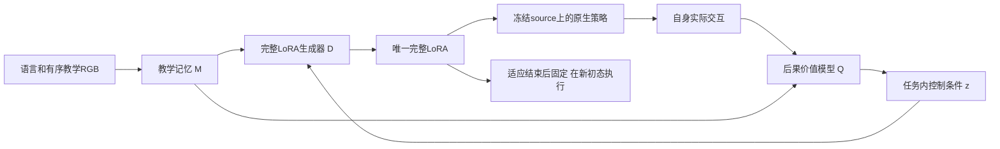

# 从当前实践重新推导完整方法：讨论稿

状态：Owner于2026-10-10要求先从头分析当前约束下的完整架构，再讨论；本稿不是active design、实现派发或启动合同。
主讨论已消费functional_revision_learning整批交付并接回tracked/Git窗口。当前无新计算；不自动续FM、加PG或修P后再测。
Owner随后要求复核该候选是否足够符合第一性原理、已尽可能解决旧问题。最新判断见§7：§3–6保留原提案，
但其适应几何、价值导数依据和共享训练目标尚未闭合，不能称为当前最合理或已排除明显设计问题的方案。

## 1. 要解决的完整问题

给定exact language L、action-hidden且内部有序的教学视频V及有预算的自身实践E，形成一套完整固定38-target LoRA，
在未参与该condition适应的新初态完成任务。最终source和图文prefix冻结，适应辅助全部退出。
第一阶段目标是明显超过强MT；视频须实际帮助形成控制能力，不能只作为额外任务内学习的形式输入。

必须保留：教学标签信息墙、合法共享训练任务allowlist、独立适应/最终初态、唯一完整LoRA、官方执行与正式paired400。
当前采用完整rank128，不把额外adapter留在部署；所有新增产物在data1。
必须排除：从恢复、合成、搜索或自身交互中准备动作轨迹，再拟合这些轨迹得到新condition的最终LoRA。
共享训练中使用合法动作监督仍允许。梯度、任务内状态更新、价值学习和参数生成本身并未一律禁止，须看实际目标和消费者。

不继承为硬约束：零初始化标量能量、固定P、16支撑点、固定经验槽数、只做FM、固定轮数、1024步、只在episode末修订、
新condition完全没有optimizer。这些都是旧方法或某批预算的选择。

## 2. 证据要求撤换什么，又不允许声称什么

| 已发生的完整比较 | 对新方法的约束 |
|---|---|
| T2340 correct161/400，other150，去视频公共支路103；后续相邻147/154/160/154/159 | 有限的视频条件能力正例仍在，不能宣布视频编译不可能；161也不是稳定大幅超过MT153。 |
| 经验条件Compiler135：真实E、递推Q、完整decoder、跨episode FM及真实终局PG已经共同学习 | “把经历接进递归网络、再接reward”不是新的充分原理。 |
| 参数条件Compiler127/130；同incoming的I/E+/E0各13/24，E+相对E0得5失5 | E能改变行为，但没学出稳定净收益；补参数入口、成功后更新和更多曝光不足以解释或修好整体。 |
| 最新功能修订143/400对MT153得16失26；train180为29/48、360为25/48，MT27 | 训练面板也无稳定净修订，不能只归因held迁移。能量头在学，但实际参数/动作作用很小；不唯一确诊根因，也未检验正式PG。 |
| PPW/local-field、control-calibrated及关系Writer的完整阴性；放大关系残差使12条件FM全差 | 正确坐标、真实导数、动作标签、准确关系或更大作用量，单独均不能替代完整控制学习。 |
| 共享SDE Writer161→154/158，训练域也无稳定增益；状态基线后续仅0更新诊断 | 不能把“加RL”当答案，也不能把未训练的actor-critic写成已否定。 |

原件入口：[最新完整结果](functional_revision_learning_20261010.md)、[经验Compiler](experience_conditioned_compiler_20261009.md)、
[参数Compiler完整读出](parameter_compiler_fullreadout_20261009.md)、[固定incoming诊断](parameter_edit_credit_diagnostic_20261009.md)、
[研究历史](../research_history.md)。历史记录中的数值和停止范围保持，不因本稿另立名称而清零。

这些证据共同降低两项主假说的优先级：

1. 把视频和经历编码好，共享编辑器就能主要依靠跨episode专家FM学出有益修订。
2. 在少量自身状态上获得可微的动作修正，再通过固定度量拉回参数，就足以形成新初态的完整能力。

FM并非无用；它已有T的正例并提供密集执行监督。但相同专家query对不同经历通常没有直接提供“这一次修订为什么有用”的比较标签。
策略导数给出参数怎样改变动作，也不给出哪种改变会提高成功率。当前要重建的是这种学习关系，不是先修大某个内部量。

## 3. 倾向讨论的完整候选

保留直接视频到完整LoRA的生成器；将任务内适应改为：学习真实执行后果的价值判断，并据此校准生成器的连续控制条件。
下面称该条件为z。z不是预先具备语义的“操作程序”，也不是task ID；其可控性和迁移性需要实证。

这不是把策略梯度改名为编译。核心仍须是D从教学提取并生成可用的控制方式；实践只校准这种生成，不能另造动作教师再吸收进LoRA。
如果最后收益主要来自与视频无关的通用任务内RL，EMBER的核心主张仍不成立。

### 3.1 教学提供什么实际特征

复用真实双相机RGB和exact language的冻结原生图文prefix，保留stride5的帧顺序与patch特征。
时间读出器处理相邻/跨帧特征及其位置，得到有序记忆M；不先把全片平均，也不要求从视频准确还原全部3D姿态。
教学侧不补造proprio、动作或动作query。源策略的动作知识在其对自身真实RGB/proprio的完整forward中发挥作用。

M希望承载对象对应、接触前后视觉变化、对象共动和操作顺序等信息，但这些只是待学习的解释，不能由槽位、注意力或差分定义直接保证。
自身状态、候选实际动作及z对M的交叉读取，使同一段教学在不同控制问题上有不同作用；没有人为写给held task的抓取/放置程序。

### 3.2 参数生成与最终控制

令Lambda(z)=D_psi(M,z)为76个完整A/B因子，38个target均可改变；D是共享的非线性生成器。
任务内不开放上千万个独立因子作为自由拟合变量，而更新远小于因子总量的z。z维数和具体decoder宽度尚未冻结。
D须容纳强MT工作点，输出形状与rank128执行合同一致；一个z对应一套完整策略，不是混合多个video LoRA或部署expert字典。

一个可计算的具体参数化是：每个target/rank位置用层位查询加W_z z读取M，得到u；分别经该层A行/B列head生成因子。
完整因子可写成Lambda_MT + H_psi(M,z) - H_psi(M,0)，使z=0精确代表MT；H对z的初始导数不能同时置零。
这只是明确输入如何成为每层因子的可行实现，尚非冻结的decoder选择；其与历史差分decoder的相似处必须保留。
新假说来自价值学习和任务内校准的组织变化，不能把这个参数化宣称为未经检验的新优势。

生成后的实际层作用仍是W h + (alpha/r) B(M,z) A(M,z) h；h来自最终策略自己的图像、state、flow latent和前层计算。
因此固定LoRA仍能对不同自身状态产生不同控制。z保存本condition的控制修订，不保存当前帧序号或当前物体绝对位置作为执行时外部阶段开关。

原生F保留完整50x32 latent及10步flow，环境执行前5x7后重新观测；所有信用经过这个真实F。
Q的动作坐标沿用冻结source normalization；记录的环境动作与F输出必须经过同一官方后处理/坐标转换对应，
不能用未经执行的尾部当成真实转移，也不假定饱和或离散执行方向具有准确可用的价值导数。
不能假设低维z必然包含改进方向。D若只有无效方向，或仅能改变当前初态，整个候选就失败。

### 3.3 实践不是只压缩为经验tokens：显式学习真实未来后果

自身实践记录x_t、合法policy输入o_t/s_t、实际前n步动作a_t、下一状态x_{t+n}、官方reward/terminal与剩余horizon。
x可包括自身已观测的机器人/对象相对位姿、夹爪和接触，按对象集合编码；这些是自身信息，绝不读取teacher配套state。
不能由仿真任务定义给出held的正确操作顺序，也不能把任意关系变化奖励当成真实成功。

价值模型Q_omega(x,a,M,z,h)的含义明确：先实际执行该动作块，再由当前同一套固定LoRA继续，剩余h步内成功的概率。
它评价的是最终将留下的原生策略，不是有搜索或外部阶段选择辅助的另一个控制器。
官方成功为终止事件，有限horizon可采用不折扣成功概率；实际预算截断与环境终止分开，不把被截断尾部标成确定失败。

其监督来自真实交互的r、x'和后续return，并用当前策略的Bellman目标传播：

    y = r + (1-terminal) E_noise[Q_target(x', F_Lambda(z)(o',s',noise)[:5,:7], M, z, h-n)]

学习action-value时必须包含真实动作输入，并覆盖当前生成策略附近的不同动作/策略及成功失败；不能只看静态专家成功片段。
准确拟合训练Q或降低TD loss不保证动作导数可用。Q的排序/改进预测须由真实策略试做核对，不能由网络自行认证。
合法non-held成功示范可在共享训练中提供初始正例，教学V与这些query保持跨episode；同时需要当前策略的真实失败覆盖。
共享Q的目标不能将示范未来成功错误归给当前策略的继续能力：可用真实r/x'做当前策略TD，完整示范return只说明其行为策略。

新condition共享D/Reader与价值特征保持固定，保留独立的小型价值校准参数副本b和z；b从共享价值模型初始化，
只用该condition自身的实际转移/结果更新。所有held局部副本独立，不反哺共享训练，也不读取最终评估反馈。
直接利用自身状态/contact是为了减少价值估计的状态混淆；它既不提供teacher的3D真值，也不制造缺失的奖励。

### 3.4 实际如何修订，边界在哪里

对当前实践分布中的自身状态，固定Q及其条件分支，沿实际动作的价值导数更新z：

    g_z = E[(d F_{D(M,z)} / dz)^T * d Q_b(x,a,M,stopgrad(z),h) / da]
    z_next = z + bounded_step(g_z)

Q的M/z条件分支在这一步停止梯度，Reader/decoder只经生成LoRA→真实F→动作这条路径接收策略信用，
防止通过改动评分条件而不是动作来提高预测值。Q估计当前完整策略的继续价值，不能把显式z导数重复计作同一动作的策略改进。
这仍含真实策略Jacobian，并没有消除优化困难；它改变的是动作信用的学习语义、任务内校准和可修改的控制条件。

单步范围根据实际函数变化和当前经验覆盖限制，主要约束critic外推；不把小步、成功锚点或软保持当作全局能力保持证明。
执行新Lambda后用真实结果重新校准，不能连续凭一个冻结critic无限爬升。实践次数由收益证据与预算产生，不预设固定轮数菜单。
首个实施可以在一段用于价值评价的rollout内固定LoRA，以明确其继续策略；这是可变的建模选择，不是Owner禁止中途修订。

这里不存在新condition的目标动作轨迹a_star，也不存在把成功动作、搜索动作或预测动作作为FM/BC目标来拟合最终LoRA。
自身动作只是实际转移中的因果输入；价值参数拟合真实回报，z优化生成策略的价值。若实现加入轨迹拟合后端，即越过方法边界，
即使优化变量名叫z、Writer或“解释”也不例外。

适应停止后物化最后确定的Lambda，D、M、Q、b、z优化和外部选择全部退出。最终新初态只运行冻结source加这一套LoRA。
适应期用于确认收益的重置也须计入实践预算，与最终评测完全隔离；一次实践成功不是跨初态能力保证。

## 4. 共享训练怎样使这条链可学

不能先把D/Q分别训成两个看似合理模块，再假定拼接有效。训练单位应包含教学、当前生成策略的实际尝试、价值校准、z修订及独立初态query。
保留当前36个审计meta任务及既定权重，不自行扩大数据或改变24/8/8协议。共享阶段允许的标签与用途分开：

| 标签/证据 | 真实消费者 | 所学关系 |
|---|---|---|
| 合法train/non-held跨episode动作query | 通过生成LoRA和真实FM回到D/Reader | 教学条件怎样形成可执行策略，提供密集控制基础 |
| 当前生成策略的自身状态、实际动作、转移和reward | 共享Q及任务内校准规则 | 在当前能力与访态下，动作怎样影响最终成功 |
| 适应后独立初态的真实query行为/return | Q校准、D/Reader的actor-critic更新，以及科学能力判断 | 局部修订是否形成能迁移的完整策略 |

策略更新可以采用经真实10-flow的reparameterized action-value梯度，与合法FM共同或交替训练；具体权重/课程尚未冻结，
但正式学习必须实际包含价值消费者和完整适应循环，不能再用仅FM阶段代替该机制的检验。
初版可采用交替一阶更新；不声称环境可微或已得到整个自适应数据分布的无偏高阶元梯度。
最终query返回的真实成功仍是裁决依据，-Q只是有近似误差的学习目标。

明确的一阶共享消费者是：固定局部校准后的z/b，在独立query状态上更新D/Reader以降低合法FM并提高Q对实际生成动作的评价；
Q的条件分支停止梯度，Q自身另用真实query转移更新。这里不假称梯度已经穿过历史实践的采样分布。
任务内首次z=0/MT可以作为稳妥起点，共享训练则须包含非零z的真实实践，否则差分参数化会使D/Reader永远没有条件学习信号。

特别要防止：对每个任意z都给同一专家FM目标，最容易教会D忽略z。FM应约束实际形成的条件策略，
并使真实尝试覆盖有不同功能的当前z；是否学到可用控制族由后续真实改进判断，不强迫无益的参数多样性。
如果D把所有z压回MT，不能宣布“训练稳定”或只调大z；这意味着本候选尚未提供可用适应自由度。

共享训练中D与Q会共同变化，Q必须评价当前D对应的继续策略并保留目标网络/数据来源；不能把旧D的Monte Carlo结果当成新D的无偏标签。
新condition的共享D固定，局部价值校准和z更新清楚分离。z不是未知task ID的贝叶斯后验：exact language已经说明目标，
此处实践主要识别当前策略的能力和错误，不能照搬“推断未知任务”就声称解决了控制。

此处的动作价值梯度有[DPG的基本依据](https://proceedings.mlr.press/v32/silver14.pdf)，但近似critic、生成策略族和少量适应不享有自动成功保证。
[FQL](https://arxiv.org/html/2502.02538v1)改用独立one-step actor以绕开迭代flow的部分优化困难，不能直接视为本候选的现成实现：
EMBER仍保留同一个10-flow原生策略和完整LoRA，须承担其真实反向成本与不稳定风险。

## 5. 为什么值得讨论，以及最可能失败在哪里

相对前向经验Compiler，关键改变是自身结果实际更新一个有可核对含义的任务内价值估计，再作用于生成条件；
不是要求冻结共享编辑器仅凭新E特征就已经知道正确更新。相对functional revision，Q由真实后果训练，
并评价同一最终策略；完整参数由D生成，不再把固定P的少量支撑点pullback当作足够的输出结构。
相对旧共享SDE RL，增加了当前condition的价值校准和策略改进，信用通过原有flow动作路径；不是把终局score乘到一次性Writer上。
相对被排除的轨迹路线，没有动作搜索教师、轨迹标签准备或新condition动作拟合后端。

这些区别改变了要检验的预测，但不是已经成立的优势。三个主要失败条件是：

1. **控制族无好方向。** Q即使判断正确，D也不能把z变成足够且可迁移的控制改变。
2. **价值导数不可信。** 稀疏成功、分布外动作或错误视频对应使Q更乐观而真实能力变差。共享经验和bootstrapping不能凭空创造成功信号。
3. **视频没有实质贡献。** 同样方法主要靠语言和额外实践就达到相同能力/成本，视频成为装饰。

少量自身成功也不能保证新初态保持；确切language可能令视频在某些任务上冗余；36个meta任务可能不足以学到通用控制族与价值迁移。
这些都是本候选的实质风险，不通过给latent命名、提高critic分数或延长训练来回避。

## 6. 讨论后若继续，验证应围绕完整预测

首批应包含完整的共享学习→合法视频→自身实践/价值校准→固定LoRA→独立初态读出，并保留强MT及未适应生成策略参照。
不能只交Q loss、动作差异或一两个梯度步骤。适量视频对照检查其是否改善尝试/学习效率；删视频掉分不是全部必要性证明。
先在non-held训练域看到有益修订且无广泛能力丢失，再根据真实缺口进入预注册held完整读出；内部正例不自动晋级。
最终仍须single-checkpoint paired400、相邻稳定、per-task/suite、得失与正式视频证据；不使用Test反哺设计。

若Q预报改善而真实闭环持续不改善，降低整套价值引导编译假说的支持，不开始critic系数/rank/LR菜单。
若训练域有效而held失效，才把任务间迁移作为主要矛盾；若同预算语言方法同样有效，不能把增益全归因教学编译。

本稿尚未指定新的计算批次。当前360批次14.26GPUh/5.13h仅是已有流程的成本锚，不能当新critic和任务内优化的ETA。
完整设计讨论确定后，需据复用组件、真实10-flow反向及交互吞吐给出首批wall-clock、GPUh、存储和停止合同；
不得默认为原1024步就够，也不能在未测前承诺更快或保证超过MT。

## 7. 再审结论：合法且有动机，但尚未解决核心学习缺口

这次是对上一稿的数学与历史复核，没有新实验或实现。不能以“任何方法都无法事先保证成功”回避具体设计问题；
也不能把下面的反例泛化成actor-critic不可能有效。上一稿对完整方法的优先判断过早，需要修正。

### 7.1 控制码没有消除旧写入几何，而是把它交给生成器学习

固定教学M，记T=∂Lambda/∂z、J_E=∂a_E/∂Lambda，a_E是自身支撑上实际十步flow生成并执行的前5动作。
若§3.4采用普通小步梯度上升，q=∂Q/∂a，则一阶有：

    δz = η Tᵀ J_Eᵀ q
    δLambda ≈ η T Tᵀ J_Eᵀ q
    δa_new ≈ η J_new T Tᵀ J_Eᵀ q

旧functional revision是δLambda=−P J_Eᵀq_old/N_E，N_E为支撑数。新方法把能量信用换为回报信用，把固定P换为隐含的可学习T Tᵀ；
若使用z空间预条件器B，则对应T B Tᵀ。它们不是同一方法，但有相同的局部回写结构，不能宣称已经绕开旧困难。
写入幅度、病态方向、当前状态与新初态的作用冲突仍然存在；低维z还使局部可改方向的秩不超过dim(z)。
这不是对整个非线性策略族全局维度/能力的断言，也不能与每个LoRA的rank128混为一谈。
对z换坐标可保持完全相同的策略族，却改变普通梯度的更新；因此“低维、连续、可学习”不等于良好优化几何。

真正的新假说必须是：共享学习将T学成实际可改进且可迁移的方向，同时自身回报能识别其中应走的方向。
旧PPW也曾学习L/R出口，因此“度量可学习”本身不是新的充分依据。T的非零梯度和D的函数拟合都不足以支持此假说。

### 7.2 回报语义正确，不代表动作导数得到足够监督

在观察到的a=0上，真实成功概率若为0.5，则Q_+(a)=sigmoid(ca)与Q_−(a)=sigmoid(−ca)都完全拟合该值，
但导数分别为+c/4与−c/4。准确的值标签无法独自识别未执行动作的反事实后果；有限高维动作覆盖下同类问题依然存在。
这是数学例子，不是本仓库已测到的critic表现。

在真实Q、合适访态分布、可用的原生动作导数等条件下，策略梯度有理论基础；随机flow可用重参数化处理，
参见[Stochastic Value Gradients](https://proceedings.neurips.cc/paper/2015/hash/148510031349642de5ca0c544f31b2ef-Abstract.html)。
但实际使用估计方向g_hat时，一阶收益取决于真实g与g_hat的内积，而不是Q loss低或g_hat的模长。
[TD3的原始研究](https://proceedings.mlr.press/v80/fujimoto18a.html)也分析了函数近似误差如何损害actor-critic；
双critic或保守估计不能被当成动作导数正确的证明。

自身state/contact减少状态混淆，不制造缺失的动作干预与成功信用。当前方案未具体说明，在有界实践内怎样取得
足够的策略变化、成功/失败覆盖及局部排序证据，使Q的方向可相信。共享正例可以帮助，但不能将专家后续成功归给当前策略。
全部试做失败也未必给出哪一小步可改进的信号；长任务可能需要多个协同改变，局部一阶方向可平坦。
这不是要求在实验前证明Q正确，而是学习组织不能把这一核心问题留给“加一个价值模型”自动完成。

### 7.3 原稿的一阶共享更新没有直接教会适应几何

§4建议把适应后的z/b当常量，更新D/Reader以提高最终策略的FM或Q评价。这能训练该点的输出，
但不等同于优化“从起点经历实践和更新后能否变好”。即使先固定已经取得的经验，真实适应后目标仍包含：

    d J(psi,z_J(psi)) / d psi = partial_psi J + partial_z J * d z_J / d psi

原稿保留第一项，未交代第二项由什么有效学习信号替代；完整采样分布还会带来额外统计信用问题。
不能把这种近似自动称为已训练好快速适应。MAML明确围绕适应后的目标训练初始化，
见[原始论文](https://proceedings.mlr.press/v70/finn17a.html)；这里并不要求照搬完整MAML或对环境求导。

一个可手算的反例说明缺项不仅是精度问题。令单步策略a_psi(z)=0.4+psi*(z−0.8z²)，z0=0，
局部合法动作区间内真实成功概率Q(a)=a。critic完全准确，内层一步梯度上升η=1得z1=psi。
适应后真实目标J(psi)=0.4+psi²−0.8psi³。在psi=1时J=0.6，真实导数为−0.4，
而固定z1计算的外层导数为+0.2。按原稿简化方向更新可降低重新适应后的收益，即使当次固定z上的动作变好。
此反例不证明所有交替一阶训练失败；它证明原稿尚不能以该更新保证所声称的学习关系。

应明确采用能评价真实修订收益的学习组织：可微更新部分的适应信用，或合法meta任务上真实修订结果的直接比较等。
哪一种成立还需完整设计；仅写“端到端”“元学习”“增加query return”不补上这个消费者。
历史经验Compiler已做递推阶段信用和真实终局PG，不能声称旧方法完全没有这类信用，再以一般元学习概念当新优势。

### 7.4 固定MT起点把首次教学作用推迟到一个尚未学好的更新器

原稿Lambda(M,z)=Lambda_MT+H(M,z)−H(M,0)，故在z=0时，对M和共享psi的输出导数均为0，
尽管对z的导数可以非零。首次执行策略严格不依赖视频，零点的FM也无法训练Reader/D；非零z才打开该路径。
Q可以从第一次更新开始读视频，因此不是整套系统永远忽略视频，但这使首次视频收益依赖尚未可信的Q方向与T几何。

MT可作为可表示的参照和能力锚，不能未经比较就永久规定所有condition先执行完全相同的MT。
若选择直接的视频条件初始LoRA，应明确其合法训练与保持关系；若保留MT先行，应明确怎样学会首次有视频因果作用的修订。
两者都是科学选择，尚未由当前证据选定，不自动采用旧T权重或恢复旧训练协议。
此外，exact language和自身reward足以让模型找到忽略视频的捷径；把M接入两个网络不证明读取了操作知识。
已有T的有限正例应保留，但不能由其少量正确/错误视频差异推断新decoder已具备同样因果联系。

### 7.5 当前取舍与下一份完整设计应回答的问题

保留的原则：教学直接进入完整LoRA生成；真实后果影响任务内学习；source冻结；自身特权信息只辅助适应；
最终唯一固定LoRA在新初态执行；新condition不准备动作轨迹作为策略拟合目标。这些合同可以同时成立。
价值学习也确实对准了FM与成功目标的差别，但其理论优势以正确价值方向、可用策略族和适当学习组织为条件。

需要重新决定的不是critic宽度、z维数或步长，而是完整的信用分配：教学怎样先形成可执行假说，自身哪些真实后果
足以比较修订，比较怎样训练下一次修订的方向/幅度，以及怎样使该修订改善独立初态而不只拟合当前访态。
直接参数空间的真实回报比较可避免依赖动作critic的局部斜率，却仍有稀疏、高方差和成本问题；
完全前向的经验编辑器减少任务内优化，却继承已观察到的修订信用困难。当前没有证据将任一路线宣布为胜者。

因此将§3–6的actor-critic加控制码方案保留为候选，撤回其已构成优先完整解的判断，不直接实现或用新一轮测试代替设计。
这不是因为RL这一名称，也不是等待万能证明，而是具体推导已发现旧困难的转移与目标缺项。
后续完整设计须给出实际特征、算子、标签、梯度消费者和独立初态作用的闭合解释，并继承本节负约束；
不能只补一个critic损失、几何归一化或元学习名词后恢复相同投入。当前仍没有新active design或新计算。
