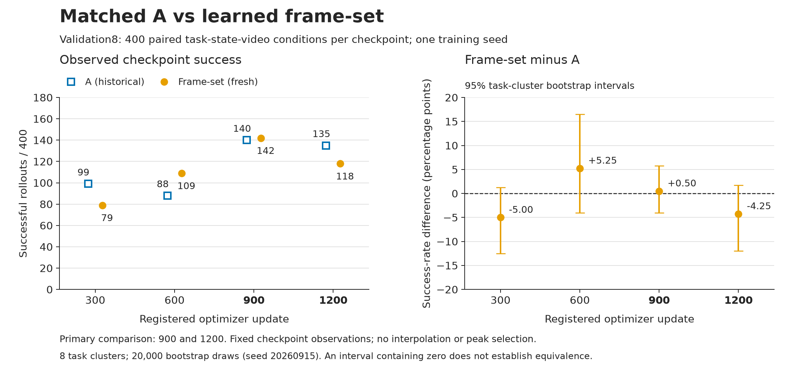

# A与learned frame-set：匹配训练诊断

## 结论

**集合参照能在900步达到142/400，但1200步回落到118；A对应为140和135。**
这说明给定播放顺序不是本配方到达约140总分的必要输入，但尚不能说去掉顺序后在相邻节点、覆盖和成功集合上同样强。
A在1200的总分、breadth及Long更好；900的总体差异并不支持A全面占优。因此结果不落入“有序稳定胜出”或“无序稳定等强”的任一简单结论。

最明确的实际缺口是集合参照在继续训练时的能力保持，尤其双物体放篮；这是任务级行为定位，尚未定位到唯一内部学习机制。
本轮没有证据支持立即删除旧顺序处理，也没有因此证明加深时序模块会改善视频学习。应保护已有A能力，把未来假设落在具体操作关系与保持问题上；本goal不启动下一实验。

## 全部登记节点

| 更新 | A validation /400 | frame-set /400 | A train /96 | frame-set /96 |
| ---: | ---: | ---: | ---: | ---: |
| 300 | 99 | 79 | 36 | 33 |
| 600 | 88 | 109 | 47 | 40 |
| 900 | 140 | 142 | 54 | 49 |
| 1200 | 135 | 118 | 62 | 57 |

集合参照train从900的49升至1200的57（R/G/L=42/15/7），validation却142→118；这不是全局停止学习，
而是本次配方中训练任务改善没有转化为validation能力保持。它不单独证明过拟合的具体原因。
train1200相对A62，保留52、获得5、丢失10，breadth20→19，差值95%CI为[-12.50,+2.08]百分点。

## 主节点与相邻保持

| validation /400 | A | frame-set | set−A | breadth A→set | A→set R/G/L | churn | Jaccard | 差值95%CI，百分点 |
| --- | ---: | ---: | ---: | --- | --- | ---: | ---: | --- |
| 900 | 140 | 142 | +2 | 6→7 | 102/40/38 | 78 | .567 | [-4.00,+5.75] |
| 1200 | 135 | 118 | -17 | 6→5 | 90/28/45 | 73 | .552 | [-12.00,+1.75] |

所有主节点四suite均非零，但覆盖与成功集合不同。不能用两点平均、union或900峰值代替single-checkpoint裁决。

| suite /100 | A900 | set900 | A1200 | set1200 |
| --- | ---: | ---: | ---: | ---: |
| Spatial | 17 | 14 | 14 | 8 |
| Object | 60 | 61 | 55 | 59 |
| Goal | 30 | 38 | 42 | 41 |
| Long | 33 | 29 | 24 | 10 |

900→1200，frame-set为142→118，R/G/L=91/27/51、churn78、Jaccard .538，breadth7→5；A为140→135，R/G/L=98/37/42、churn79、Jaccard .554，breadth6→6。
**总churn几乎相同，不能把集合参照描述成“所有行为更不稳定”。** 差异在于其丢失较多、获得较少，且Long保留更差；A本身也存在明显success-set更替。

集合参照净降24中，Long降19、Spatial降6、Object降2、Goal升3。Long的“双物体放篮”从28→10（R/G/L=8/2/20），
A同任务33→24（20/4/13）；这支持有序路径可能有助于该能力保持的有限假设，不能证明播放顺序是所有任务的必要信息。
“开抽屉放碗”在set900/set1200均0（A为0/2）；“开灶放壶”在set为1/0（A为0/0）。
这些任务尚未得到可靠能力，不能据本轮判定顺序关系已学会或不重要。

完整四节点、24个train任务、8个validation任务及相邻对照见[自动结果表](result_tables.md)。

## 问题与合同

本实验执行[专家意见](expert_review.md)提出的唯一训练诊断：已有约130–140/400能力的A，在相近学习条件下是否从给定视频播放顺序获得额外收益。
[预注册设计](../../learned_frameset_reference_design.md)先于新训练与分数确定；固定训练到1200，节点300/600/900/1200，主要解释相邻900和1200。
Owner再次明确1200停止；没有延长窗口、重训A、并开新架构或按controls挑点。

唯一科学干预：从fresh训练起移除Procedure中的视频frame-index RoPE和causal mask，以及Procedure到参数槽读取的时间寻址。
保留全部stride5真实帧、语言位置、原生空间位置、动作horizon位置、Core、三个Meta、P中心化/AdaLN、八组共享完整A/B头及冻结source。
agentview与fixed-mean H是匹配历史A的本轮例外，不是未来架构的永久接口。

集合参照仍能利用多帧对象、接触、中间结果与物理关系；它没有接收给定播放顺序，不等于无法推断操作关系。
因此本实验不直接测量“视频相对语言是否必要”，也不测量单帧、静态图像或无视频baseline。

## 实施与可比性

- 历史A冻结版本：`575c189a743be121bc9801092b0d94b3a53285e6`；本轮正式运行版本：`a9d8614964abfcddef40eb82f2862623f587ffa6`。两者复用aligned source的raw step1000。
- fresh seed7，Writer与三个Meta从头共同接受跨episode FM，source无可训练参数；无RL、privileged held梯度或Test访问。
- 1200次optimizer update、4800条件访问、100800监督query；4800条训练事件与A匹配。每更新4任务×21 queries，任务等权。
- AdamW、学习率及更新语义匹配A；scheduler的12000是匹配A的时间基准，实际训练硬停1200。
- 历史A使用4卡，本轮按真实profile选择3卡；物理切分变化不改变逻辑batch、采样事件或优化时钟。未要求逐bit相等。
- profile使用最长105帧视频、真实三路Meta信用和完整resume，权重不进入formal。详见[profile记录](profile_summary.json)。
- 每100步保留完整checkpoint。各登记节点validation为8任务×50 states，共400行，50条合法teacher videos每task各使用一次；train为24任务×4 states，共96行的固定诊断面板。
- A与集合参照逐行配对task、init state、teacher video、environment/policy RNG；跨checkpoint复用固定映射。train96的有限面板不宣称使用50条视频无放回。

## 分析定义与限制

R为两者共同成功，G为参照失败而候选成功，L为参照成功而候选失败；churn=G+L，Jaccard=R/(R+G+L)。
模型间比较的参照为A，候选为frame-set；相邻比较的参照为较早checkpoint，候选为较晚checkpoint。
breadth为至少有一次成功的任务数，不能代替各task完整成功率。

差值区间按task cluster bootstrap计算：20,000次、seed20260915、95%区间。validation仅8个任务簇，单个训练seed；
区间不是训练seed间不确定性，包含零不证明统计等价，也不能把400行都当作独立任务。
相邻节点与四个suite共同解释，不通过checkpoint union、模型融合或峰值选择提高分数。
本轮没有新增same-task-other、wrong、shuffled、reversed或no-video评测，因此不能宣称通过最终视频因果资格。

## 证据与复核

四个新节点均完成400+96行、所有worker退出码0，driver退出码0；共1984个配对条件、3968个两模型outcome。
比较器复核完整task/state集合、normalization、source、policy/environment合同、RNG及teacher映射。
12个完整checkpoint和原始run/eval contracts、raw rows、aggregate及completion留存在本地canonical study：
`runs/analysis/a_learned_frameset_20260918/`；历史A原件在`runs/analysis/source_alignment_20260915/A/`。

远程保留[配对CSV](paired_successes.csv)、[机器可读汇总](paired_summary.json)、[逐task/suite表](result_tables.md)、
[图表脚本](plot_results.py)及本报告。汇总中的本机绝对路径已转为仓库相对provenance路径；不包含私有主机配置、权重或视频。
CSV保留task/state、teacher demo、video ordinal、RNG、两模型success与steps，可重算计数、R/G/L、breadth和任务簇bootstrap；
完整原件合同核验已在本地执行，精简CSV不声称包含全部runtime metadata。
图可用`python docs/review_materials/20260918/plot_results.py`从汇总重建，依赖Matplotlib和NumPy。

训练在1200停止，四节点分析结束；本轮不选择新的部署模型，也不自动恢复任何历史路线或新增实验。
