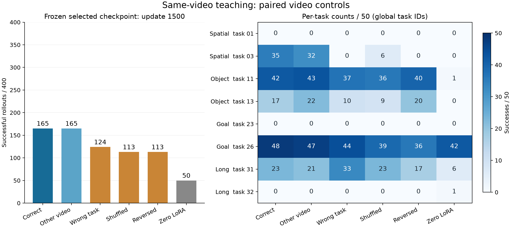

# 冻结1500：视频因果对照读出

正确与同任务另一视频均为165/400；真实打乱、倒序均为113/400，净少52次成功。两项任务簇95%区间均低于零，
支持此checkpoint的有益输入顺序依赖。该依赖并不均匀，也不单独证明普遍的物理过程理解或同视频教学项的因果收益。
三个验证任务仍为零，wrong在Long反而高于correct；匹配监督消融与追加续训将单独报告。

## 结果与配对变化

每臂完整400行，K1；同task每轮使用全部50条合法teacher各一次。R/G/L表示从correct到该臂的保留／获得／丢失，
差值为该臂减correct。区间按8个task簇重采样20,000次，seed20260915；不是400个独立任务的区间，也不证明等价。

| Condition | Success /400 | S/O/G/L | Breadth /8 | Difference | R/G/L | Churn | Jaccard | 95% CI (pp) |
|---|---:|---|---:|---:|---|---:|---:|---|
| correct | 165 | 35/59/48/23 | 5 | +0 | 165/0/0 | 0 | 1.000 | [+0.00,+0.00] |
| same_task_other | 165 | 32/65/47/21 | 5 | +0 | 143/22/22 | 44 | 0.765 | [-2.75,+3.25] |
| cross_suite_wrong | 124 | 0/47/44/33 | 4 | -41 | 100/24/65 | 89 | 0.529 | [-29.50,+3.75] |
| shuffled | 113 | 6/45/39/23 | 5 | -52 | 89/24/76 | 100 | 0.471 | [-27.50,-2.25] |
| reversed | 113 | 0/60/36/17 | 4 | -52 | 93/20/72 | 92 | 0.503 | [-30.75,-0.50] |
| no_video | 50 | 0/1/42/7 | 4 | -115 | 44/6/121 | 127 | 0.257 | [-51.00,-8.50] |

| Global task | correct | same_task_other | cross_suite_wrong | shuffled | reversed | no_video |
|---:|---:|---:|---:|---:|---:|---:|
| 1 | 0 | 0 | 0 | 0 | 0 | 0 |
| 3 | 35 | 32 | 0 | 6 | 0 | 0 |
| 11 | 42 | 43 | 37 | 36 | 40 | 1 |
| 13 | 17 | 22 | 10 | 9 | 20 | 0 |
| 23 | 0 | 0 | 0 | 0 | 0 | 0 |
| 26 | 48 | 47 | 44 | 39 | 36 | 42 |
| 31 | 23 | 21 | 33 | 23 | 17 | 6 |
| 32 | 0 | 0 | 0 | 0 | 0 | 1 |

## 如何解释

- **同任务换视频没有总量崩塌。** 165→165，保留143、获得22、丢失22，Jaccard0.765。总分相同不代表逐行结果一致。
- **扰乱顺序有明确净损害。** shuffle差值−13.00pp，95%CI[−27.50,−2.25]；reverse−13.00pp，[−30.75,−0.50]。
  实际lost分别76、72，同时gained24、20，不能把净差52当成全部丢失数。相对other，两项区间也均低于零。
- **wrong的平均损害更不均匀。** 165→124，−10.25pp，但CI[−29.50,+3.75]跨零。Spatial35→0、Object59→47、Goal48→44，Long23→33。
  不能据总分直接宣称所有任务都需要正确视频。
- **效应较集中。** 从曲奇盒上拿黑碗放盘子的global task3，correct35、other32、wrong0、shuffle6、reverse0。
  该任务贡献shuffle净差中的29/52、reverse中的35/52。Object两个任务的reverse合计反而59→60。
  顺序干预也会改变端点、视觉状态和相邻关系；这些结果不足以独立证明抽象的“先A后B”理解。
- **尚未获得广覆盖。** global task1（ramekin旁黑碗）、23（开顶层抽屉放碗）、32（开炉灶并放摩卡壶）仍为零；正确臂breadth5/8。
  Goal48成功集中在将奶油奶酪放碗的task26；裸source本就有42成功。Long只有双物体放篮task31取得23成功，wrong为33。
- **no-video的语义有限。** 本臂是零完整LoRA／source identity，50/400；它同时撤掉生成的参数。
  165对50证明整套生成LoRA的收益，不能当成对一个learned language-only Writer或匹配static prior的胜出。

## 与历史A的定位

| 固定点 | correct | other | wrong | shuffle | reverse | no-video |
|---|---:|---:|---:|---:|---:|---:|
| 历史A900 | 140 | 136 | 116 | 128 | 139 | 48 |
| 本轮selected1500 | 165 | 165 | 124 | 113 | 113 | 50 |

历史A900的shuffle/reverse净差为−12/−1，本轮为−52/−52；本轮同时有更高的correct/other绝对能力。
A900为历史固定点诊断，本轮1500按correct/other规则选出；节点、训练曝光、过程读取、辅助教学与LR尾段不同。
因此这张表只定位观察差异，不能将增强的顺序敏感性单变量归因于同视频配对或某个新增读取模块。
原A未重训。历史原件位于本地`runs/analysis/source_alignment_20260915/A/video_specificity_step900/`。

## 完成与证据边界

主checkpoint在任何本轮control分数读取前已冻结为1500，见[选择记录](selected_main.json)。四个新control均400行、所有worker正常退出。
同一checkpoint/source、任务、初态、exact language、env/policy RNG和视频ordinal已核对；每条结果的Writer证据与sealed manifest一致。
wrong使用跨suite真实RGB；shuffle/reverse重排真实stride5帧后完整重编码；no-video确为零LoRA、无RGB读取。
原正式代码为`39c3919c9dd54713f7bff6aa24d275e4a6231ff0`。原始rows、manifest、completion和日志保存在本地study。

远程精简原件：[统计与核验](controls_summary.json)、[400行各臂成功标记](controls_successes.csv)、[可编辑SVG](controls_overview.svg)。
完整本地读出使用`runs/analysis/video_teaching_20260919/controls_readout.py`，包含每task/suite的配对集合及bootstrap。

Owner追加的1500→2100窗口在读取这些分数前已登记，见[续训登记](continuation_registration.json)；当前结果不改变该窗口、架构或主选择。
本文只完成原selected1500的controls读出，不宣称整项goal、匹配消融或追加续训已完成。
