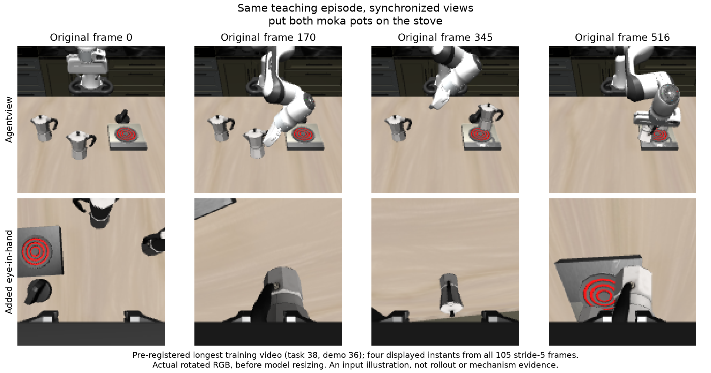

# 专家讨论所需的方法与证据边界

## 本轮实际实现

部署时，exact task language 与一条 action-hidden 教学视频经冻结 π0.5 source 和可训练 Text／VL／Action Meta 读取，形成逐帧视觉内容 E 与完整 H50。语义 Core 保留对象、关系和任务内容；两个重复 Procedure 块分别读取完整 H50 和带前后角色的相邻 E，再沿真实视频位置作 causal RoPE 交互。Core 条件化的居中 Procedure 通过原 AdaLN、归一化和八组共享完整 A/B heads，生成唯一一套 38-target、rank16 LoRA。Writer 在 rollout 前调用一次；执行策略使用机器人自己的观察与 state，期间不再看教学视频。

每次更新四个不同 train task，等权。每个条件用同一套生成 LoRA 承担两项监督：21 个同 task、跨 episode 的常规 FM query，以及 7 个来自所看视频的动作 query。后者使用 tau=1 的纯噪声端点，只监督真实未来五步；两组各自取平均，再按 1 与 1/3 相加。总信用更新整个 Writer 与三组 Meta，source 基础权重始终冻结。没有独立动作头、P-only 梯度、教师动作部署输入或任务内优化。

主组先用 agentview。匹配消融保留模型、query 数、loss、噪声流、seed、学习率和训练预算，仅将辅助 query 改为同 task 另一 episode。因此该比较识别辅助监督与所看视频的对应关系，不能单独识别新增完整 H／相邻视觉读取，也不是“有辅助 loss 对无辅助 loss”。历史 A 与本候选同时存在读取、监督及登记的学习率尾段变化，只能作为整体参考。

正式run contract按模块登记：Writer 12,077,320参数，Action Meta 626,688，VL Meta与Text Meta各921,600；三臂这些参数计数一致，source可训练参数为0。复制Procedure块可以扩展实际H/E读取和时间计算，但本轮没有开展宽度、深度或rank扫描。

## 数据、优化和执行口径

source复用generic `lerobot/pi05_base`经审计source71建立的aligned1000 checkpoint，排除目标40重叠spec；normalization由该source训练数据冻结。Writer仅在固定train24的episodes0–45上产生梯度，46–49只用于冻结诊断；本轮没有增加独立meta task。validation8/test8固定，不重划分。

辅助标签对齐post-action观察索引p，监督真实`actions[p+1:p+6]`；只从stride5采样位置且未来五步完整的位置取7个query，尾部不足五步不补假动作。完整最后RGB帧仍读入Writer。主FM保持完整50步horizon与原flow-time分布；教学端点输入是完整50×32独立噪声，仅在前五步、真实七维动作上算loss。

```text
exact language + RGB video → source读取 / 三Meta → E与完整H50
                                           ├→ Core
                                           └→ 重复H50/相邻E读取 + 有序Procedure
                                                 ↓
                       Core条件化P / 中心化 / AdaLN / 完整A、B heads
                                                 ↓
                                    一套完整38-target LoRA
                                     ├→ 跨episode执行query → 主FM
                                     └→ 同视频执行query → 五步教学loss
                                          两项信用共同更新整个Writer/三Meta
```

执行query可以有机器人自身state和双执行相机；这些信息与动作标签均不进入上面的Writer条件。部署没有loss或optimizer，只把一次生成的LoRA应用到冻结source。

所有fresh臂seed7，AdamW初始lr3e-4、betas(0.9,0.95)、eps1e-8、weight decay1e-4、clip1；前900沿用A的warmup100/decay12000/floor1e-5，之后600步cosine到900学习率的0.1。尾段选择在训练前登记，不能事后宣称已经修复遗忘。续训只延续该尾值。

官方闭环保持render256/model224、两执行相机180°rotate、八维state/七维action、10 flow steps，每次执行前五个actions后重规划，初始settling10，成功即终止，Spatial/Object/Goal/Long horizon220/280/300/520。

## 分阶段证据为何分开

原窗口是 fresh 1500 更新；900／1200／1500 均报告完整 correct400 与 train96。主组在满足登记条件后完成三个节点 other400，以预注册相邻对规则冻结 selected1500，之后才读取该点的视频 controls。消融固定使用主组的 1500 比较点，不自行选优。

Owner 后续追加的 1500→2100 用两组各自完整训练状态继续：optimizer、scheduler、sampler、rank RNG 和原 world2 拓扑保留，LR 不重启，尾值固定约 2.95994e-5。1800／2100 均做 correct400 与 train96，2100 各补 other400。它回答低 LR 尾段能否继续提升；不是任意更长预算或新学习率的结论。原 selected1500 及其 controls 不因此改写。

Owner 再追加消融视频特异性检查：两组都固定 1500，用相同 task／state／policy RNG／video ordinal 和真实 RGB 变换比较 wrong、shuffled、reversed。各臂始终保留目标 exact language；wrong 仅换跨 suite 的教学视频，shuffle／reverse 仅改变真实帧顺序。报告组内 correct 或 other 相对 control 的差，并比较两组的差值之差。共同 zero-LoRA source 面板只计一次。它不是 learned language-only 或静态视觉 prior；相对它的提高不能证明视频相对这些未训练参照的必要增量。

条件性双相机只添加相同教学 episode、相同帧索引的同步 eye-in-hand RGB；执行 policy 原本就使用双执行相机。其余科学配方及 fresh1500 预算与主组匹配，四任务逻辑更新保持，物理卡数与 chunk 按实际吞吐调整。全部 900／1200／1500 correct400／train96 和 fixed1500 other400 均报告；没有为它追加 wrong／order、续训或新的 checkpoint 选择。相机增量不能被唯一归因于遮挡或接触信息。



输入示例取自训练前profile已选定的最长视频（train task38、demo36），这里只显示105个实际输入时点中的4个。取样不依赖模型成败；它说明新增相机的实际输入，不作为机制或闭环效果证据。[RGB取样记录](teacher_camera_example.json)。

## 读表口径

- 训练“条件数”是实际访问次数，包含同一教学episode的重复访问；每臂仍只有24个独立train meta task，不以更多访问冒充更多任务映射。
- validation 是固定八任务，每任务 50 个初始化与全部 50 条合法视频各一次；跨 checkpoint 复用映射。train96 是固定 24×4 有限面板，teacher pool46–49，不能与 validation 的全池口径混称。
- R/G/L 表示从参照到候选的保留／获得／丢失；churn=G+L，Jaccard=R/(R+G+L)。总成功接近不代表成功条件相同，churn 本身也不构成失败。
- 所有 CI 为 task-cluster bootstrap，20,000 次、seed20260915，validation 只有八个 task 簇；只有一个训练 seed。区间跨零不证明等价，不能把 400 行当 400 个独立任务，也不宣称跨 seed 稳定。各区间未作跨节点／多 control 的多重比较校正，按登记比较解释，不升级为总体显著性结论。
- shuffled／reversed 重排真实 frames 后完整重新生成 LoRA。降分说明当前模型对该干预有行为敏感性，不自动证明普遍的顺序关系理解；还需结合正确能力、换视频、任务分布和 matched DID。
- 所有新结果均属于 development split。没有 Test 反馈、RL、validation/test 梯度、checkpoint 融合、挑视频或部署第二套 adapter。

## 适合向专家提出的问题

1. 哪些结果支持同视频监督相较等量跨 episode 监督的作用？正确能力、换视频和视频差值之差三项证据是否指向同一个结论？
2. 在当前低 LR 追加窗口中，主要问题是能力继续获得、相邻保持，还是不同任务之间的交换？哪些观察足以停止当前配方续训，哪些不能外推到所有优化过程？
3. 控制效应较集中的任务与仍缺乏可靠成功的任务，对“保存了操作过程”的主张分别允许多强结论？如何避免把错视频或顺序破坏造成的分布偏移误写成完整因果解释？
4. 双相机若显示增益或非增益，最小可支持的结论是什么？是否已足以把未来输入固定下来，还是需要先解决学习与保持而非继续加视角？
5. 若下一步只能改变一个主要科学变量，哪一个有明确预测、可复用的参照和有界检验？请区分性能、视频必要性与稳定性，给出相反结果将如何更新判断，而非直接提出 rank／LR／seed 扫描。

专家可综合历史，但不要把旧 A／v5.2、不同映射或不同 checkpoint 的优点拼成一个不存在的强结果。下一步建议供 Owner 讨论，不构成自动执行授权。
