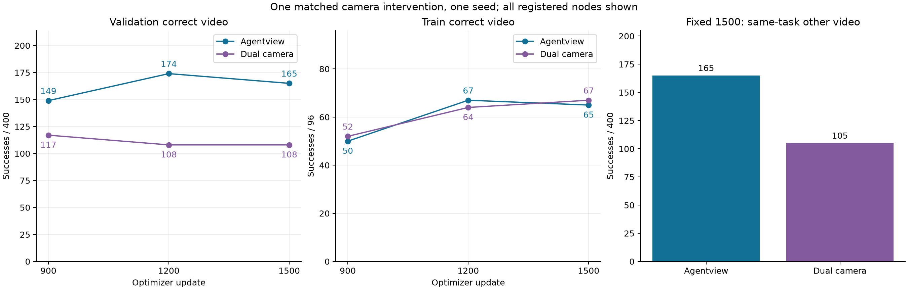

# 唯一双相机fresh1500对照：完整结果

当前同视频教学配方加入同步手眼RGB没有带来验证能力收益。双相机900/1200/1500 correct为117/108/108，对单相机149/174/165；fixed1500 other为105，对单相机165。三个correct差值的任务簇95%CI都低于零，末点为−14.25pp、CI[-27,-4]pp，other为−15pp、CI[-27.75,-2.75]pp。本轮不能把双相机补充视为有效改进；该结论限于当前配方、预算与一个训练seed，不表示所有双相机方法无效。

训练任务的双相机成绩为52→64→67/96，单相机为50→67→65；固定train-action FM从0.104100628降到0.098245136，末点与单相机0.098259576接近。因此不能用训练任务提升或FM下降替代未见任务闭环，也尚未唯一定位表示、泛化或优化方面的原因。实际事件、查询噪声、输入相机、source冻结、完整checkpoint与四组梯度核对均通过。

1500单→双correct保留93、获得15、丢失72；S/O/G/L由35/59/48/23变为10/43/36/19。双相机correct breadth为6/8，仅因task1出现一次成功；other breadth为7/8，但task1与23也各只有一次，task32仍为零。覆盖计数增加不能掩盖既有任务能力下降。

双相机自身1200→1500虽同为108，仍保留78、获得30、丢失30；correct→other108→105保留76、获得29、丢失32。总分接近不等于成功集合稳定。没有双相机wrong/shuffle/reverse检查，不能继承单相机1500的顺序敏感性结论，也不据此自动追加训练或相机扫描。

Owner在凌晨明确授权资源和耗时允许时补双相机，以当日上午形成讨论材料为时间预算；完成真实最长视频与四卡吞吐检查后，按登记唯一fresh1500方案执行。没有根据单相机control分数改变模型；没有新选checkpoint、增开controls或续训。

## 配对结果：agentview→同步dual

### validation400

| 比较 | 成功数 | 净差 | 95% CI (pp) | 保留/获得/丢失 | churn | Jaccard |
| --- | --- | ---: | --- | --- | ---: | ---: |
| 900 | 149→117 | -32 | [-14.50, -1.50] | 91/26/58 | 84 | 0.520 |
| 1200 | 174→108 | -66 | [-31.50, -4.25] | 91/17/83 | 100 | 0.476 |
| 1500 | 165→108 | -57 | [-27.00, -4.00] | 93/15/72 | 87 | 0.517 |

### train96

| 比较 | 成功数 | 净差 | 95% CI (pp) | 保留/获得/丢失 | churn | Jaccard |
| --- | --- | ---: | --- | --- | ---: | ---: |
| 900 | 50→52 | +2 | [-7.29, +11.46] | 40/12/10 | 22 | 0.645 |
| 1200 | 67→64 | -3 | [-11.46, +4.17] | 57/7/10 | 17 | 0.770 |
| 1500 | 65→67 | +2 | [-6.25, +12.50] | 57/10/8 | 18 | 0.760 |

### 固定1500换视频

| 比较 | 成功数 | 净差 | 95% CI (pp) | 保留/获得/丢失 | churn | Jaccard |
| --- | --- | ---: | --- | --- | ---: | ---: |
| agentview→dual other | 165→105 | -60 | [-27.75, -2.75] | 88/17/77 | 94 | 0.484 |
| dual correct→other | 108→105 | -3 | [-3.25, +1.75] | 76/29/32 | 61 | 0.555 |

## 双相机自身相邻保持

### validation400

| 比较 | 成功数 | 净差 | 95% CI (pp) | 保留/获得/丢失 | churn | Jaccard |
| --- | --- | ---: | --- | --- | ---: | ---: |
| 900→1200 | 117→108 | -9 | [-6.25, +2.25] | 77/31/40 | 71 | 0.520 |
| 1200→1500 | 108→108 | +0 | [-3.25, +3.00] | 78/30/30 | 60 | 0.565 |

### train96

| 比较 | 成功数 | 净差 | 95% CI (pp) | 保留/获得/丢失 | churn | Jaccard |
| --- | --- | ---: | --- | --- | ---: | ---: |
| 900→1200 | 52→64 | +12 | [+2.08, +22.92] | 43/21/9 | 30 | 0.589 |
| 1200→1500 | 64→67 | +3 | [-3.12, +9.38] | 60/7/4 | 11 | 0.845 |

## 逐suite与覆盖

| 面板 | 更新 | 模型 | breadth | Spatial | Object | Goal | Long |
| --- | ---: | --- | --- | ---: | ---: | ---: | ---: |
| validation | 900 | agentview | 5/8 | 15 | 60 | 42 | 32 |
| validation | 900 | dual | 5/8 | 9 | 52 | 34 | 22 |
| validation | 1200 | agentview | 5/8 | 36 | 76 | 45 | 17 |
| validation | 1200 | dual | 5/8 | 6 | 47 | 39 | 16 |
| validation | 1500 | agentview | 5/8 | 35 | 59 | 48 | 23 |
| validation | 1500 | dual | 6/8 | 10 | 43 | 36 | 19 |
| train | 900 | agentview | 18/24 | 16 | 15 | 14 | 5 |
| train | 900 | dual | 18/24 | 17 | 18 | 13 | 4 |
| train | 1200 | agentview | 21/24 | 22 | 22 | 13 | 10 |
| train | 1200 | dual | 22/24 | 19 | 20 | 15 | 10 |
| train | 1500 | agentview | 22/24 | 22 | 20 | 15 | 8 |
| train | 1500 | dual | 21/24 | 20 | 20 | 14 | 13 |

validation每suite100条件；train每suite24条件。

## validation逐任务（每点50条件）

| Global task | exact language | agentview900/1200/1500 | dual900/1200/1500 |
| ---: | --- | --- | --- |
| 1 | pick up the black bowl next to the ramekin and place it on the plate | 0/0/0 | 0/0/1 |
| 3 | pick up the black bowl on the cookie box and place it on the plate | 15/36/35 | 9/6/9 |
| 11 | pick up the cream cheese and place it in the basket | 46/46/42 | 36/35/31 |
| 13 | pick up the bbq sauce and place it in the basket | 14/30/17 | 16/12/12 |
| 23 | open the top drawer and put the bowl inside | 0/0/0 | 0/0/0 |
| 26 | put the cream cheese in the bowl | 42/45/48 | 34/39/36 |
| 31 | put both the cream cheese box and the butter in the basket | 32/17/23 | 22/16/19 |
| 32 | turn on the stove and put the moka pot on it | 0/0/0 | 0/0/0 |

## train逐任务（每点4条件）

| Global task | exact language | agentview900/1200/1500 | dual900/1200/1500 |
| ---: | --- | --- | --- |
| 0 | pick up the black bowl between the plate and the ramekin and place it on the plate | 3/3/3 | 4/2/3 |
| 2 | pick up the black bowl from table center and place it on the plate | 4/4/4 | 3/3/4 |
| 4 | pick up the black bowl in the top drawer of the wooden cabinet and place it on the plate | 2/4/4 | 2/4/3 |
| 5 | pick up the black bowl on the ramekin and place it on the plate | 2/3/3 | 2/3/3 |
| 7 | pick up the black bowl on the stove and place it on the plate | 4/4/4 | 4/4/4 |
| 9 | pick up the black bowl on the wooden cabinet and place it on the plate | 1/4/4 | 2/3/3 |
| 12 | pick up the salad dressing and place it in the basket | 2/3/4 | 3/4/3 |
| 14 | pick up the ketchup and place it in the basket | 2/3/3 | 4/3/3 |
| 15 | pick up the tomato sauce and place it in the basket | 1/4/1 | 1/2/3 |
| 16 | pick up the butter and place it in the basket | 3/4/4 | 2/4/4 |
| 18 | pick up the chocolate pudding and place it in the basket | 4/4/4 | 4/3/3 |
| 19 | pick up the orange juice and place it in the basket | 3/4/4 | 4/4/4 |
| 20 | open the middle drawer of the cabinet | 3/2/2 | 3/3/2 |
| 21 | put the bowl on the stove | 4/4/4 | 4/4/4 |
| 22 | put the wine bottle on top of the cabinet | 3/3/4 | 2/3/4 |
| 25 | push the plate to the front of the stove | 0/1/1 | 0/1/0 |
| 28 | put the bowl on the plate | 4/3/4 | 4/4/4 |
| 29 | put the wine bottle on the rack | 0/0/0 | 0/0/0 |
| 34 | put the white mug on the left plate and put the yellow and white mug on the right plate | 2/3/3 | 0/2/3 |
| 35 | pick up the book and place it in the back compartment of the caddy | 3/2/2 | 2/2/3 |
| 36 | put the white mug on the plate and put the chocolate pudding to the right of the plate | 0/4/1 | 2/3/4 |
| 37 | put both the alphabet soup and the cream cheese box in the basket | 0/1/1 | 0/2/2 |
| 38 | put both moka pots on the stove | 0/0/0 | 0/1/1 |
| 39 | put the yellow and white mug in the microwave and close it | 0/0/1 | 0/0/0 |

## Frozen train-action FM（仅诊断）

| 更新 | agentview | dual |
| ---: | ---: | ---: |
| 0 | 0.146830087 | 0.146830087 |
| 900 | 0.104706116 | 0.104100628 |
| 1200 | 0.100550718 | 0.099837918 |
| 1500 | 0.098259576 | 0.098245136 |

该固定诊断只在24个训练task的held-action query读取，没有梯度且不选点；低loss不能替代闭环。

## 只改变了什么

教学输入从agentview变为同一episode、同一stride5时点的agentview＋eye-in-hand RGB，均按官方180°rotate；每帧原生image tokens由256变为512。所有帧及末帧保留，主FM与教学query、三Meta、完整H50读取和LoRA生成图不变。执行policy原本即使用双相机，所以本对照识别的是教学输入信息增量。

与主组匹配source/normalization、seed7、train24、完整6000采样事件、query/frame/noise流、参数量、AdamW、LR及1500预算；实际6000条件访问与事件一致。逻辑每更新四task、每task21＋7query保持，物理world2/frame16变为world4/frame8、每rank microbatch16。允许这种正常硬件和reduction顺序差异，不追求逐bit复现，也不把一次同seed比较当跨seed统计。

最长105帧的frame16/microbatch16在backward OOM；frame8/microbatch16三次完整更新通过，峰值约28.18GiB。四卡六更新及完整4→6恢复通过，均值15.624秒，包含15%余量和尾部一小时的训练前估计约8.49小时。profile权重未加载到formal。实际1500更新计算为22233.25秒（均值14.822秒），allocated峰值28.175GiB。该计算总和不等于包含初始加载、保存、诊断、排队与闭环的墙钟。

四卡固定同节点，source可训练参数0，Writer/三Meta在identity开启后均有有限正梯度；每100步完整checkpoint保留。全部7个面板/1888行的manifest、相机模式、一次Writer调用、stride5完整帧、视频全池映射及worker退出核对通过。正式训练与物化runtime为clean pushed detached `35124aa965a0081b29c060e682ee9a1aaf1982b3`。

## 解释边界

- 该对照直接回答当前同视频教学配方加入同步手眼RGB是否改善这些固定节点的能力；不单独识别遮挡、接触或时序推理机制。
- 1500是预先固定的同预算比较点，不按双相机最高分再选择checkpoint；没有进一步续训、双相机消融、wrong/shuffle/reverse、Test或RL。
- 单相机1500的controls不转移给双相机；仍缺learned language-only或静态prior参照，不能宣称视频必要性的完整论文主张已成立。
- 所有95%CI为task-cluster bootstrap20,000次、seed20260915，validation8簇、train24簇，一个训练seed，未多重比较校正。区间跨零不等价于没有效果。

[配对1888行CSV](dual_camera_successes.csv) · [全比较与审计JSON](dual_camera_summary.json) · [预先登记与profile](dual_camera_registration.json) · [实际RGB输入示例和方法](discussion_context.md) · [总报告](final_report.md)
