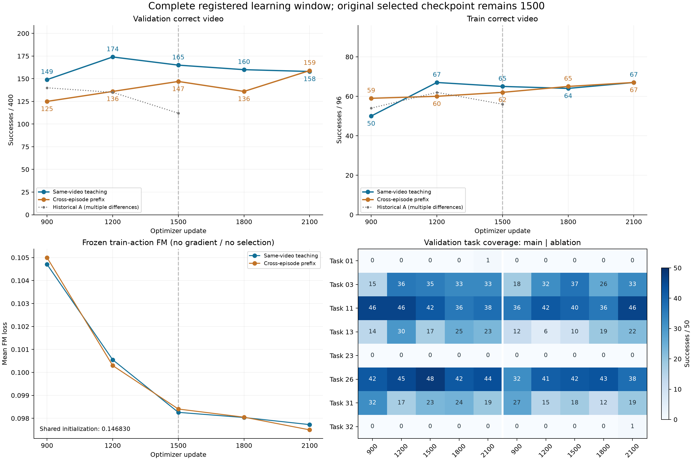
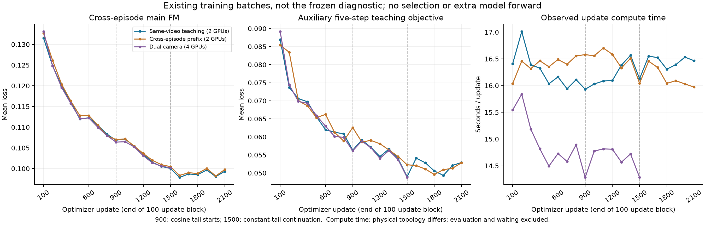
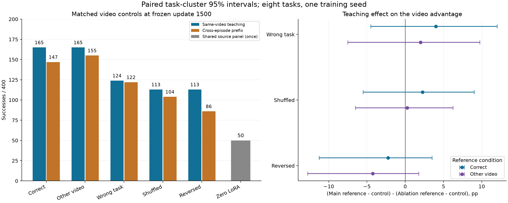

# 同视频教学、后续趋势与双相机：专家讨论总报告

本轮实现、三臂训练及全部登记评测已完成：主组与匹配消融各2100更新，双相机fresh1500；共40个正式面板、12,048次新增闭环。共同source只计一次，历史A复用而未重训。

核心结论是：同视频教学在原1500窗口带来有限的正确视频能力增量，但该优势没有持续到2100，也尚未证明它增强了相对错视频或顺序破坏的优势。固定1500的两组都对顺序破坏敏感，仍有明显任务覆盖缺口。双相机三个节点117/108/108也未改善当前配方。原selected1500保持不变。

## 先看完整学习窗口

| 更新 | 同视频 /400 | 消融 /400 | 双相机 /400 | 同视频 train /96 | 消融 train /96 | 双相机 train /96 |
| ---: | ---: | ---: | ---: | ---: | ---: | ---: |
| 900 | 149 | 125 | 117 | 50 | 59 | 52 |
| 1200 | 174 | 136 | 108 | 67 | 60 | 64 |
| 1500 | 165 | 147 | 108 | 65 | 62 | 67 |
| 1800 | 160 | 136 | 未运行 | 64 | 65 | 未运行 |
| 2100 | 158 | 159 | 未运行 | 67 | 67 | 未运行 |

同视频相对匹配消融的correct净差依次为+24、+38、+18、+24、−1；对应95%区间见下表。其中1200/1500的正增量不能升级为整段训练的持久优势；2100的159对158也不证明消融更好或两者等价。这些事实与前期更快获得部分能力、随后消融追近相容，也可能受任务交换和单seed波动影响；尚未唯一辨认优化或表示机制。

| 比较 | 成功数 | 净差 | 95% CI (pp) | 保留/获得/丢失 | churn | Jaccard |
| --- | --- | ---: | --- | --- | --- | ---: |
| 900：消融→同视频 correct | 125→149 | +24 | [+0.00, +12.50] | 97/52/28 | 80 | 0.548 |
| 1200：消融→同视频 correct | 136→174 | +38 | [+2.00, +21.00] | 117/57/19 | 76 | 0.606 |
| 1500：消融→同视频 correct | 147→165 | +18 | [+0.25, +9.00] | 119/46/28 | 74 | 0.617 |
| 1800：消融→同视频 correct | 136→160 | +24 | [+0.75, +12.50] | 105/55/31 | 86 | 0.550 |
| 2100：消融→同视频 correct | 159→158 | -1 | [-5.75, +4.50] | 117/41/42 | 83 | 0.585 |

主组1500→2100 correct165→158、other165→156；消融correct147→159、other155→161。主组固定尾段没有改善，消融有回落后恢复；观察窗口回答了当前配方的后续趋势，没有证据支持继续无限续训。消融追加段的净增主要是Object50→68，Spatial与Goal各降4；主组Object增加2，但Goal与Long各降4。两组frozen train-action FM都微降，未同步转化为更强的未见任务闭环。

[续训完整报告](continuation_report.md)包含全部相邻和1500→2100比较、train96、逐task/suite、breadth、R/G/L及churn。

### 实际优化过程

以上只读取已有训练日志，每100个连续更新取均值；不是固定query诊断，不新增forward，也不用于选点。同视频主组末百步教学loss在1401–1500为0.048987，2001–2100为0.052901；消融对应0.052275/0.052819。query随事件重新采样，且两臂辅助标签关系不同，不能据此单独判优或唯一诊断过拟合。耗时只含记录的更新计算，双相机使用四卡、单相机两卡，不能当相同硬件成本比较。[完整57个区块CSV](optimization_trace.csv)／[参数组梯度与耗时汇总](optimization_trace_summary.json)。

## 固定1500：视频依赖与教学增量

| 固定1500（各400） | correct | 同task换视频 | 错task视频 | 打乱 | 逆序 | 共同零LoRA/source |
| --- | ---: | ---: | ---: | ---: | ---: | ---: |
| 同视频 | 165 | 165 | 124 | 113 | 113 | 50 |
| 匹配消融 | 147 | 155 | 122 | 104 | 86 | 50 |

共同zero/source的两次列示是同一份400行参照，不是800次新评测；它不等于learned language-only或静态视觉prior。

主组correct相对shuffled/reversed各多52，消融分别多43/61。两个模型的这些组内区间均为正；但要回答“同视频教学是否增强视频特异性”，须比较二者差值，而不能比较各自显著与否。

| 参照 | control | 同视频 gap | 消融 gap | 差值之差 | 95% CI (pp) |
| --- | --- | ---: | ---: | ---: | --- |
| correct | wrong | 41 | 25 | +16 | [-4.50, +12.00] |
| correct | shuffled | 52 | 43 | +9 | [-5.50, +9.00] |
| correct | reversed | 52 | 61 | -9 | [-11.25, +3.50] |
| 同task换视频 | wrong | 41 | 33 | +8 | [-7.50, +9.75] |
| 同task换视频 | shuffled | 52 | 51 | +1 | [-6.50, +6.25] |
| 同task换视频 | reversed | 52 | 69 | -17 | [-12.75, +1.75] |

六个匹配DID区间都跨零，尚不能证明教学项增强这些视频／时序优势。顺序敏感性较集中于特定任务；例如主组task3 correct35、shuffle6、reverse0，而Long wrong总成功反而23→33。没有可靠基础成功的任务不支持强过程理解主张。干预分布偏移、只有八个task簇及一个训练seed均限制外推。

这些controls在selected1500冻结后执行，不用于选checkpoint、修改loss或设计；2100和双相机没有运行新controls，不能继承1500的因果结论。完整任务表、组内和匹配区间见[视频检查报告](ablation_controls_report.md)。

## 同预算双相机对照

当前同视频教学配方加入同步手眼RGB没有带来验证能力收益。双相机900/1200/1500 correct为117/108/108，对单相机149/174/165；fixed1500 other为105，对单相机165。三个correct差值的任务簇95%CI都低于零，末点为−14.25pp、CI[-27,-4]pp，other为−15pp、CI[-27.75,-2.75]pp。本轮不能把双相机补充视为有效改进；该结论限于当前配方、预算与一个训练seed，不表示所有双相机方法无效。

训练任务的双相机成绩为52→64→67/96，单相机为50→67→65；固定train-action FM从0.104100628降到0.098245136，末点与单相机0.098259576接近。因此不能用训练任务提升或FM下降替代未见任务闭环，也尚未唯一定位表示、泛化或优化方面的原因。实际事件、查询噪声、输入相机、source冻结、完整checkpoint与四组梯度核对均通过。

1500单→双correct保留93、获得15、丢失72；S/O/G/L由35/59/48/23变为10/43/36/19。双相机correct breadth为6/8，仅因task1出现一次成功；other breadth为7/8，但task1与23也各只有一次，task32仍为零。覆盖计数增加不能掩盖既有任务能力下降。

双相机自身1200→1500虽同为108，仍保留78、获得30、丢失30；correct→other108→105保留76、获得29、丢失32。总分接近不等于成功集合稳定。没有双相机wrong/shuffle/reverse检查，不能继承单相机1500的顺序敏感性结论，也不据此自动追加训练或相机扫描。

| 比较 | 成功数 | 净差 | 95% CI (pp) | 保留/获得/丢失 | churn | Jaccard |
| --- | --- | ---: | --- | --- | --- | ---: |
| 900：agentview→dual correct | 149→117 | -32 | [-14.50, -1.50] | 91/26/58 | 84 | 0.520 |
| 1200：agentview→dual correct | 174→108 | -66 | [-31.50, -4.25] | 91/17/83 | 100 | 0.476 |
| 1500：agentview→dual correct | 165→108 | -57 | [-27.00, -4.00] | 93/15/72 | 87 | 0.517 |
| fixed1500：agentview→dual other | 165→105 | -60 | [-27.75, -2.75] | 88/17/77 | 94 | 0.484 |

相机干预只给Writer增加同一episode、同一采样帧的同步eye-in-hand RGB；执行policy本来就读双相机。source、参数量、seed7、6000条件计划、实际query与噪声、优化器和1500预算均匹配；训练world2/frame16变为world4/frame8，保持四task逻辑更新和每条件21＋7query。没有从单相机checkpoint热启动。

[双相机完整报告](dual_camera_report.md)给出全部配对区间、task/suite、相邻成功集合和输入／训练审计。仅凭增加相机的结果不能唯一归因于遮挡、接触或更好的过程理解；本轮没有额外双相机消融或controls。

## 方法和比较究竟识别什么

Writer输入是exact task language与action-hidden完整教学RGB，经冻结source及共同训练的Text/VL/Action Meta得到E和完整H50。两个重复Procedure块读取H50和带前后角色的真实相邻E，再沿实际时间交互；保留Core、条件化P读取、中心化/AdaLN、八组共享完整A/B heads，输出唯一一套38-target rank16 LoRA。部署只在rollout前调用一次，没有动作标签、state或任务ID进入Writer。

同一套LoRA同时接受21个同task跨episode主FM query与7个所看视频的短程教学query。教学端点tau=1，监督未来真实五步；两项各自归一后按1与1/3相加，共同更新整个Writer及三Meta，source始终冻结。匹配消融只把7个辅助query改为同task另一episode，因此识别的是监督和所看视频的对应关系，不是辅助loss有无，也不单独识别新增H/E读取。没有沿用已撤回的P-only梯度方案。

历史A correct900/1200/1500为140/135/112；当前主组为149/174/165。同一source、映射和主query可配对，但读取、辅助监督、登记LR尾段同时不同，不能把整体提升归因给其中单一模块。旧A、frame-set及原v5.2没有被重训。更多历史依据从[证据审计](../../v52_evidence_audit_20260917.md)和[研究历史](../../research_history.md)按问题追溯。

[详细数据流水线、输入实例和解释边界](discussion_context.md) · [专家最终修订原文](expert_proposal.md) · [封存实验合同](../../video_teaching_writer_design.md)

## 工程、资源和证据完整性

三臂合计5700个实际optimizer更新、22,800次条件访问、478,800主query＋159,600教学query；续训复制的父历史只计一次。每臂仍仅24个独立train task，访问次数不是新增meta task数量。所有应训练梯度组在identity开启后获得有限正梯度，source可训练参数为0，完整checkpoint及恢复状态保留。

训练与物化／闭环采用流水并行，评测按显存安排1–3个persistent workers/GPU并动态分配任务；双相机依据最长105帧和真实四卡profile选择frame8/microbatch16。固定两节点合计6/8张、单节点6张限制，正式启动前核验独立quota与峰值存储预算，调度时重新检查两节点可用资源。没有占卡等待或干扰他人任务。

保留三类可解释尝试：原1500评测调度切换时0完成shard的启动尝试、尚无worker的显存准入拒绝、双相机frame16/microbatch16可丢弃profile在backward OOM；对应原面板完整重跑／延期，最后正式评测全部完成。这些不是按分数筛选重跑；OOM的profile权重从未进入正式训练。

实现阶段相关CPU检查已通过：主教学图累计246项；相机门禁与observer绑定相关222项（包含重叠覆盖，不相加宣称468个不同测试）。之后只新增配置、执行记录和报告。正式训练／物化从clean pushed detached commits执行：`39c3919c`主组、`bd497edc`消融、`d1474ce0`续训、`35124aa9`双相机。

validation每task50个init state与全部50条合法视频各一次，跨checkpoint复用映射；train96是24×4固定有限面板。报告的95%CI统一为task-cluster bootstrap20,000次、seed20260915，未作多重比较校正；八个验证task和一个训练seed不足以证明跨任务总体或跨seed稳定。Test、RL、checkpoint融合、挑视频及部署第二adapter均未运行。

## 与专家讨论的下一步

当前最有用的是区分“原窗口能力增量”“未保持的后续优势”和“尚未证实的特异性增量”，再解释双相机的有限干预结果。本轮没有识别唯一内部失效原因；最早可确定的缺口在未见任务闭环能力、相邻保持与任务覆盖。讨论可提出一个有具体相反预测的后继实验，但本次goal结束后不自动启动新训练或扫描。

可直接复制[专家讨论提示词](expert_discussion_prompt.md)。精简原件：[单相机数值表](discussion_tables.md)、[全体逐task指标](per_task_metrics.csv)、[全体逐suite指标](per_suite_metrics.csv)、[全体12,048行](all_completed_rollouts.csv)、[结构化汇总](discussion_summary.json)、[完成清单](completion.json)。各panel的checkpoint、manifest、raw rows、queue及worker日志保留在本地study `runs/analysis/video_teaching_20260919/`。
