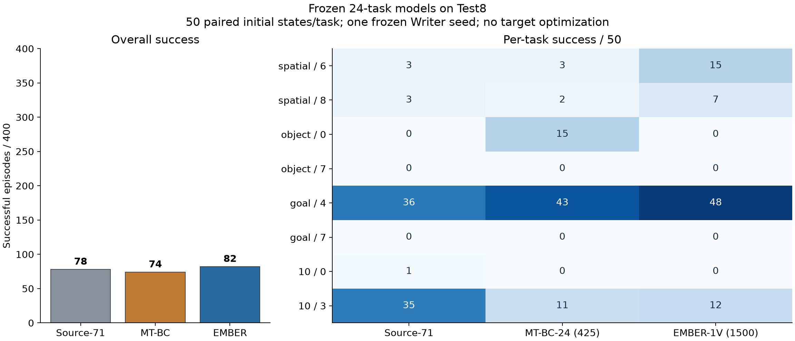

# 冻结模型Test能力比较

Source-71 **78/400**，MT-BC425 **74/400**，EMBER1500 **82/400**。
EMBER−MT-BC为**+8/400（+2.00pp）**；Owner推进门槛为至少+40/400，结果：**未通过，暂停后续实验并询问Owner**。

任务簇bootstrap95%差值区间为[-8.51, 11.25]pp；只有8个task簇及一个Writer训练seed，区间不代表跨训练seed稳定性。
MT-BC→EMBER保留/获得/丢失=50/32/24，churn=56，Jaccard=0.472。

| Suite / task | Source | MT-BC | EMBER |
|---|---:|---:|---:|
| libero_spatial / 6 | 3 | 3 | 15 |
| libero_spatial / 8 | 3 | 2 | 7 |
| libero_object / 0 | 0 | 15 | 0 |
| libero_object / 7 | 0 | 0 | 0 |
| libero_goal / 4 | 36 | 43 | 48 |
| libero_goal / 7 | 0 | 0 | 0 |
| libero_10 / 0 | 1 | 0 | 0 |
| libero_10 / 3 | 35 | 11 | 12 |

## Suite与覆盖

| Suite | Source /100 | MT-BC /100 | EMBER /100 |
|---|---:|---:|---:|
| libero_spatial | 6 | 5 | 22 |
| libero_object | 0 | 15 | 0 |
| libero_goal | 36 | 43 | 48 |
| libero_10 | 36 | 11 | 12 |

至少成功一次的任务覆盖：Source 5/8，MT-BC 5/8，EMBER 4/8。
EMBER在Spatial与Goal的局部优势被Object损失部分抵消，Long上与MT-BC接近，二者均低于Source。结果不能支持Test上广泛优于MT-BC。

## 执行与成本

每组2张A40、每卡3个独立worker，18个worker全部正常结束；Source/MT-BC/EMBER纯评测墙钟分别为27.28/27.61/28.32分钟，不包括EMBER物化和首次启动失败的等待。
最初nohup提交未留下计算进程；改用tmux后正式执行。EMBER预定gpu02:3在启动前被占用，preflight拒绝后改用gpu02:0,1；没有丢弃已评测行，也没有改变科学合同。

## 口径与限制

全部1200行完成，执行合同、共同source/normalization、逐行state与env/policy RNG及视频全池调度已核对。
EMBER是单相机1500完整Writer，执行policy仍使用双相机。MT-BC为已知Validation最高425，共享rank128；EMBER输出rank16。
MT-BC训练每task50演示，Writer46演示；基线与Writer训练预算和参数对象不同，不称为单变量架构比较。
当前仅回答Test绝对能力；本轮视频controls尚未执行，不能把Validation因果结果移植到Test。
历史已有另一冻结方法的sealed Test曝光（2026-09-15）；本轮不声称Test从未被项目查看，不依据Test选点或修正架构。
原始逐行配对见paired_rows.csv，完整统计见summary.json；正式run contract、raw结果及worker日志保留在study/evaluation。
