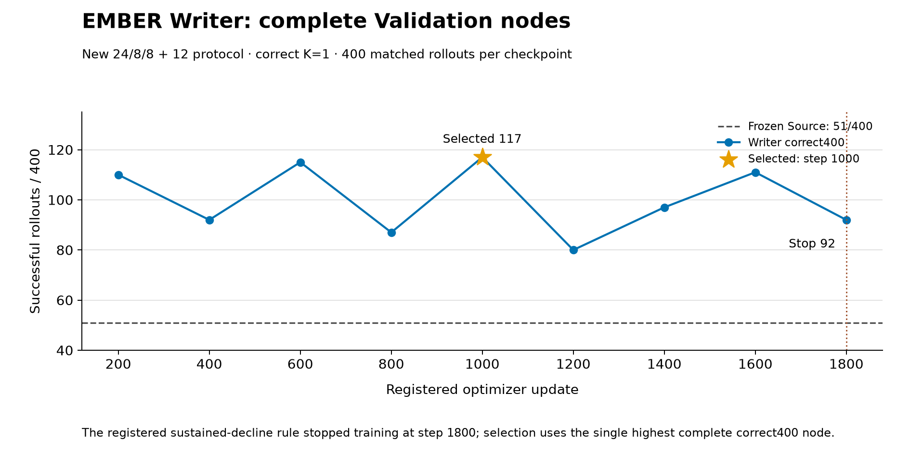
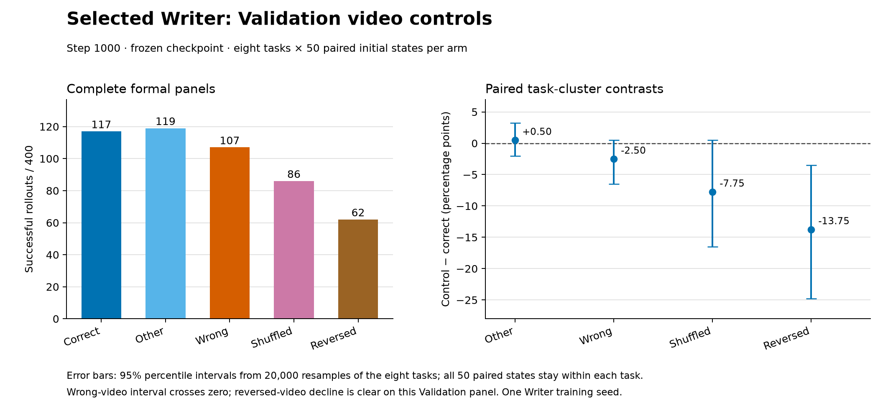

# EMBER 覆盖重训：正式证据报告（编制中）

> 状态：Writer 训练及五个 Validation 视频臂已完成；MT-BC 训练仍在后台运行。新 Test、FT、RL 和外部比较尚未执行。Writer 的时间倒序敏感性有证据，但 wrong-video 的内容特异性不清楚；依Owner合同暂停下游，等待裁决。本稿只记载已经完成且通过正式 exit、400 行及 worker 检查的结果。

## 研究问题与协议边界

本轮检验：在冻结 Source-71、同一 source normalization 和原单教学相机 K=1 Writer 架构下，改用经过语义覆盖审计的任务划分及 12 个辅助任务 fresh 训练一次 Writer 和一次 MT-BC，是否获得足够的零交互任务能力和视频特异性。Source 不重训，旧 Writer/MT-BC 权重也不续训。

新协议把目标40任务固定为每个 suite 的 6 train、2 validation、2 test，合计24/8/8；训练还包括 12 个审计过的 LIBERO-90 辅助任务，因此两种新模型各训练36任务。明确任务 ID 和源文件见 [protocol.json](../../../../configs/libero_24_8_8_coverage_v1/protocol.json) 与 [coverage.md](../../../../configs/libero_24_8_8_coverage_v1/coverage.md)。Writer 梯度使用每任务 demo0..45，MT-BC 使用0..49，这项示范数量差异在比较中保留。Long9 的 cup→microwave、Goal6 的 cream cheese On bowl、Long8 的 stove turn-on 来源及 Spatial9 的 cabinet-top 方向仍是覆盖审计边界；不把原语支持写成完整 held task 监督。

旧冻结 Test 的 Source/MT-BC/EMBER 为 **78/74/82／400**，EMBER−MT-BC 仅 **+8／400**，未达到至少 **+40／400** 的门槛；这是正式负结果，见[旧报告](../../20260920/test_capacity/report.md)。旧 Test 已经使用并参与后续讨论。新划分受到该结果与语义覆盖审计影响，所以本报告不会声称整个项目历史上从未查看 Test，也不会把两种划分的分数合并或当成同一 held 样本的独立重复。

## 完整 Validation 与选点

Source 在新 Validation8 为 **51/400**。Writer 每200次更新完成一个 correct400 节点，九个完整节点如下。预注册的持续下降规则在1800节点触发；唯一 correct 最高点为1000节点 **117/400**，没有 other 破同分需求，已冻结该 checkpoint。所有数字均为 single-checkpoint、8任务×50初态的完整结果。

| Writer 更新 | 200 | 400 | 600 | 800 | **1000（选中）** | 1200 | 1400 | 1600 | 1800（停止） |
| ---: | ---: | ---: | ---: | ---: | ---: | ---: | ---: | ---: | ---: |
| correct 成功／400 | 110 | 92 | 115 | 87 | **117** | 80 | 97 | 111 | 92 |

相对于新 Validation 的 Source，选中 Writer 为 **117 对 51／400**，逐行配对保留/获得/丢失 **36/81/15**，成功任务覆盖均为 **4/8**。提升集中于 Object1（1→43）与 Long1（5→27），Spatial3 为0→8；Goal6 为42→39、Spatial6 为3→0，Long9、Goal3、Object6 仍为0。该总分优势不代表八个任务都改进。8任务簇、各50配对初态的20,000次 bootstrap 给出 +16.5 个百分点点估计与 **[−1.0，+39.0]** 百分位区间；仅一个训练 seed，区间不能证明跨训练 seed 稳定性。

选中 Writer 同任务换视频 other400 已完成 **119/400**，与 correct117配对保留/获得/丢失 **100/19/17**。两臂各任务50条视频无放回，逐行视频也不同；other−correct 点估计 **+0.5** 个百分点，任务簇 bootstrap 95%百分位区间 **[−2.0，+3.25]**。此结果支持同任务视频条件更换后总体能力未出现严重下降；其余视频对照见下节。

## 冻结 Writer 的视频对照与当前裁决

选中 checkpoint1000 的五个臂都完成正式 Validation400，全部12个worker/臂正常退出。wrong 使用8个跨suite donor task；shuffled 和 reversed 各400个条件都变换了真实 RGB 帧顺序，再完整运行观察器与 Writer。后两臂逐行使用与 correct 相同的同任务 teacher demo，state、policy/environment RNG 与视频 ordinal 按正式比较器配对。

| 视频臂 | 成功／400 | 相对correct百分点 | 任务簇bootstrap 95%百分位区间 | correct→该臂保留/获得/丢失 |
| --- | ---: | ---: | ---: | ---: |
| correct | 117 | — | — | — |
| same-task-other | 119 | +0.50 | [−2.00, +3.25] | 100/19/17 |
| cross-suite-wrong | 107 | −2.50 | [−6.50, +0.50] | 88/19/29 |
| shuffled | 86 | −7.75 | [−16.50, +0.51] | 64/22/53 |
| reversed | 62 | −13.75 | [−24.75, −3.50] | 52/10/65 |

倒序下降55/400，且8任务簇区间低于零，支持该冻结模型在此面板对视频时间方向敏感。乱序点估计下降31/400，但任务簇区间跨零。跨suite错误视频只下降10/400，任务簇区间也跨零；Long1在wrong下还增加1条、Goal6不变，内容效果主要来自Object1的4条和Spatial3的7条。故现有结果**不能清楚证明正确教学视频内容相对错误视频是必要增量**。这是科学资格问题，当前没有完整结果指向工程合同错误；不通过重新选点、换seed或改配方补救。

按预登记规则，视频内容特异性不清楚时暂停新Test和FT/RL/外部比较，向Owner报告并询问。MT-BC独立训练控制器继续完成原授权的完整Validation与选点；其结果不会反过来改Writer checkpoint或上述视频判断。

## MT-BC 仍在训练：已完成节点

MT-BC 每50次更新完成一次correct400，目前六个完整节点为 **82、112、99、133、136、155／400**（step50至300）。step300刷新当前最佳且早停为false，控制器仍在运行；因此 **155不是最终选定模型**。它相对已冻结Writer correct117多38/400；按相同Validation task/state配对，以MT-BC300为参考，Writer保留/获得/丢失为87/30/68，成功任务覆盖为MT-BC 6/8、Writer 4/8。该对比不能代替未来是否获准开展的Test硬门槛。

MT-BC从双卡step201–250变为五卡step251–300，始终保持每更新36任务×16查询。完整段平均更新耗时从75.303秒降到31.369秒，实测更新吞吐约2.40倍；完整Validation400评测墙钟从1640.64秒降到701.37秒，约2.34倍吞吐。五卡使用gpu01:0,1,2,5,6，资源快照和物理恢复语义在study/launch记录。最终完整曲线、唯一选点、后续Owner裁决与未执行范围将在控制器结束后补入。

## 成本与限制

Writer 的1800次更新循环实测合计 **17,684.20 秒（约4.91小时）**，平均 **9.825 秒/更新**，四卡最大记录 reserved **22.803 GiB/卡**；累计201,600查询，其中151,200条跨 episode 主查询、50,400条同视频教学查询。该时长不含模型物化、Validation、启动和阶段切换。选中 Writer correct400 的纯评测墙钟为873.25秒，other400为871.91秒，均使用4卡×3 worker。物化的准确墙钟尚无正式计时，不从文件时间戳推造数值。

本轮 Writer 按完整 correct Validation 选择，即便1000后的节点出现反弹也未改早停规则。其高分集中于少数任务，视频内容必要性未获清楚支持，且 MT-BC 仍在训练。新 Test 严格等待Owner对资格问题的裁决；若获准执行主表，仍需检查 EMBER−MT-BC 至少40/400，否则停止 Test 视频 controls 与所有后继 FT/RL/外部比较。

## 原始材料（待总表完成后封装）

当前正式原件保存在 `/data0/user/ymdai/ember_runs/coverage_retraining_20260920`：`writer_selection.json`、`method_freeze.json`、`writer_validation_history.json`、`evaluation/{source_validation,writer_00001000,writer_00001000_other,writer_00001000_cross_suite_wrong,writer_00001000_shuffled,writer_00001000_reversed}`、`analysis/writer_1000_correct_vs_*_validation.json`、对应bootstrap JSON与`writer_validation_control_integrity.json`。本目录封装了[节点CSV](writer_validation_nodes.csv)、[视频对照CSV](writer_validation_controls.csv)、[对照完整性JSON](writer_validation_control_integrity.json)、[逐任务CSV](source_to_selected_writer_per_task.csv)、[逐suite CSV](source_to_selected_writer_per_suite.csv)、两张图的PNG/SVG及[曲线](plot_writer_validation.py)、[视频对照](plot_writer_validation_controls.py)、[bootstrap](bootstrap_paired_tasks.py)可复用源码。最终还需列出MT-BC正式checkpoint、exit及manifest的溯源路径。
