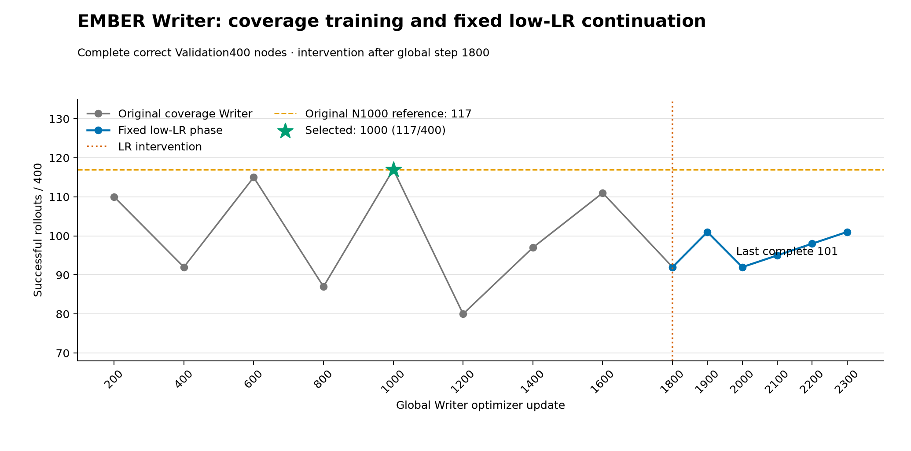

# Writer N1800 恒定低学习率修复续训报告

> 状态：Owner在五个完整phase节点后明确停止；正式证据已封存并按资格规则完成选点。本报告不包含Test、FT、RL、外部比较或其它补救分支。

## 合同与执行

从覆盖重训正式N1800完整状态恢复Writer、三个Meta、AdamW、采样器和四rank RNG；global1801起实际学习率固定为
`2.959936e-05`。训练任务、监督、四卡拓扑、视频seed与评测协议不变。每100更新只用完整correct
Validation400执行phase早停。首次启动在任何更新前因可选diagnostics历史文件被误设为必需而失败；修复后从原N1800
重新启动，没有恢复不完整输出，也没有改变科学变量。

## 完整曲线、停止与选点

新phase完整节点为 **1900:101, 2000:92, 2100:95, 2200:98, 2300:101**（均为成功数/400）。Owner在global2400训练完成、对应Validation尚未形成正式400行时明确要求停止；因此正式曲线截止global2300，未宣称触发预登记早停。 phase最高为
**101/400**。最终裁决为`retain_original_n1000`，选中global
**1000**，correct为 **117/400**。phase分数必须严格超过原N1000的117才可替换；并列correct只用
same-task-other破同分，wrong从不参与选点。

## 视频对照

未执行；phase未严格超过117，按合同保留原N1000。

## 配对结果、失败案例与成本

选中模型相对原N1000的配对保留/获得/丢失为
**117/0/0**。
逐节点逐任务、逐suite、相邻节点R/G/L和选中correct失败行分别见随附CSV；phase及实际执行controls的400行精简原始记录见
`writer_low_lr_validation_rows.csv`，正式完整JSON仍保留在study。

phase共执行 **600** 次更新（其中正式Validation截止2300），训练循环合计 **6400.99秒**，平均
**10.668秒/更新**，记录峰值reserved **22.803 GiB/卡**；累计
**67200** queries。训练耗时不含物化、闭环评测和阶段切换。

## 结论边界与材料

本实验只检验N1800后固定低学习率能否恢复并稳定超过原N1000。科学负结果不会解释成工程待修复，也不触发其它
起点、学习率、seed、任务权重、loss或架构补救。原始早停历史、选点记录、成本JSON、全曲线PNG/SVG及绘图导出源码
均随本目录或仓库脚本保留；旧Test的78/74/82及其+40未通过结论不受本实验改写。
