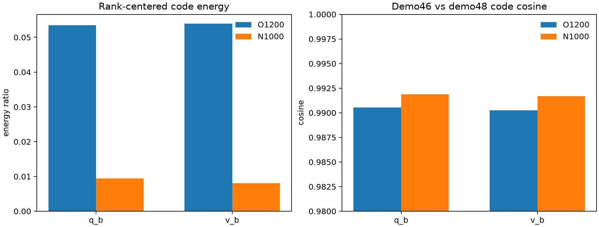
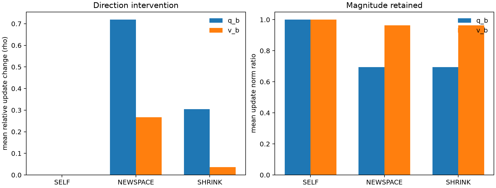
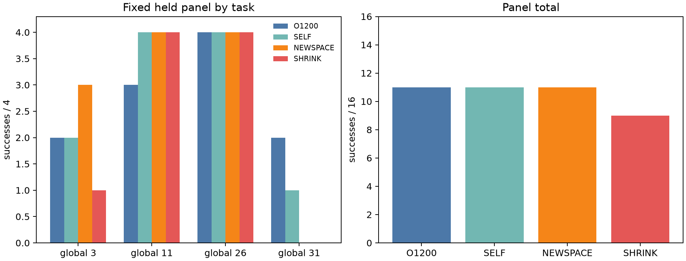

# EMBER Writer输出空间与code投影诊断

## 结论

本轮没有支持“新Writer的B输出空间删除了旧Writer有效方向，因而导致性能下降”这一解释。
O1200 LoRA投进N1000完整B空间后，q-B有效更新方向变化很大（平均`rho=0.719`，更新范数保留69.5%），
但固定16条件闭环仍为**11/16**，与原O1200和SELF相同。只做逐层等范数缩放的SHRINK为**9/16**。
因此新空间确实改变动作行为，却没有在这个小面板上造成净成功下降；方向排除不是当前证据支持的根因。

N1000的216维code比O1200更趋同：rank-centered能量约0.8%–0.95%，O1200约5.35%；N1000的
rank间平均余弦约0.998，O1200约0.984。实际B和有效`BA`也更接近单一主方向。这个差异可作为
“系数映射坍缩/共享过强”的候选定位，但A1只是四个Train任务、两个诊断视频上的描述，不能授权拆head、
正交约束或新损失。

## 合同与完整性

- A0：O1200、N1000、N1800三份checkpoint，q/v-B末层按正式BF16有效权重做FP64分解；
- A1：global 5/7/12/37、demo46/48，O1200和N1000各8次无梯度编译，共16次；
- A2：held global 3/11/26/31、state0..3，SELF/NEWSPACE/SHRINK各16条，共48条新闭环；
- O1200既有16条参照只读复用；没有Test、反向传播、optimizer更新、checkpoint选择或训练；
- A0/A2由clean pushed `2848684f`执行；A1的layer-order工程修复由clean pushed `36e7f791`重跑；
- 所有正式completion齐全、exit均为0、正式stderr为空。初版A1已封存为无效工程尝试，不混入下述统计。

SELF首replan的原始模型重放与保存动作逐元素一致；SELF相对原始动作的relative-L2最大0.818%，其余15条
均低于0.196%。SELF更新范数比例均值接近1，最大`rho=5.62e-4`。闭环11/16且一得一失，说明接口可靠，
同时表明这个16条件面板存在至少一次成功边界交换的数值敏感性。

## A0：输出空间

六个末层矩阵均为完整数值列秩216；三个checkpoint的38个B template均为物理零。

| checkpoint对 | family | 主角余弦平方均值 | 最小主角余弦 | chordal距离 |
| --- | --- | ---: | ---: | ---: |
| O1200–N1000 | q-B | 0.1900 | 0.00069 | 13.227 |
| O1200–N1800 | q-B | 0.1909 | 0.00109 | 13.220 |
| N1000–N1800 | q-B | 0.6367 | 0.07113 | 8.859 |
| O1200–N1000 | v-B | 0.8496 | 0.02096 | 5.699 |
| O1200–N1800 | v-B | 0.8486 | 0.00295 | 5.718 |
| N1000–N1800 | v-B | 0.8785 | 0.00205 | 5.123 |

q-B列空间在旧/新Writer间差异明显大于v-B，且N1000到N1800仍发生变化。列空间差异本身不说明行为损害；
A2是相应的冻结功能干预。

## A1：code与实际更新几何

| Writer | family | rank-centered能量 | layer-centered能量 | rank平均余弦 | layer平均余弦 | 跨视频余弦 | B第一奇异方向能量 | BA第一方向能量 |
| --- | --- | ---: | ---: | ---: | ---: | ---: | ---: | ---: |
| O1200 | q-B | 0.0535 | 0.0878 | 0.9849 | 0.9126 | 0.9905 | 0.9726 | 0.99835 |
| O1200 | v-B | 0.0539 | 0.0909 | 0.9839 | 0.9092 | 0.9903 | 0.9766 | 0.99876 |
| N1000 | q-B | 0.00947 | 0.0407 | 0.9981 | 0.9654 | 0.9919 | 0.9965 | 0.99991 |
| N1000 | v-B | 0.00804 | 0.0387 | 0.9979 | 0.9635 | 0.9917 | 0.9975 | 0.99997 |

两模型在demo46/48之间的code余弦都约0.99，N1000没有在这四个Train任务上表现出更大的跨视频变化。
N1000在rank和layer轴上更趋同，B/BA能量也更集中，但O1200的`BA`本身已经高度单方向化，因此不能把
“出现单一主方向”写成新训练独有故障。修复后的`C @ code`重建relative-L2均值约0.166%，最大0.174%，
验证hook、layer映射和正式BF16输出相符。

## A2：冻结投影干预

| 臂 | q-B范数比例 | q-B mean rho | v-B范数比例 | v-B mean rho | 成功/16 | retained/gained/lost | churn |
| --- | ---: | ---: | ---: | ---: | ---: | --- | ---: |
| SELF | 1.0000 | 0.00046 | 1.0000 | 0.00018 | 11 | 10/1/1 | 2 |
| NEWSPACE | 0.6948 | 0.7188 | 0.9632 | 0.2674 | 11 | 8/3/3 | 6 |
| SHRINK | 0.6948 | 0.3052 | 0.9632 | 0.0368 | 9 | 8/1/3 | 4 |

逐任务成功数如下：

| global task | O1200 | SELF | NEWSPACE | SHRINK |
| ---: | ---: | ---: | ---: | ---: |
| 3，cookie box上的碗放盘 | 2 | 2 | 3 | 1 |
| 11，cream cheese入篮 | 3 | 4 | 4 | 4 |
| 26，cream cheese放碗 | 4 | 4 | 4 | 4 |
| 31，cream cheese与butter入篮 | 2 | 1 | 0 | 0 |
| **合计** | **11** | **11** | **11** | **9** |

NEWSPACE相对O1200有3得3失：task3增加两个状态但丢一个，task11增加一个，task31丢两个。SHRINK有1得3失，
同样丢掉task31两个原成功，并在task3净少一个。NEWSPACE与SHRINK逐层具有相同更新范数，方向不同；前者总分
反而高2条。因此“只因幅度减弱”和“新方向必然破坏旧能力”都不能解释全部交换。样本仅16个条件，不能把
2条差异扩展为总体方向优势。

## 成本与边界

修复后A1两个模型在两张A40并行，各约35秒。A2单臂进程墙钟为SELF 296秒、NEWSPACE 256秒、SHRINK 274秒；
执行顺序是先SELF资格检查，再并行后两臂，总关键路径约570秒。三臂逐episode wall time合计约2205秒。
正式study保留code safetensors、48条compact轨迹、完整launch合同和旧A1事故证据；Git包保留可复算轻量表。

本轮只定位了两个事实：旧/新q-B空间差异很大，N1000 code/更新更趋同；冻结功能干预没有证明新空间排除了
旧闭环能力。它没有解释为何旧Writer在完整Validation上更稳定，也没有验证新的结构修复。按冻结合同到此停止，
不自动恢复Test、FT、RL、完整E2、split-head或其它训练。
