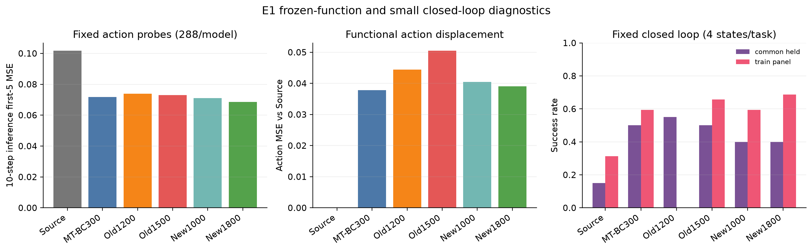
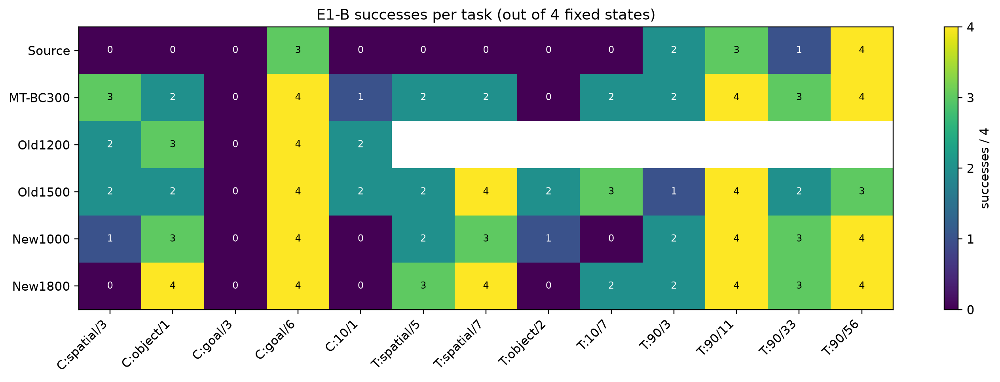

# EMBER Writer 训练稳定性诊断：E0/E1 已有结果

状态：2026-09-21 Owner 暂停后续计算。本报告只覆盖完整结束的 E0、E1-A 和 E1-B；E2 没有完整
shard 集合，E3 未启动。这里的结果不用于重新选择 checkpoint，不使用 Test，也不产生新的训练资格。

## 1. 这次比较了什么

六个冻结资产如下：

| 代号 | 资产 | 作用 |
| --- | --- | --- |
| S1000 | Source-71 step1000 | 未适配参照 |
| M300 | 新划分 MT-BC step300 | 新训练的监督多任务参照 |
| O1200 | 旧划分 Writer step1200 | 与 N1800 按每任务约200次访问、相同学习率对齐的旧父节点 |
| O1500 | 旧划分 Writer step1500 | 旧正式选点参照 |
| N1000 | 新划分 Writer step1000 | 新正式选点参照 |
| N1800 | 新划分 Writer step1800 | 与 O1200 对齐的新父节点 |

E1 采用很小的诊断闭环面板，每任务只有4个固定初态。它不是正式 Validation400，也不能替代旧、新完整
Validation曲线。旧Writer在新36任务中的辅助任务属于训练外任务，原始行保留`old_writer_unseen_auxiliary`标记。

## 2. E0：恢复和梯度路径完整

O1200与N1800都恢复了545个Writer参数及545个AdamW状态，Adam step分别为1200和1800；旧、新运行的
原生frame chunk分别为16和8，checkpoint world size分别为2和4。主监督与同视频教学监督的四条完整Writer
梯度全部有限。

| 父节点 | 分量 | Writer main grad norm | TextMeta | VLMeta | ActionMeta | loss |
| --- | --- | ---: | ---: | ---: | ---: | ---: |
| O1200 | main | 0.473873 | 0.000605 | 0.012686 | 0.000543 | 0.174680 |
| O1200 | teaching | 0.645915 | 0.004276 | 0.029806 | 0.002697 | 0.123759 |
| N1800 | main | 0.212946 | 0.000069 | 0.003908 | 0.000361 | 0.121437 |
| N1800 | teaching | 0.490321 | 0.000047 | 0.004958 | 0.000282 | 0.075123 |

这些数值说明完整恢复及两条梯度路径可执行；单个condition的norm大小不能单独解释Validation波动。

## 3. E1-A：冻结动作探针

每个模型使用当前36个训练任务，每任务固定teacher/query 46→47、48→49，query位置25%/75%，两个噪声seed，
合计288行/模型、1728行。下表是各模型均值。

| 模型 | 全50步FM MSE | 前5步FM MSE | `tau=1`前5步MSE | 10步flow前5步MSE | 动作MSE vs Source |
| --- | ---: | ---: | ---: | ---: | ---: |
| S1000 | 0.106602 | 0.101027 | 0.074698 | 0.101705 | 0.000000 |
| M300 | 0.076946 | 0.063159 | 0.047166 | 0.071804 | 0.037833 |
| O1200 | 0.085152 | 0.065509 | 0.046870 | 0.073873 | 0.044445 |
| O1500 | 0.085216 | 0.064856 | 0.046318 | 0.073036 | 0.050475 |
| N1000 | 0.079046 | 0.063497 | 0.044794 | 0.070970 | 0.040466 |
| N1800 | **0.074284** | **0.056108** | **0.039318** | **0.068651** | 0.039028 |

在这组训练分布动作探针上，新Writer没有出现统一的功能崩溃；N1800的四项动作误差均为六模型最低。
这只说明固定query上的FM/动作拟合，不能推出held闭环更强。

## 4. E1-B：固定小闭环

共同held面板包含Spatial3、Object1、Goal3、Goal6、Long1，每任务4个固定初态，六模型共120行。
训练面板包含Spatial5、Spatial7、Object2、Long7以及LIBERO-90的3、56、11、33，每任务4个固定初态；
除O1200外的五模型共160行。总计280行及280个本地轨迹，所有正式进程exit0且stderr为空。

| 模型 | 共同held | 训练面板 |
| --- | ---: | ---: |
| S1000 | 3/20 | 10/32 |
| M300 | 10/20 | 19/32 |
| O1200 | **11/20** | 未登记 |
| O1500 | 10/20 | 21/32 |
| N1000 | 8/20 | 19/32 |
| N1800 | 8/20 | **22/32** |

逐任务结果显示共同held差距并非所有任务同向：所有模型在Goal3均为0/4；Goal6均为3–4/4；旧、新Writer
在Object1、Spatial3上的交换较明显。训练面板上N1800为22/32，高于O1500的21/32和M300的19/32，
但共同held面板低于两个旧Writer参照。

## 5. 当前能说什么

完整E0/E1证据支持以下有限结论：

1. 新Writer父节点能完整恢复，主监督和同视频教学监督都有有限梯度，未发现参数/Adam状态缺失。
2. 新Writer在当前36任务固定动作探针及小训练闭环上没有表现为全面失效；N1800在动作探针最好、训练面板最高。
3. 新Writer在5个共同held任务×4状态上只有8/20，旧Writer1200/1500分别为11/20和10/20。冻结函数的差异更集中在held迁移，而不是所有动作query。
4. 这仍不能回答训练任务构成、Adam历史、学习率时间尺度或任务梯度冲突中哪一项造成正式Validation的大幅波动。该因果问题原本由E2/E3回答，目前仍未解决。

不能据此声称N1800优于旧Writer，也不能用20条held小面板替代正式Validation400。每任务只有4个状态，
没有统计区间；不同训练任务使旧、新checkpoint不是单变量对照。

## 6. 完成状态与原始材料

- 完成：E0 4行；E1-A 1728行；E1-B 280行。
- 未完成：E2、E3。没有导出任何E2部分结果。
- 本地保留：280个轨迹张量、完整checkpoint、运行日志和暂停证据。
- 远程保留：脱敏原始CSV/JSON、逐状态配对表、轨迹索引、PNG/SVG、绘图与导出脚本。

`frozen_probe_rows.csv`含每个固定query的逐时间/逐动作维误差和预测动作；
`frozen_rollout_rows.csv`含逐episode成功、步数、RNG、阶段谓词和Writer condition证据；
`e1_closed_loop_paired.csv`把相同panel/task/state的六模型结果放在同一行。
