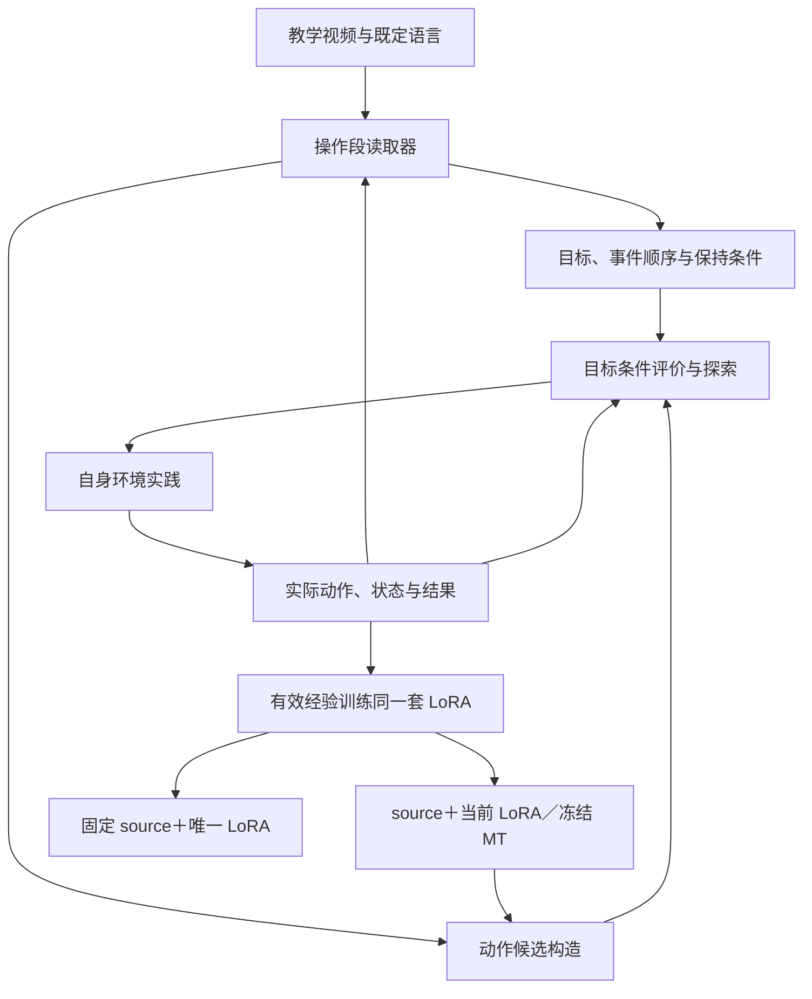

# 第六轮专家：完整架构、训练与推进建议

2026-10-08，新专家阅读前五轮材料后给出的架构建议。以下保留十节正文，省略末尾总结句。
专家审阅的仓库版本为 `b943f037`；这些内容是候选设计，不是已实现方法或新实验结果。
其引用标记沿用原文，跨会话可能无法解析；具体来源优先使用正文中的 Git 或论文链接。
后续主讨论审阅与 owner 最新要求见 [架构审阅](ARCHITECTURE_REVIEW.md)。

---

# EMBER：以教学引导实践，并把有效行为学进同一套 LoRA

**我最推荐的主方案是：从强 MT 的完整 LoRA 副本出发，把视频读成可修订的操作约束；利用原生 action expert 生成动作，以目标条件评价器组织真实尝试；再把实际发现的有效行为，直接训练进最终要部署的同一套 LoRA。**

这里有两个核心选择：

- **教学不再主要承担“一次前向生成全部任务参数”的负担。** 它具体改变接近方向、操作部件、释放顺序、保持条件和下一次尝试。
- **任务内学习直接修改最终策略。** 搜索、目标选择和特权状态评价帮助它获得训练经验；最终是否成立，由这些辅助模块退出后的完整任务表现判断。

我已按指定顺序阅读入口、衔接材料、第五轮与 owner 后续要求、长期要求、概念、历史地图、机制和证据，并回查第一至第四轮及最接近路线的代码和结果。审阅固定在提交 [`b943f037`](https://github.com/LinFyM/EMBER/tree/b943f0370afd5108f2f8487bee7d7563da31c41e)。必读文档没有读取缺口；我没有重新运行服务器上的模型或环境，因此原件记录的张量核验和实验结果按已有证据引用，下面的新架构、收益和时间估计均明确作为待验证设计。

---

## 一、完整架构与参数分工

### 1. 总体信息流

图中“实践反馈到读取器”有明确含义：**用自己的图像与真实状态校准视觉读出，并根据实际失败定位重看片段、调整操作假说。** 它不代表从失败中恢复了教师当时的隐藏动作或接触真值。

### 2. 参数所有权

| 部分 | 共享训练阶段 | 单个教学条件的适应阶段 | 最终执行 |
|---|---|---|---|
| Source 基础权重、原生图文 prefix、normalizer | 复用已冻结版本 | 冻结 | 保留、冻结 |
| 强 MT LoRA，记为 \(\lambda_{\mathrm{MT}}\) | 复用现有强 MT | 作为初始化和冻结提案参考 | 不另行叠加 |
| 教学读取器 \(R_\phi\) | 新训练共享关系与时序读出 | 共享参数 \(\phi\) 冻结 | 退出 |
| 小型视觉校准参数 \(\delta_c\) | 学会通用校准接口 | 用本条件自己的图像—状态对更新 | 退出 |
| 目标条件双 Q，\(Q_{\psi_1},Q_{\psi_2}\) | 用合法训练转移学习 | 复制为本条件参数，用自身经验更新 | 退出 |
| 最终任务 LoRA，\(\lambda_c\) | 初始化来源是 MT | **直接更新完整 A/B** | **唯一保留的任务参数** |
| 操作进程、候选编辑、探索、经验回放 | 实现和验证 | 工作 | 退出 |

首版保持现有 **38-target、rank128** 拓扑：18 个 Q、18 个 V，以及 action-in/action-out，共 76 个 A/B 张量。任务适应直接复制 MT 的完整因子并更新；最终是这一个完整参数对象。现有 `DirectLoRAParameters` 和完整因子训练路径已支持这一出发点，无需先开发新的参数生成器。[完整 LoRA 与直接参数实现](https://github.com/LinFyM/EMBER/blob/b943f0370afd5108f2f8487bee7d7563da31c41e/src/ember/writer/model.py)；[38-target 定义](https://github.com/LinFyM/EMBER/blob/b943f0370afd5108f2f8487bee7d7563da31c41e/src/ember/pi05_lora.py)

### 3. 首版必需与可以省去的部分

必需的是：**操作段读取、真实状态关系计算、操作进程管理、候选构造、目标 Q、经验认证和直接 LoRA 学习。**

以下内容可以先省去：

- 新的完整世界模型；
- 从教师视频恢复动作的逆模型；
- 独立的全任务视频 actor；
- 另一个整任务 critic；
- 学习式阶段选择网络；
- 输出完整 LoRA 的新 hypernetwork；
- 对整个适应循环做高阶元梯度。

旧 T/C 应保留为证据和对照，但不放在新方案的必经路径上。**已有 action expert 的主要职责，是在自己的真实观测下提供完整行为先验。** 教学理解的一部分，发生在“把含糊的视频解释变成行动假说，再用实践检验”的过程中。

---

## 二、教学究竟提供什么，以及怎样进入控制

以下始终以“打开上层抽屉，退出后保持开口，再把碗放入”为例。这里描述的是方法应如何工作，不是声称新实验已经取得这些结果。

### 1. 输入与实际特征来源

读取器输入只有：

\[
V=\{I_1,\ldots,I_T\},\qquad L=\text{既定语言}.
\]

使用现有冻结 source 的空间视觉 token 和真实语言特征，保留相机、空间位置、教学时间及真实末帧。首版沿用登记的 stride5。

新增读出采用：

1. 对象／部件槽的 cross-attention；
2. 保序的双向时间解释层；
3. 关系、局部运动路径和事件预测头。

**教师侧不补造 proprio。** 自身经验用于视觉校准时，也经过同一条“RGB＋语言、没有 state token”的读取路径；自身状态仅作为校准标签。否则校准头可能依赖自己的 proprio 完成预测，而教师视频中根本没有这个输入。

原生动作策略则继续使用正常的自身 RGB、proprio 和语言。两条输入路径要在实现中明确区分。

### 2. 输出“操作段”，而不只输出阶段名称

每个操作段输出：

\[
z_k=
\left(
b_k,\mathcal P_k,e_k,g_k,\mathcal I_k,\mathrm{pre}_k,c_k
\right).
\]

| 输出 | 具体内容 | 实际消费者 |
|---|---|---|
| \(b_k\)：角色绑定 | 操作对象、部件、被移动物体、容器 | 对应到当前环境实体 |
| \(\mathcal P_k\)：局部运动走廊 | 相对把手、开口或物体的方向、路径范围、姿态变化 | 编辑原生动作候选 |
| \(e_k\)：事件顺序 | 接近、夹紧、拉动、释放、离开等顺序及不确定度 | 构造夹爪与移动时序候选 |
| \(g_k\)：退出条件 | 本段完成时应建立的联合关系 | Q 的目标、经验认证 |
| \(\mathcal I_k\)：保持条件 | 需要持续保持的关系及其解除事件 | 路径评价、恢复、训练资格 |
| \(\mathrm{pre}_k\)：下一步前置条件 | 当前是否具备进入该操作的条件 | 目标选择与必要恢复 |
| \(c_k\)：置信度与帧范围 | 哪些解释明确、哪些有歧义、对应哪段视频 | 重读与探索分配 |

运动关系使用对象局部坐标。例如：

\[
\rho(S;i,j)=
\left[
R_j^\top(p_i-p_j),\
\operatorname{Log}(R_j^\top R_i),\
q_{\mathrm{grip}},\
q_{\mathrm{joint}},\
\mathrm{contact},\ldots
\right].
\]

教师侧输出的是这些量的视觉估计与区间；自身侧可以从合法环境状态计算实际值。

这样，“从把手上方退出”会被重新定位到当前把手坐标中。“先释放再远离”会改变夹爪与位移的次序。“放入前保持抽屉打开”会进入实际行为的资格判断。

视频中始终不变的量不能自动成为必要约束。**单条成功录像证明了某种过程发生过，通常不能证明每一步都不可省。** 保持条件应带置信度，并接受自身后续成功证据的修订。

### 3. 操作进程必须区分三种状态

我建议不用另一个阶段策略网络，而采用小型、显式的操作进程：

| 记录 | 语义 |
|---|---|
| 已完成事件 | 某事件曾经被真实状态认证；完成后锁存 |
| 活动保持条件 | 某关系现在仍必须成立；在指定后继事件后解除 |
| 下一段前置条件 | 当前是否能进入下一操作；丢失时允许恢复 |

这一区分直接影响抽屉任务：

- “抓住过把手”是已完成事件；
- “抽屉仍打开”是放入之前的活动保持条件；
- “手已离开把手，且能接近碗”是下一段入口。

释放后 contact=false，不能导致流程回到“重新抓把手”。若新初态中抽屉已经打开，且下一段入口成立，则可以跳过拉开过程。

目标选择遵循**最早尚未认证、当前可执行的操作段**，必要时恢复真实丢失的前置条件。它不从所有子目标中选 Q 最大的那个，否则容易不断重复最容易的动作。恢复同一个条件也不反复累计进度奖励。

---

## 三、已有动作知识怎样形成有效尝试

### 1. 原生 action expert 保持完整计算

定义：

\[
A=F_{\Theta,\lambda}(q,\epsilon),
\qquad
q=(I^{\mathrm{front}},I^{\mathrm{wrist}},p,L).
\]

这里 \(F\) 是现有原生生成过程：完整 \(50\times32\) latent、10 步 flow，实际环境使用 7 维动作，每次执行前 5 步后重新观测。[原生执行合同](https://github.com/LinFyM/EMBER/blob/b943f0370afd5108f2f8487bee7d7563da31c41e/AGENTS.md)

每次决策，首版可从**当前 LoRA 和冻结 MT 各生成少量完整动作块**。一个合理的 profile 起点是总共 4 个原生样本，再产生约 16 个编辑候选。数量属于工程起点，不承担可达性保证。

三条时间轴各司其职：

- 教学时间用于理解过程；
- 50 个 horizon 位置构成当前状态下的协调动作提案；
- 10 步 flow 是生成动作的内部求解过程。

未执行的后 45 步仍参与原生动作生成，但不是已经发生的环境轨迹。

### 2. 视频必须改变真正执行的动作前缀

候选构造为：

\[
\widetilde A=\mathcal E(A,S,z_k,\xi).
\]

编辑在**现有控制器的实际执行单位**中完成，随后按冻结 normalizer 转回模型坐标。首版保留四类通用编辑：

1. **对象局部的平滑位姿编辑。** 改变接近侧、退出方向、少量姿态与曲率。
2. **夹爪事件编辑。** 改变开闭时机及持续时间。
3. **时间伸缩与停留。** 改变释放、抬升、绕开边缘等过程的节奏。
4. **显式 pose-hold／release-and-dwell 分支。** 保持手部目标或抑制主动移动，先释放，再依据实际反馈决定是否退出。

第四类是必需的。假如 MT 提出了很大的后退动作，小幅 additive 扰动未必能产生“手先不动，张开夹爪”。增加相似 seed 也无法解决这种支持范围不足。

这些是通用控制算子。由哪段教学、哪个当前关系触发，以及哪种方向和时序值得尝试，由读取结果与自身反馈决定。它们不包含一个预先写好的抽屉完整控制器。

释放／停留模式还需要跨重新规划保留，直到实际脱离或超时。否则每 5 步重新调用 MT，可能刚释放就再次夹紧。

### 3. Q 评价实际前缀与后续可达性

核心评价器采用目标条件双 Q：

\[
Q_{\psi_i}(S,m,u,g,\mathcal I,H),\qquad i=1,2.
\]

其中：

- \(S\)：自己的实际状态、对象关系、接触等；
- \(m\)：上述事件与保持条件进程；
- \(u=\widetilde A_{1:h}\)，\(h\le5\)：真正要执行的前缀；
- \(g,\mathcal I\)：当前联合目标与活动保持条件；
- \(H\)：剩余实际控制预算。

它近似评价：**执行该前缀后，在登记的候选搜索机制下继续行动，能否在期限内达到目标并满足保持条件。**

这是搜索机制下的可达性评价，不是最终无搜索 actor 的 \(Q^\pi\)。首版也不把 action hidden 或未执行尾部当作真实效果预测。

实际转移先更新目标自动机，再构造：

\[
y=
\begin{cases}
1,&\text{实际进入接受状态},\\
0,&\text{实际违反必要条件、失败终止或预算耗尽},\\
\displaystyle
\max_{u'\in\mathcal C(S')}
\min_iQ^-_{\psi_i}(S',m',u',g,\mathcal I,H-h),
&\text{其余情况}.
\end{cases}
\]

用 BCE 或等价的概率回归目标训练两个 Q，目标网络停止梯度；一个更新轮内固定候选生成版本。全任务环境 success 始终单独记录，并可以结束整个教学过程，不让误读的教程条件否决真实完整成功。

选择主要依据 \(\min(Q_1,Q_2)\)，同时为尚未充分尝试的结构化分支保留探索配额。**双 Q 的较小值只是保守排序分，未经真实校准不能称为严格置信下界。**

失败经验也可按实际达到的其他关系做 hindsight 重标记，但原目标的失败标签必须保留。HER 可以提高已观察经验的利用率，不会产生经验中从未出现的有效动作。:chatgpt-content-reference{index="0"}

Q 的校准必须使用**执行前目标已经固定的真实尝试**。未执行候选没有结果标签；从自己的已访问状态恢复并测试其他候选时，重置、执行和后续验证都计入交互成本。

---

## 四、自身实践怎样改变下一次理解

这条联系采用两个具体渠道。

### 1. 用自身经验校准共同的视觉读出

任务内只更新小型参数 \(\delta_c\)：

\[
\mathcal L_{\mathrm{cal}}
=
\mathbb E_{(o,S)\in\mathcal B_c}
\ell\!\left(
\widehat\rho_{\phi,\delta_c}(o^{RGB},L),
\rho(S)
\right)
+\alpha\|\delta_c\|^2.
\]

共享特征和主体读取器冻结；监督来自自己的 RGB 与真实状态。

它可以校准：

- 当前图像中的把手与部件绑定；
- 夹爪视觉宽度与实际开度的对应；
- 抽屉可见开口与关节位置的对应；
- 某些可见的脱离／仍接触线索。

再用更新后的读出重读原视频。遮挡导致不可辨识的量仍应保留不确定性；自己的接触标签不能变成教师的接触真值。

### 2. 用实际违约定位重读，并调整尝试优先级

假设模型退出时把抽屉带回：

1. 实际日志确定：哪个前缀执行后，开度下降、接触是否持续、手怎样移动。
2. 操作进程定位：失败发生在“退出并保持开口”，而不是笼统的整任务失败。
3. 检索教师相应片段及前后上下文，重新估计释放顺序、退出方向和开口保持。
4. 对仍有歧义的解释保留多个分支，例如先释放、改变退出角度、短暂停留。
5. 用已有实际结果和 Q 调整下一次尝试的优先级。

可以将优先级写为：

\[
w(h)\propto p_{\mathrm{vis}}(h)
\exp\!\left[
\beta\underline Q(S,\mathcal E(A;h),g(h))
\right].
\]

这里 \(h\) 是一个操作假说。这个量表示“下一次值得试什么”，**不表示已经证明教师当时采用了该隐藏动作。**

多次观看按需要组织：

- 失败位置明确时，重读相关片段；
- 阶段对齐、对象绑定或最终目标有疑问时，重读完整视频；
- 当前 LoRA 改善后，它生成的新候选和到达的新状态，会提出新的比较问题。

冻结视觉特征可以缓存；新的校准、操作解释和对齐仍需实际重新计算。若目标解释发生变化，应给解释版本编号，并依据保存的真实状态重新认证相关经验，防止通过修改目标定义制造“进步”。

---

## 五、训练目标：怎样把经验学进同一套 LoRA

这里我对第五轮作一处实质修订：

> **完整真实动作窗口继续使用原生 FM；不足完整 horizon 的有效经验，直接监督原生采样器的动作前缀分布。**

我不建议把短正例与任意 proposal 尾部拼起来，再把 masked FM 当作正确的前缀边缘学习。原生 action tokens 相互作用，前缀 velocity 可以依赖后缀；这种拼接通常不能保证训练目标与实际前缀分布一致。

### 1. 三类经验的用途

| 经验 | 资格 | LoRA 更新 | 其他用途 |
|---|---|---|---|
| 完整成功轨迹 | 环境真实 success | 真实完整窗口 FM；短末段可做前缀学习 | Q、校准、完整行为回放 |
| 局部有效片段 | 联合退出条件达成，活动保持条件满足，经过稳定观察 | 较低权重前缀学习 | Q、后续阶段探索 |
| 失败或未认证经验 | 原目标失败、保持条件破坏、效果不明确 | 首版不作正向模仿 | Q、视觉校准、重读、探索 |

局部经验再区分两个等级：

- **暂定有效**：当前段成立，给予有限学习权重；
- **得到后续支持**：之后确实进入下一段，或最终完成任务，提高回放权重。

这允许首次局部成功立即帮助后续实践，又不把局部成功认定为可靠完整教师。

例如，一条最终失败的 episode 中，“释放、退出且抽屉保持打开”可以成为局部正例；后来抓碗滑落的动作不会因此自动变成正例。反之，仅“曾经打开过”不足以认证整段退出行为。

### 2. 完整真实窗口：沿用 FM

从自己的执行日志构造：

\[
A_t^{\mathrm{real}}=(a_t,\ldots,a_{t+49}).
\]

这些动作可以跨多次重新规划，因为它们确实发生过。采用现有定义：

\[
x_\tau=\tau\epsilon+(1-\tau)A_t^{\mathrm{real}},
\]

\[
\mathcal L_{\mathrm{FM}}
=
\mathbb E
\left\|
v_{\Theta,\lambda_c}(q_t,x_\tau,\tau)
-(\epsilon-A_t^{\mathrm{real}})
\right\|^2.
\]

临近 terminal 不足 50 步时，不补造成功尾部。现有 FM、完整因子梯度和只读 prefix 缓存路径可以直接复用。[现有功能信用实现](https://github.com/LinFyM/EMBER/blob/b943f0370afd5108f2f8487bee7d7563da31c41e/src/ember/writer/function_credit.py)

### 3. 短片段：采用前缀 energy score

令 \(P_h\) 取最终生成动作的前 \(h\le5\) 步和真实 7 个动作维度。对认证前缀 \(u^+\)，采样两个**新的、相互独立**的噪声：

\[
\epsilon_1,\epsilon_2\sim\mathcal N(0,I),
\qquad
U_i=P_hF_{\Theta,\lambda_c}(q,\epsilon_i).
\]

采用：

\[
\mathcal L_{\mathrm{pre}}
=
\frac{
\|W(U_1-u^+)\|_2+
\|W(U_2-u^+)\|_2-
\|W(U_1-U_2)\|_2
}{
2\sqrt{7h}
}.
\]

\(W\) 是固定、满秩的尺度变换，不从 held 教师标签估计。

这是对实际执行前缀的分布评分：前两项使生成前缀接近有效经验，第三项使目标不被预先限定为条件均值。使用一次范数的 energy score 在相应矩条件下具有严格适当性；平方范数会退化为主要约束均值。:chatgpt-content-reference{index="1"}

需要限定其含义：

- 它拟合的是经认证、加权后的经验分布；
- 它不是任务回报的无偏策略梯度；
- 一个状态只有一个正例时，无法凭空恢复其他有效模式；
- 它不保证策略单调改进、完整任务成功或跨初态泛化。

**选择它的理由是接口完整：直接训练最终采样器实际产生的前缀，不需要教师动作、假尾部或未经验证的 \(\nabla_aQ\)。**

### 4. 实际梯度消费者

前缀 loss 通过完整 10 步生成过程回传到全部 38-target A/B：

\[
\nabla_{\lambda_c}\mathcal L_{\mathrm{pre}}
=
\sum_{i=1}^{2}
\left(
\frac{\partial F_{\Theta,\lambda_c}(q,\epsilon_i)}
{\partial\lambda_c}
\right)^\top
P_h^\top
\frac{\partial\mathcal L_{\mathrm{pre}}}{\partial U_i}.
\]

梯度不经过环境、候选 argmax、正例认证或 Q。

这里有四个必须实现正确的细节：

1. **使用新 seed。** 只回归搜索时被选中的原 seed，可能在更新开始时就误差为零，无法提高普通 seed 生成好动作的概率。
2. **样本间项两侧都回传。** 可以顺序重放两个 VJP 降低显存，但两侧梯度累积完成前不能更新参数。
3. **完整 latent 留在图中。** 每个 flow step 都保留 \(50\times32\)，仅最终评分取前 \(h\times7\)；不能中途截断其余位置或维度。
4. **建立可微采样入口。** 已核对的原生 `sample_actions` 等公开入口带 `@torch.no_grad()`。需要复用同一 `denoise_step` 与同一求解过程，在相同参数、相同噪声下核对训练入口和正式推理输出一致。[原生 π0.5 实现](https://github.com/huggingface/lerobot/blob/30da8e687a6dfc617fcd94afc367ac7071c376ce/src/lerobot/policies/pi05/modeling_pi05.py)

这部分是新方案中需要实测的优化假说，不能凭数学定义就宣布可用。

### 5. 同一 LoRA 的累计学习与保持

总目标选为：

\[
\mathcal L_{\mathrm{actor}}
=
\mathcal L_{\mathrm{FM}}^{\mathrm{full}}
+
\eta\mathcal L_{\mathrm{pre}}^{\mathrm{certified}}
+
\beta\mathcal L_{\mathrm{keep}}.
\]

数据按操作事件和阶段均衡，完整成功优先；大量“接近、等待、反复打开”不能淹没少量释放、运输和放入经验。

保持能力首先依赖**所有已获得阶段的联合回放**，其次使用小型功能保持项：

\[
\mathcal L_{\mathrm{keep}}
=
\mathbb E_{(q,\epsilon_{\mathrm{ref}},u_{\mathrm{ref}})\in D_{\mathrm{keep}}}
\left\|
P_hF_{\Theta,\lambda_c}(q,\epsilon_{\mathrm{ref}})
-u_{\mathrm{ref}}
\right\|^2.
\]

锚点来自此前 MT 或纯 actor 实际产生并验证有效的行为。这里使用旧 seed 是合适的，因为目的就是保持原有有效映射。

不对所有 MT 失败状态强行保持，也不冻结某一阶段专属的 LoRA 子块。若后续证据说明旧局部认证遗漏了条件，应撤下错误锚点、重新认证，而不是永久保护错误行为。

新日志应明确记录 \((o_t,a_t,o_{t+1})\)。旧示范数据使用 post-action observation 的 offset1；新日志若是标准前状态—动作格式，正确标签就是 \(a_t\)，不能照搬 offset。[现有数据对齐定义](https://github.com/LinFyM/EMBER/blob/b943f0370afd5108f2f8487bee7d7563da31c41e/src/ember/writer/data.py)

---

## 六、共享训练、任务适应与最终执行的完整流程

### 1. 共享训练：先学会读、评和提供控制基础

首批复用现有强 MT，以及其对应的既有 36 项合法训练数据范围。暂不把扩大外部数据规模设为修复路线。

| 合法训练监督 | 用在哪里 | 产生什么学习 |
|---|---|---|
| 完整动作标签 | 已有 MT 的 FM | 复用共享控制基础 |
| 物体、关节、机器人状态与事件 | 读取器关系、路径、时序头 | 学会从 RGB 估计操作过程 |
| 实际动作与状态转移 | 目标 Q | 学习动作条件的可达性 |
| 训练任务自己的失败和恢复交互 | Q、读取校准及完整循环训练 | 补充成功示范缺少的动作后果 |
| 教师 RGB 与跨 episode query 的实际后果 | 读取器—Q 消费者 | 学习目标与保持条件的功能含义 |

读取器的目标／保持分支使用：

\[
\mathcal L_{\mathrm{use}}
=
\ell\left(
Q_\psi(S,u,\widehat g_\phi(V,L),\widehat{\mathcal I}_\phi(V,L),m,H),
\operatorname{stopgrad}(y_{g^\star}^{\mathrm{real}})
\right).
\]

训练侧 \(g^\star\) 由合法标签定义；效果标签由真实转移计算，**不随读取器预测移动**。Q 实际接收视觉预测，避免只在完美 state goal 上训练、到 validation 才第一次接入读取器。

信用边界必须坦诚：

- 目标／保持分支获得实际 Q 消费者的梯度；
- 路径／事件分支由合法位姿、开合和顺序监督，并实际控制候选构造；
- 首版不声称所有读取器分支都接受了闭环 return 梯度。

我不建议为了形式上的全程可微，额外用一条跨 episode 正确动作强拉视频路径。动作存在多解，这种目标也会重新引入配对与复刻问题。

一个必要的小型功能检查是：**固定同一真实转移，换成结果确实不同的两个目标／保持语义，Q 应随真实标签改变；路径与事件变化则应改变实际前 5 步候选。** 这用于确认消费者成立，不需要先铺开完整视频因果矩阵。

### 2. Validation 适应：每个教学条件独立运行

对每个 \(c=(V,L)\)：

1. 从同一 MT 初始化 \(\lambda_c\)，初始化本条件的 Q、校准头、进程和空回放。
2. 读取指定视频，建立带不确定度的操作段。
3. 在自己的适应初态中实践，按当前进程生成、评价和执行候选。
4. 保存全部实际转移及其来源，区分模型预测与环境事实。
5. 用自身数据更新校准头，按失败位置重读；必要时修订操作解释。
6. 重新认证相关经验，用全部实际转移更新 Q。
7. 用完整成功和有效局部经验更新同一套 LoRA，并回放旧能力。
8. 穿插纯 actor episode，观察它自己的状态分布；必要时再在这些状态上搜索恢复行为。
9. 重复至登记的适应流程结束，保存唯一 \(\lambda_c\)。

各轮的读取解释、候选版本、标签和更新权重应在相应优化批次内固定，避免相互追逐。适应中的纯 actor episode 仍属于适应数据，最终评测另行隔离。

**不同教学条件之间不传递 validation 的 Q、校准参数、回放或优化器状态。** 共享训练版本保持冻结。

### 3. 最终执行为什么可能独立成立

最终只运行：

\[
\pi_c(a\mid I^{\mathrm{front}},I^{\mathrm{wrist}},p,L;\Theta,\lambda_c).
\]

读取器、目标进程、Q、编辑器、搜索和参数更新全部退出。

这个迁移有机会成立，因为：

- actor 从第一条训练经验开始就只接收最终合法输入；
- 自身经验覆盖了“握住把手”“已经脱离”“正持碗”等不同可见状态；
- 后续阶段与前面阶段在同一回放、同一 LoRA 中共同训练；
- 纯 actor 自己到达的偏差状态也被纳入后续实践；
- 完整成功轨迹提供真实阶段衔接。

但它存在一个重要前提：**搜索所依赖的必要决策差异，最终应能由 actor 的输入辨别。**

如果两个 RGB/proprio 几乎相同的状态，需要因为外部阶段记忆而采取相反动作，FM 或前缀分布学习不能凭空补上这个信息。此时应先尝试获得可见、稳定的衔接状态；若仍不能解决，就应降低“当前固定输入的单 LoRA 足以吸收该控制器”的支持度。

---

## 七、抽屉任务的多轮学习过程

| 轮次 | 实际发生与获得的证据 | 下一次理解和尝试 | 同一 LoRA 学到什么 |
|---|---|---|---|
| 初读 | 视频显示拉开、离开后开口仍在、随后放碗；释放瞬间可能不清楚 | 形成部件绑定、局部拉动方向、退出保持条件和若干释放假说 | 仍从 MT 起步 |
| 第一次退出失败 | 退动作后关节回缩，可能仍接触；整任务失败 | 定位退出片段，校准开度与夹爪读出，区分释放、碰撞方向等解释 | 失败用于 Q，不模仿失败退出 |
| 发现有效退出 | 实际验证先释放／停留，再沿某方向退出，开口稳定 | 提高该操作假说的尝试优先级，目标转向接近碗 | 认证前缀立即进入局部学习 |
| 更常到达抓碗阶段 | 当前 LoRA 自己更常完成释放，但可能抓取滑落 | 重读抓取、抬升与运输片段，测试不同姿态和夹爪时序 | 保留退出经验，加入有效抓取 |
| 放入阶段失败 | 碗碰边或开口丢失；此前局部动作不等于完整成功 | 修订运输走廊、入口关系或保持期限，检验连续衔接 | 升级真正支持下一段的片段权重 |
| 完整成功 | 同一 episode 内满足环境 success | 保留完整过程，继续从 actor 自身初态分布练习 | 真实 50 步窗口 FM 加强跨阶段能力 |
| 固定后评测 | 在未参与适应的新初态中独立运行 | 辅助模块不再参与 | 只检验 source＋固定 LoRA 的完整能力 |

这一过程允许模型发现与教师不完全相同、但能完成任务的做法。教学提供任务过程与可行方式的证据，自身实践负责确认哪些做法适合自己的控制系统。

---

## 八、这套方案怎样继承已有正反证据

当前同协议下，MT 为 **153/400**，T 为 **161/400**；T 相对 MT 保留 117、新增 44、丢失 36。净增只有 8，且后续相邻点没有明显拉开。这意味着主问题不能被简化成“再增强一点视频表示”。[当前证据汇总](https://github.com/LinFyM/EMBER/blob/b943f0370afd5108f2f8487bee7d7563da31c41e/docs/review_materials/20261007_research_reassessment/EVIDENCE.md)

| 已有证据 | 对新设计的约束 |
|---|---|
| T/C 已有真实跨 episode FM、完整 LoRA 功能信用、自己状态调用和完整 horizon | 这些作为基础继承，不作为新增答案 |
| 最近 Product 配对为 152/400，对 T 的 161 为保留140、新增12、丢失21 | 单独改变配对没有总体修复；新方案的变化应发生在实际学习循环 |
| LocalField、P/I 已有局部物理结构、真实动作消费者或不同初态的实际执行数据 | 不能把“物体相对编辑”“真实动作监督”单独重新命名为突破 |
| self-read 真实重读，但中间策略没有实践，没有新增环境证据 | 支持把“有新经验的重读”与单纯重复读取区分 |
| 四个独立任务专家有改善，但 T50 接手仍有明显增失，未形成可靠完整教师 | 有效教师需要逐步发现和验证，不能先假定存在 |
| 旧共享 Writer RL 有真实更新但没突破；full-writer state-credit 是零更新分析 | 前者约束实际执行的共享终止回报估计器；后者不能算任务内 actor-critic 训练失败 |

相关原件：[配对结果](https://github.com/LinFyM/EMBER/blob/b943f0370afd5108f2f8487bee7d7563da31c41e/docs/analyses/cross_context_pairing_20261008.json)、[LocalField](https://github.com/LinFyM/EMBER/blob/b943f0370afd5108f2f8487bee7d7563da31c41e/docs/designs/local_correction_field_design.md)、[P/I](https://github.com/LinFyM/EMBER/blob/b943f0370afd5108f2f8487bee7d7563da31c41e/docs/designs/demonstration_transfer_learning_design.md)、[self-read](https://github.com/LinFyM/EMBER/blob/b943f0370afd5108f2f8487bee7d7563da31c41e/docs/analyses/operator_self_read_evidence_20261001.json)、[局部教师恢复](https://github.com/LinFyM/EMBER/blob/b943f0370afd5108f2f8487bee7d7563da31c41e/docs/analyses/aligned_teacher_recovery_20261008.json)、[零更新信用分析](https://github.com/LinFyM/EMBER/blob/b943f0370afd5108f2f8487bee7d7563da31c41e/docs/analyses/state_baseline_full_writer_credit_20261008.json)。

**新假说集中在三条连接：**

1. 视频约束与原生动作先验，能在可接受实践预算内产生有效的新行为；
2. 自身结果能把暂定局部能力逐步变成可衔接的完整行为；
3. 这些行为能进入同一 LoRA，并在辅助退出后跨初态保持。

它们尚未被这套完整组合检验。

---

## 九、由架构推导出的推进规划

### 1. 首批应解决的决定性未知

首批目标应是完成：

> **发现一个原先不可靠的操作 → 更新同一 LoRA → actor 更常独立完成它 → 实际进入后续阶段。**

读取器误差、Q loss 或训练梯度接通只能解释这条链，不能替代它。

### 2. 分批推进

| 批次 | 工作内容 | 必须产出的判断证据 |
|---|---|---|
| A：完整链搭建 | 复用 MT、FM、原生输入和评测；实现读取器、Q、日志、候选编辑及可微采样；在少量合法训练任务上跑通完整循环 | 视频是否改变真实前缀；标签是否来自实际执行；更新后普通 seed 的行为是否改变 |
| B：小规模完整适应 | 建议 task23 与一个 MT/T 已有较强表现的任务，如 task11，各取两个事先固定视频，共4条件 | 有效尝试、后续可达状态、搜索成功、纯 actor 成功分别怎样变化 |
| C：增加初态与任务覆盖 | 先扩当前条件的练习初态，再覆盖8个 validation task；加入较难完整链路 | 收益是否超出单一几何位置、单视频或既有强任务；新增能力是否伴随明显丢失 |
| D：正式完整评测 | 冻结共享版本和适应算法，按全部400教学条件运行 | 固定 LoRA 的 paired400、R/G/L、任务覆盖、相邻稳定性 |
| E：贡献归因 | 在整体性能成立后，补充分语言适应及视频对照 | 区分总适应收益与视频的条件增量 |

第一批 B 可采用以下**起始预算方案**：

- 每条件先做 32 个完整适应 episode，覆盖 4–8 个练习初态；
- 每轮若干 episode 后更新，穿插纯 actor 实践；
- 若关键链路持续改善，允许一次有依据的扩展至 64 episode；
- 结束后每条件在 20 个未参与适应的新初态上运行固定 LoRA；
- 为候选辨识使用自己的状态分支时，另记重置、控制步和验证成本。

这是获得判断依据的起点，不是声称 32 或 64 次练习一定足够。小面板用于判断下一步，不用于选出“正式最佳 checkpoint”。

### 3. 什么证据支持继续

以下情况支持保持架构、继续学习：

- 认证有效尝试增加，且确实进入了此前到不了的后续状态；
- Q 在真实固定目标试验上的排序逐步改善；
- 同状态下，新 seed 的 actor 行为更可靠；
- 搜索与纯 actor 的差距缩小；
- 早期阶段保持，新增初态开始受益。

以下情况应修订一条具体连接：

- 视频解释变化没有改变实际前缀；
- 有效候选存在，Q 却持续排错；
- 局部成功增加，但出口状态始终无法支持下一段；
- 搜索已反复完整成功，充分认证的数据仍无法被当前 actor 吸收。

建议每批预先指定一个主要未知和一次有界干预。连续两批没有下游进展、也没有新增辨识信息时，停止同配方续训，定位最早失效接口。这个规则不等于两批失败就更换整套架构。

### 4. 正式评测的关键含义

现有 K=1 合同要求 8 个任务、每任务 50 个不同教学视频各使用一次，即 **400 个不同 task-video 条件**。[正式评测合同](https://github.com/LinFyM/EMBER/blob/b943f0370afd5108f2f8487bee7d7563da31c41e/AGENTS.md)

对新架构，这意味着：

- 每个条件独立初始化和适应，生成自己的唯一 LoRA；
- 不能只适应 8 个任务，再把结果扩写成 400 个视频条件；
- 正式初态不进入该条件的适应；优先使用与正式池全局分离的练习初态；
- state-video 映射与环境／策略 RNG 严格配对；
- 一个共享 checkpoint 和一套适应规则用于整轮；
- 若比较两个相邻适应节点，各自报告完整400，不能逐条件取较好者。

首批就要核验环境能否生成合规、独立且同分布的练习初态。若需要改变正式初态分布，MT 必须同协议重测，不能继续直接引用 153/400。

此外，K=1 的400评测中，每套条件 LoRA 只有一个正式初态结果。它不能单独证明“同一 LoRA 跨多个初态”。应另保留一个事先选定的条件子集，每套 LoRA 在多个新初态上评估，作为这一能力的补充检查。

对于“明显超过强 MT”，我建议将 **净增约10个百分点**作为第一阶段的投入目标——在相同400协议下相当于约40个净新增，而不是继续满足于原先的8个净新增。这个数是我的建议，不是已有 owner 门槛；同时报告配对不确定性、任务与 suite 分布、R/G/L 和相邻稳定性。

充分语言适应和视频因果对照不作为启动前置门槛。完成之前，结论称为“完整适应方法的收益”；视频贡献在后续公平对照中确认。

### 5. 工作量与时间预期

有两类已有成本可参考：

- 四个独立专家的480更新训练合计约 **4.55 A40 GPUh**；
- Within/Product 整批约 **13.67 GPUh**，其中训练约 **7.35 GPUh**。

但新方案的搜索和前缀学习明显改变成本，不能直接套这些速度。[专家成本原件](https://github.com/LinFyM/EMBER/blob/b943f0370afd5108f2f8487bee7d7563da31c41e/docs/analyses/aligned_teacher_recovery_20261008.json)；[配对批次成本](https://github.com/LinFyM/EMBER/blob/b943f0370afd5108f2f8487bee7d7563da31c41e/docs/analyses/cross_context_pairing_20261008.json)

前缀评分每个样本需要两个完整10步生成分支及梯度，约涉及20条 field 路径；缓存和重计算会改变实际墙钟。首个 profile 应测清：

- 原生候选与编辑后实际决策吞吐；
- 普通 FM 与前缀学习的样本吞吐；
- 长 episode 和长视频的稳定峰值；
- 每个教学条件的完整适应成本。

作为工程排期，我会暂按 **3–5个工程工作日搭建与验证，首轮完整证据再预留约40–100 A40 GPUh**估算，拆成符合现有单批资源合同的小批执行。6–8张实际可用卡下，计算通常还需数天；环境串行、显存重算和数据处理可能拉长。这个估计需由第一批实测尽快替换。

正式400的数量级必须单独核算：每条件32次练习就是 **12,800个适应 episode**，64次则为25,600。若 profile 得到每条件总计1 GPUh，400条件本身就是约400 GPUh。完整阶段可能需要数百 GPUh 和数天至一两周排程，不能包装成一次旧式400 rollout 的成本。

---

## 十、关键困难与自主接续原则

### 1. 视频能说出目标，却没有帮助产生更有效的尝试

**竞争解释：**读错了操作方式；编辑只改变未执行尾部；编辑范围太小；Q 忽略教学目标。

优先检查实际前缀、执行单位、夹爪符号、操作模式是否跨重规划保留。固定少量自己的状态，比较不同视频操作解释产生的真实命令；在训练任务上才使用合法真值路径作辨识。

若视觉路径准确，但编辑长期不覆盖有效行为，应修订提案支持；不要继续只训练关系头。若视频变化根本未进入前缀，这是接口未成立。

### 2. 候选缺少有效行为，或 Q 高分与效果不一致

必须区分**支持不足**和**排序错误**。

从少量自己的关键状态，付费测试若干不同候选，并使用一致的后续执行规则：

- 有有效候选、长期选不中：优先修 Q 的实际负例、目标语义、bootstrap 外推和探索分配；
- 不同方向、姿态、夹爪时序已经真实覆盖，仍无有效行为：降低“MT＋有限编辑足够”的支持度；
- 所谓候选多样性只存在于 latent：先修实际提案。

只有后一种证据成立时，才考虑用现有合法训练动作训练更强的目标条件提案器，**替代已证明不足的编辑限制**。增加 flow seed 数不应成为默认修复。

### 3. 局部行为改善，完整任务没有进展

查看：

- 局部谓词是否同时、持续成立；
- 出口是否支持下一段；
- 是否反复恢复同一条件；
- 后续阶段实际获得了多少尝试；
- 哪条保持条件最早丢失。

最小辨识是在同一实际连续轨迹上，从局部成功后继续下一段，记录衔接失败，不能拼接不同 episode 的最好片段。

若大量局部成功仍不能产生下一段入口，修订当前段出口与下一段前置条件，或延长目标的后续验证范围。反复出现这种结果，应降低当前目标分解足以组织完整控制的支持度。

### 4. 搜索能成功，固定 LoRA 无法吸收

依次检查：

1. actor 训练与部署输入是否一致；
2. 动作对齐、归一化、完整采样图和新 seed 是否正确；
3. 数据是否覆盖 actor 自己的访态；
4. 搜索是否依赖 actor 不可见的信息；
5. 才是优化或表达能力。

如果只在搜索理想轨迹上成功，应增加纯 actor 实践后的真实恢复数据。若在相同已认证状态上，普通 seed 也学不会，则重点检查更新机制。

前缀学习过贵时，先用双分支顺序 VJP 和 flow-step checkpointing。如果仍不可承受，最小退路是暂时只对**真实连续执行且认证有效的50步窗口做 FM**，短片段继续用于 Q 和探索。代价必须明确：它暂时失去了“短局部成功立即进入 LoRA”的能力。不能把这条退路等同于主方案，也不能在始终凑不出有效窗口时无限等待。

### 5. 后续阶段学会了，前面明显退化

先区分回放失衡、错误锚点、过期保持条件和真实参数干扰。

使用同一批自己的已验证状态，比较旧阶段与新阶段的动作及闭环表现；优先修正阶段均衡、联合回放和功能保持强度。

只有在输入可辨、标签一致、数据充分、实现正确的情况下，仍无法共同拟合，才提高容量或更强优化约束的优先级。LoRA rank、学习率小扫不应先于这个辨识。

### 6. 练习初态有效，新初态失败

检查错误随什么变化：

- 对象位置或姿态；
- 接触方式；
- 摄像机中的遮挡；
- 是否已抓持／已打开；
- 纯 actor 到达的中间状态。

优先在相同总交互预算下增加练习初态覆盖，并检查局部坐标编辑是否真正重定位。若只复现单一练习几何，不能称为完整能力迁移；这首先削弱状态覆盖或策略泛化假说，不自动证明视频无用。

### 7. 每批结束后的判断规则

后续主讨论应把结果归入三类：

| 类别 | 典型证据 | 后续动作 |
|---|---|---|
| 工程违约 | 数据错位、无梯度、未执行尾部冒充标签、条件间状态泄漏 | 修复后重跑受影响部分，不计作方法负证据 |
| 学习尚不充分 | 有效支持、排序或吸收持续改善，但覆盖不足 | 保持架构，按明确缺口增加一批学习 |
| 核心假说受削弱 | 实现正确、关键候选和状态已覆盖，针对性干预仍无下游改善 | 修订最早失效的连接，停止同配方续训 |

每批应留下四项能够接续的证据：**真实发生了什么；最早失败的是哪条连接；当前仍有哪些竞争解释；下一次哪一个有界干预能区分它们。**
