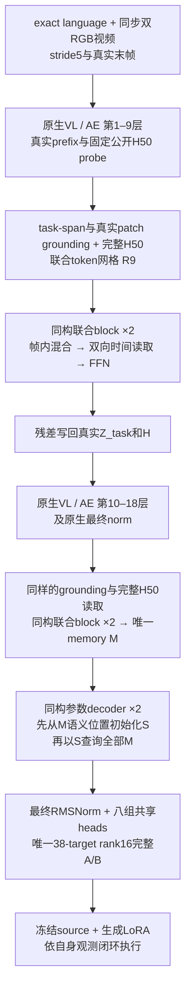

# 从 v5.2 处理原则推导的统一 Writer 设计

2026-09-17，第二轮设计已完成，Owner随后授权整套实现/实验goal；本文登记为唯一active design。
实现进度、实际launch资源、节点与结果只看[progress](../progress.md)；设计登记不等于新模型已经运行。
对应证据、预算、比较边界和原件见[证据审计](v52_evidence_audit_20260917.md)。
首轮“中层联合栈＋原v5.2全部尾端”保留在Git `426dc5be`；它是比较对象，不是本轮默认答案。

## 1. 结论与要解决的问题

本轮选择**原生中层与末端使用同一种联合视频块，随后以单一参数槽状态生成完整LoRA**。
原生1–9层 → 联合块×2 → Z/H双残差写回 → 原生10–18层 → 同构联合块×2 → 同构参数读出块×2 → 八组共享A/B头。
取消独立Core编码器、独立Procedure编码器、P中心化和专门Core/P AdaLN；它们承担的内容获取、过程组织和条件化读取
分别由统一视频表示与连续参数槽更新重新实现，不声称这些旧部件已被消融证明无用。
保留真实视觉内容、完整H、源网络内部消费、内容先行的参数初始化、归一化、小型共享完整A/B出口与三Meta共同学习。
这继承的是v5.2有依据的处理原则，而不是要求新的计算图逐模块包含v5.2。

主要问题不是将 130 多的已有能力视作无用，而是：

1. **视频特异性没有可靠复现。** 旧 v5.2 曾有真实视频依赖正例；当前 A 的主图近等价、absolute 甚至更高，
   却没有复现旧强特异性。需要让过程知识更容易进入生成参数的主路径。
2. **对合理训练条件变化脆弱。** 同图换 task grouping／优化时钟会明显变化；当前 source、标签和采样纠正后也不能自动保持旧性质。
   需要解释具体学习机制，不能以“底座变了”免除方法责任。
3. **获取和保持是两个问题。** 分数上涨时仍有大量新旧成功交换；A 较晚训练保持而 validation 回落。
   新结构须尽量保留已有获取能力，但不把 residual、归一化或参数共享说成闭环保持保证。
4. **结构可扩展且与训练一致。** 全部 Writer／Meta fresh、纯同 task 跨 episode FM 共同训练；
   增加容量通过复制同构块，不依赖越来越多的专用监督、分段冻结或部署优化。

长期资格仍为 validation8 single-checkpoint strict paired correct **>145/400**，并满足相邻稳定、breadth、
四 suite、Goal/Long、换正确视频和最终因果 controls。本文没有将新设计的理论可行性写成这项资格已经成立。设计选择明确，性能主张仍需新证据。

## 2. 证据究竟允许得出什么

这里将“实测事实”“结构性质”“工作假设”分开。完整审计保留短窗口和负结果，不只挑最强 checkpoint。

| 证据 | 能支持的判断 | 对设计的约束 |
| --- | --- | --- |
| 旧 v5.2 132、v6 task-complete 143、当前 A 140，以及各自完整曲线 | 普通 FM 的合法视频到完整 LoRA 可以获得真实能力；尚无稳定资格 | 保留绝对内容、功能信用和有容量的输出原则；整组合正例不证明每个旧模块必须保留 |
| v5.2 old900/TC150 同 3,600 条件为132/51；v6 同曝光为95/111 | 配方影响很大，且与架构交互；曝光相同不是优化过程相同 | 保留 task-balanced 小组更新和实际优化时钟，不能只匹配样本总数 |
| 固定 native 因子投影损伤已知成功行为；P/Q 完整出口有局部正增益；Pullback free-A/B 行为优于 free-q | 若干固定出口确实排除了可取得的功能；具体干预不证明所有自由出口可学 | 输出保留可学习完整 A/B，不重新套固定 X/Y、PCA 或单一 q 的硬映射 |
| 完整 P/Q 已有真实视频、四层共享主干、完整 A/B 和 FM，却多任务弱；Semantic-Path 也有小型共享 heads 和调制却弱 | “完整 A/B＋共享 Transformer＋FM”不是 v5.2 优势的充分解释 | 解释具体内容路径、归一化、读取位置和共同训练，而不是通用流程 |
| G2 动态读出正；G3 共享编译弱；真纠正 G 有局部闭环增益，合法 RGB 预测场弱 | 有信息、存在可解更新、能共享获取、能闭环，是四件事 | 不用 oracle／probe 代替全链；本设计仍须由真实 FM 和闭环裁决 |
| 双相机 source t=1 输出在训练侧动作预测上优于任务均值；单相机在同诊断上弱 | 原生 source 在合法双视角下有可用动作先验；不是视频世界模型 | 用真实双路 RGB、真实前缀和完整 50 horizon，不增加没有证据的 denoise 深度 |
| 旧source上v5.2双相机/learned-H50 B完整1200步只有97→105→77→85，训练35→49→50→56；语义共现C600更弱 | 原生输入更完整及语义分组都不自动转为更强闭环；也存在source/标签/池变化的混杂 | 双相机/fullH是当前输入合同，不能充当新架构收益；需同读取条件的v5.2 matched基线 |
| 历史多层 native memory、Horizon 反复外部读写、native-reader 诊断已有不同程度交互 | 不能宣称首次使用原生层、多轮读取、完整 H 或真实 Value | 新假设严格限定为“跨帧结果写入真实中间 Z/H 并由原生后续层消费” |
| A1200→2700：validation135→108，train62→64；相邻大量交换 | 较长趋势有泛化回落；不能从净分或小参数距离判断保持 | 不将架构小改、低漂移或 norm 当保持证据，保留相邻逐行验证 |

这些证据**没有识别出唯一的 v5.2 成功原因**。最可信的解释是一个相互配合的组合：
保留绝对视觉内容、允许过程调制但不强制所有能力来自差分、少量共享且归一化的参数生成坐标、三个 Meta 的共同学习，
再加与之相容的优化过程。后继方法常同时改变其中数项；当前 A 又证明完整组合也不足以保证视频特异性。
把组合中的任意一项单独宣布为因果答案，会越过现有证据。

## 3. 从真实 task 到应学习的对象

本节只使用固定 train24 中的 specification 和合法 RGB。审读了四个任务的 BDDL 与 demo_0 双相机图像；
没有读取 teacher action/state、held action、reward 或 Test。所有视频按 stride5 并保留真实末帧。
task 来源是 [target manifest](../configs/pi05_target_data_v1/manifest.json)；RGB 来自其固定 revision 的 canonical HDF5。

| 训练 task | 原件事实 | 要迁移的知识；不能混淆的内容 |
| --- | --- | --- |
| Spatial global0：取盘子与 ramekin 之间的黑碗，放到盘子上 | 初始有两个同类黑碗；目标是指定 bowl 的 On(plate)。demo_0 显示选碗、抓取、搬运、放置 | 语言用于关系定位；图像提供实例、可接触部位和真实转换。不能仅靠“有一个黑碗”或复制 teacher 像素位置 |
| Goal global20：打开中层抽屉 | 目标是中层抽屉 Open；RGB 显示靠近把手、接触并拉出 | 需要将目标部件与允许的接触／移动方向联系起来。执行初态和接近姿态不同，不能复制视频时刻的动作 |
| Long global39：黄白杯放进微波炉并关门 | **初始微波炉已打开**；目标为 In(mug,microwave) 与 Close。demo_0 可见放入、撤手和关门 | 门可通行、杯子放入、手退出等关系约束有价值；不能杜撰此 task 必须先开门，也不能只学终态图像 |
| Long global37：汤罐和奶酪盒都放进篮子 | 目标是两个 In 的合取，没有指定两件物体的事件先后 | 一个 demonstration 展示一种完成顺序；不能把这个顺序提升为任务必须遵守的总序 |

已审 train24 的成功谓词有 19 个单原子目标、5 个合取目标；没有事件顺序计数器。
这不代表过程无用：可达性、接触、遮挡和物理前置关系仍限制成功轨迹；也不代表全部任务都必须模仿 teacher 顺序。
详见[信息可识别性分析](video_information_identifiability.md)。

令任务知识为 k，当前机器人观测为 o，任务条件策略为 π(o,L;k)。应从视频学习的是

\[
 (L,V)\longmapsto k\longmapsto\Delta W,
 \qquad a\sim\pi_{W_s+\Delta W}(o,L),
\]

其中 k 可以隐式包含目标实例关系、可执行接触、状态转换和部分顺序，不要求新增人工事件标签或显式符号图。
一个固定 task LoRA 可以编码随自身 o 变化的行为；固定参数不意味着固定动作序列。
teacher 时间 t、执行动作 chunk 的 horizon h、FM flow time τ、网络层 j 是四个不同坐标。
不能用 h 对齐 teacher 的绝对视频时刻，更不能用 teacher 的当前帧替代执行策略自己的状态。

### 3.1 为什么纯 FM 可以学，也可以走捷径

先考虑任务条件下teacher与action query独立的分布，例如历史不相交分池的独立抽样，或独立episode总体模型。
把合法LoRA w的期望FM风险记为R_T(w)。在这个明确前提下

\[
 \mathbb E_{V,Q}\ell_{FM}(W_\theta(L_T,V);Q)
 =\mathbb E_V R_T(W_\theta(L_T,V))\ge\inf_w R_T(w).
\]

若函数类能表示、优化能到达每个已知 L_T 的最优 w，同 task 各视频输出同一个 w 已可达到下界。
因此，跨 episode FM 不强制同 task 不同视频产生不同参数，也不强制学到顺序。
但新 task 没有训练动作；“语言唯一标识任务”不等于有限共享模型已经知道如何实现它。
视频仍可能提供可迁移的操作知识。旧 v5.2 的正例阻止我们把上式误读为视频必然无用。

**当前46池排除同episode的采样不能直接套用严格独立前提。** teacher为episode e时，query排除e，
所以有限经验分布实际为R_{T,−e}，目标是M^{-1}Σ_e R_{T,−e}(W(L,V_e))，这里M=46。
若episode等权、记各episode风险为R_{T,e}，有

\[
 R_{T,-e}(w)={M R_T(w)-R_{T,e}(w)\over M-1}.
\]

这个排除效应产生有限池依赖，不能把它说成严格为零，也不能在未给出损失界时宣称数值可忽略。
它主要改变“哪个训练episode不在query支持中”，并未提供必须理解物理顺序的监督约束。
因此精确结论是：独立总体下有上述静态最优解论证；当前经验训练仍允许强静态task映射，
但不能声称同一个w必然达到其逐teacher条件最优下界。两者都不能代替新task视频增量的实测。

本设计不新增错误视频训练、顺序判别、静态清零或 teacher/query 绑定去人为制造可识别性。
它尝试改善**有用动态证据进入有效参数更新的函数类与学习路径**；纯 FM 中的静态捷径仍是公开残余风险。

## 4. v5.2 的具体结构与可检验解释

每帧真实图文前缀和公开、固定的 Gaussian action suffix 经过完整原生网络，得到 patch X_t、task-span Z_t、
完整 H_t∈R^{50×1024}。旧结构随后才跨帧计算：

\[
 E_{t\ell}=W_Z Z_{t\ell}+\operatorname{Attn}(q_\ell^{text},W_ZX_t,W_ZX_t),
 \qquad C=\operatorname{LangBlocks}(\operatorname{FrameRead}(E)).
\]

FrameRead 对每个 task token 沿全部帧聚合，初始化约 95% 均匀＋5% 学习权重。
文本 q 用于寻址，没有直接进入这个 readout Value 的残差；但多模态 Z 本身含语言，故不构成视频必要性的保证。
旧 Procedure 为 H50 均值投影后两层 causal Transformer，使用真实 raw frame index 的 RoPE。

对 320 个 layer/rank slot，原编译器为

\[
 c_i=\operatorname{Attn}(r_i,N(C),C),\quad
 p_i=\operatorname{Attn}(r_i+N(c_i),N(P),P-\bar P),
\]
\[
 (\gamma_i,\beta_i)=W_m N(p_i),\quad
 s_i=(1+\gamma_i)\odot N(c_i)+\beta_i.
\]

之后有一次 slot self-attention／FFN 和最终 RMSNorm。八组 family/side heads 为
256→216→native width，生成所有 38-target rank16 的 A=A0+ΔA、B=ΔB。
总 head 参数 1,838,592，旧 Writer 共 10,237,704；三个 rank4 Meta 都属于 Writer 的可学习读取侧。

这比“video→backbone→LoRA”多出了以下实质解释，但证据强度不同：

1. **绝对内容与过程分工是确实存在的函数性质。** P 为零仍可从 C 生成有效 LoRA；
   差分路线则可能在禁止静态 Value 时连有用的目标内容和基线能力一起移除。
   这是保留内容路径的理由，不是证明所有视频内容都已被正确理解。
2. **归一化与调制提供条件化的共享坐标。** 对 RMSNorm，忽略 epsilon 的简写为
   J_N≈diag(g)/r·(I−xxᵀ/(d r²))，控制整体尺度并削弱径向变化。
   它可能改善 FM 优化条件；没有匹配删除实验，不能从此推出闭环优势。
3. **共享 heads 池化跨层信用。** 对一个 family，B_l=W_f Φ_lᵀ；不同层仍有不同 Φ_l，
   但共享学习到的输出坐标。它以较小参数规模训练许多条件化更新；Target-Owned 解开共享时同时改变了输入和归一化，
   因果归属并未隔离。Semantic-Path 的失败还说明“小 head＋调制”单独不够。
4. **完整 A/B 不等于无约束的任意矩阵。** 共享 head 仍有其学习到的有限列空间；优势在于这个空间由任务信用共同学习，
   而不是预先固定为某个 source X/Y/PCA span。它不是对任意 rank16 更新的完备性证明。
5. **共同学习不能省略。** v5.2 的 Text/VL/Action Meta 与输出共同更新；早期 P/Q 冻结 observer。
   但 later native-correction／field 联训仍弱，故共同训练也不是单独充分条件。

### 4.1 一个确切的结构弱点：Core 对时间置换不变

在旧逐帧 native 图中，E_t 独立计算，Core 的 FrameRead 是帧集合算子，因而在固定参数下

\[
 C(V_\pi)=C(V)
\]

对任何帧置换 π 成立（忽略正常浮点 reduction 差异）。Core 可以读整条视频的丰富多状态内容，但没有显式顺序。
所有显式顺序影响只能从 P 通过 W_m 的调制进入 slot。局部 Jacobian 为

\[
 {\partial s_i\over\partial p_i}
 =\left[\operatorname{diag}(N(c_i))W_\gamma+W_\beta\right]J_N(p_i).
\]

这不是整个Writer对顺序不敏感的定理，也不是P数学上只能作很小修正：β和γ训练后可以显著改变乃至主导slot。
旧v5.2的时序依赖正例正说明该通路能工作。这里确定的是“只有这一条晚期显式顺序入口”，
而不是已经证明它的容量不足或所有时序收益必然消失。

W_m 初始为零。B 输出末层也为零，原图通常第一步只学习 B 末层，第二步打开 Core／调制，第三步才打开 Procedure／Action Meta。
真实 A 日志与这个有限初始化过程一致。它能说明信用开启顺序，**不能解释数百步后所有差距**。
中心化 P 还会删除在各帧相同的公共分量；这有抑制静态旁路的作用，也可能丢掉被广播为公共上下文的过程知识。
不能据此断言 W_m 实际一直太小，或所有失败都由此产生。

当前 A 没有复现旧强特异性，与这个可忽略 P 的函数类相容，却不唯一证明它就是根因。
新设计针对的具体假设是：**不要让动态知识只能通过这一个晚期调制入口影响参数生成。**

### 4.2 为什么只向 H 写入时间信息不够

原生 block mask 使 prefix 只读 prefix，Action suffix 读 prefix 与 Action suffix。
所以只在中间 H_j 加跨帧消息，并继续原生计算，有

\[
 {\partial Z_{18}\over\partial H_j}=0,
 \qquad {\partial C\over\partial H_j}=0.
\]

它可能改进 P 的内容，却未改变上述 Core 顺序不变性。此前 H-only 候选不能被描述为已经解决主生成路径的消费问题。
因此，本设计把同一跨帧计算的结果**同时写回 task-span Z 和完整 H**。

这条零导数结论限定于旧Core读取图。本轮改为末端Z/H联合处理后，H-only也能通过末端联合块影响语义memory和参数；
不能继续声称它在新图中完全影响不了主要输出。仍选择双写回，是为了让原生后半段的视觉前缀和动作计算都消费跨帧上下文，
而不仅在native结束后才让视觉内容与动作上下文结合。

## 5. 从处理原则到统一架构的选择

### 5.1 v5.2值得继承的是什么

| 处理原则 | 比“video→native→LoRA→FM”多出的具体内容 | 本轮承接方式 |
| --- | --- | --- |
| 先有任务相关内容，再产生条件作用 | 多个task-token直接读取真实patch与上下文，内容没有被强制变成差分或少量动作目标 | 两个native边界都保留task语义和真实patch；参数槽首先从联合后的语义内容建立初值 |
| 过程应修正实际内容解释 | 旧slot的P读取由c条件化，随后以gamma/beta改变同一个参数内容；不是两个独立LoRA相加 | 统一Z/H上下文参与原生续算；同一参数槽在取得内容后继续条件化读取全部联合证据 |
| 在受控尺度的共享坐标中生成参数 | RMSNorm、256维slots、八个256→216→native-width heads；同family跨层共享输出坐标 | 保留256维、pre/post norm、同320个层/rank地址和八组heads；更换取得slot内容的计算 |
| 输出作用由执行者状态决定 | A/B共同学习BAx，不绑定teacher激活与执行激活，也不预固定为source/PCA span | 保留完整38-target rank16的A=A0+ΔA、B=ΔB；没有native硬投影、q回拉或额外adapter |
| 读取与参数生成一起适应真实功能信用 | Text/VL/Action Meta和Writer共同接受同一版本的跨episode FM | 所有读取、联合块、decoder和Meta fresh联合训练，source基础权重冻结 |

这些是有证据约束的组合解释，不是逐项已识别的成功充分条件。P/Q、Video Functional、Semantic-Path等反例
意味着“真实Value”“紧凑head”“共享Transformer”“可反传”各自都不够。新方案额外承担的是一个具体假设：
**在保留目标内容与自由参数坐标的同时，让共同的图文—动作表示跨帧形成，再参与原生动作计算和参数查询。**
不是先把视频压成另一个局部监督目标，再要求参数生成器追随那个目标。

“统一”在这里有三个可核标准：视频理解只维护一种带语义/动作位置的表示；时间组织只使用一种可复制block；
参数生成只维护一个连续更新的slot状态。不要求把输入维度、原生层和最终输出头伪装为完全相同的物理操作。

### 5.2 为什么选择这一版

| 实质不同的选择 | 优点 | 本轮判断 |
| --- | --- | --- |
| 首轮中层Z/H联合栈，再保留整套Core/P/AdaLN | 方便与旧图做较集中干预；整组合的历史依据最直接 | 是合理的控制实验候选，但不能因缺少删除消融就认定它是最协调的最终结构 |
| 完全外部的统一视频Transformer＋参数decoder | 接口短，直接使用成熟的最终native响应，不需中层续算 | Video Functional/Horizon等已有较近的外部共同处理；纯模块合并没有补上原生消费这个新假设，因此本轮不选 |
| **中层与末端的同构联合块＋内容起始的统一参数decoder** | 原生续算与完整视频理解有明确分工；保留内容锚点，取消独立过程摘要和特制融合；全H直到实际参数读取 | **本轮选择。** 同时重构表示和读出，整体比较负责；不冒充单模块消融或已证性能改进 |
| 每隔少量native层都加新写回位置 | 可增加原生与视频交互轮次 | 没有证据要求先加多处接口；首版用一个内部位置。增加容量先复制既有联合block，不增加新的接口类型 |

选择第三项不是因为“P看过同样信息所以可删除”。本轮将P的时间组织职责放入两处相同的联合块，
将Core的内容职责保留在语义token与第一层参数读取，将条件融合改为同一个slot的连续内容依赖读取。
这是明确更换计算分解；旧AdaLN可能有未保留的有用偏置，无法用函数类包含关系保证新图不退化。
我们接受这项可检验代价，因为本轮目标是统一的整体方法，而非以最少改变量定位一个旧模块的效果。

第9层是首版的平衡切点，前后各9层；不是“第9层已被证明最优”。仅一处写回使native消费假设具体、成本可控。
末端再用同构块，是为了让各帧经过原生后半段后的新响应重新交流，再交参数查询；两处输入不同，不是同一张量原样重复计算。
也不声称每一层都必需。当前每处两层让“帧内结合→跨帧传播”至少完成后再有一次跨角色组合；容量扩展只复制同一种块。

### 5.3 最早多通路方案没有被当作反证淘汰

此前讨论的真实形成链是：

1. 最初方案保留丰富内容直达compiler；另由跨帧关系触发第二次真实帧读取，并在AE内部消费；compiler具体结构尚未确定。
2. 后改成单次native计算中间的H残差写回，避免两次完整forward；引入“中层证据足够”的新假设，并非两者已证明等价。
3. 在进一步具体化时，一度把R写成视觉pair-MLP再由当前H查询，未充分交代原来可读取其它帧H的输入。这是接口说明的收窄，
   不是已有证据淘汰了其它帧H。
4. 后来接回完整Core/P/AdaLN尾部，理由是控制实验改变量；又曾因信息访问重叠提议删除P。将访问重叠等同功能可替代不成立。
5. 首轮正式文档改为Z/H联合同构栈并同时写回Z；双写回有真实mask依据。保留旧尾部仍是选择，不是推导出的必要条件。

本轮不再混用“控制实验方便”和“整体结构统一”两套评价标准。职责对应如下：

| 最早的功能通路 | 本轮保留在哪里 |
| --- | --- |
| 丰富内容直接可用，避免动态差分抹掉对象/关系 | 原生完整prefix、联合块残差、最终M的语义位置，以及S的内容初始化 |
| 整段Z/H提供前后关系证据 | 每处联合块先混合全部语义/H位置，再按真实时间读取所有帧；明确保留所有帧H |
| 过程进入native动作计算 | j9同时写Z/H，然后继续原生10–18层；原H与真实prefix均保留 |
| 原生动作响应重新约束过程解释 | 后半native产生新的Z/H，末端同构块继续联合处理，fullH不先变成单向量 |
| 观察知识转成执行状态可调用的作用 | 内容起始的S统一读取M，八组heads学习完整BA，真正的执行FM给全链信用 |

因果作用保留，不等于每条作用必须单独命名一个网络。最早shared compiler未定；本轮现在给出了它的明确内容、状态和更新规则。

### 5.4 一个具体的消费差异，而不只说“信息更全”

双向理解可能把一个有用的全视频条件b(V)广播到所有帧。若旧P_t=q_t+b(V)，中心化后的Value为q_t−mean(q)，
b不再直接进入Value；当所有q_t相同时，全部过程Value严格为零，寻址也无法恢复它。不能要求有益过程一定表现为帧间残余差异。
这不是旧P实际已经发生该失败的诊断，也不是整个旧Writer都不能另行编码b。

新memory允许M_t,r=c_t,r+b(V)。在decoder的线性Value读取中，由归一化权重之和为1，
`W_O Σ α_t,r W_V M_t,r = W_O Σ α_t,r W_V c_t,r + W_O W_V b(V)`。
因此共同的过程上下文有直接Value作用；它无需先经另一个专用调制矩阵，也不因帧间恒定被规定为零。
最终norm/head仍可忽略该方向，所以这里只证明取消了一种具体结构限制，不证明动态信用一定胜过静态解。

同时保留内容起始的S，是另一侧约束：不把新方案变成只有关系差分/过程码的生成器。
这两项共同构成选择统一表示的理由；它们不能单独解释v5.2的全部历史优势，也不为新图提供旧图全部函数的包含定理。

## 6. 完整可实现规格

### 6.1 原生输入与两个读取位置

K=1，一条同步agentview/wrist RGB，stride5及真实末帧，official rotation/render/model处理；exact language。
没有teacher action/state、reward、terminal、ID、filename、pose或policy outcome输入。
每帧使用同一公开Gaussian suffix `50×32`、flow time=1，保留真实完整prefix；不是捏造teacher动作或空图forward。
source基础权重始终冻结；三组rank4 Text/VL/Action Meta属于Writer，全部fresh联合训练。

记T为真实采样帧数，m为tokenizer给出的有效task-token数。中层j9保留完整prefix
`Z9[T,512+L,2048]`及`H9[T,50,1024]`；512为两相机各256 patch，L含原生合法prompt其余部分。
仅将task-span的m个token拿入新增联合网格；其它prefix内容在native主路径完整保留。
末端j18使用原生最终norm后的Z/H。j9按原生层间hidden处理，不提前使用原生final norm。

Text Meta只对真实exact language作一次18层text-only读取，同时保留Q9和Q18；两处grounding使用对应深度的text query。
不把final text hidden与mid-layer视觉坐标认定为天然等同，也不增加第二次完整text forward。
两处投影和grounding参数独立，因为原生深度不同；它们使用同一个模块接口，不强制跨深度共享数值坐标。

### 6.2 同一种输入表示：保留语义位置和全部H位置

对j∈{9,18}，P_Z^j为2048→256，P_H^j为1024→256。P_Z^j在该处的task、patch和text query间共享。
沿用v5.2实际TaskQueriedPatchGrounding的Q/K/O形式，Value直接来自投影后的真实patch：

\[
 E^j_{t,\ell}=P_Z^jZ^j_{t,task,\ell}
 +\operatorname{PatchRead}_j(P_Z^jQ^j_\ell,\ P_Z^jX^j_t),
 \qquad
 R^{j,0}_t=[E^j_t;\ P_H^jH^j_t].
\]

PatchRead有独立Q、K、O的d×d线性层和query/patch RMSNorm，8 heads；没有从语言query到输出Value的直接残差。
它不是物体检测器或跟踪标签。Z_task本身仍含语言，不能据上述query限制宣称排除了语言捷径。

`R[T,m+50,256]`保留两种位置。m个语义位置负责按语言组织内容；50个动作位置保留原生horizon坐标。
这里没有H均值、per-frame单向量P、event slot、固定阶段、局部纠正标签或低阶路径统计。
256维是可学习消息宽度；中层原生完整Z/H还在残差主路径，所有原始patch也仍在后半native中。
完整50只指没有删除horizon轴；2048/1024→256仍是有损投影，patch读取也有选择瓶颈，末端M不宣称无损保留全部native信息。

### 6.3 唯一的视频联合block

令S=m+50，N为不同模块各自的RMSNorm。一层为

\[
 R_1=R+\operatorname{MHA}_{role}(N_1(R);a),
\]
\[
 R_2=R_1+\operatorname{MHA}_{time}(N_2(R_1);n),
 \qquad
 R'=R_2+W_2\operatorname{GELU}(W_1N_3(R_2)).
\]

- role attention在每一帧的全部S个位置间进行；time attention对每个role读取全部T帧，无causal mask。
- 每套attention独立Q/K/V/O、8 heads；FFN expansion4；线性无bias、dropout0；无效task/padding不参与读取。
- a是两种learned type向量之一，加该type内部固定sinusoidal位置；语义位置与horizon位置分别编号。
  type向量共2×256，跨两处联合栈及decoder的memory地址共享；初始小随机，不能作为Value残差。
- role的Q/K为W_Q/K(N(R)+a)，V为W_VN(R)；time对投影后的Q/K施加raw-frame-index RoPE，Value无时间注入。
  原生token位置、视频时间n、action horizon h、flow time τ和native layer j互不替代。
- j9和j18各串联2层，总4层；各层参数独立。可以在两处复制同构层扩深，不额外发明监督或模块类别。

沿同h做时间读取不是宣称同h对应同一实体或真实未来事件：帧内混合已允许跨h、跨语义交换；后续层继续重新组合。
所有相同结构的操作跨frame/task共享参数，没有task embedding字典。全视频双向理解保留方向，但不将demonstration顺序当必须模仿的总序。

### 6.4 中层写回与原生消费

只有j9需要写回：

\[
 \widetilde Z^9_{t,task}=Z^9_{t,task}+U_ZR^{9,2}_{t,semantic},\qquad
 \widetilde H^9_t=H^9_t+U_HR^{9,2}_{t,action}.
\]

U_Z为256→2048，U_H为256→1024，均zero-init，其余非零线性用常规fan-in初始化；没有另一个gate。
真实patch和其它prefix token在此接口处不变。再继续原生第10–18层及各自final norm，保持原mask、RoPE、AdaRMS条件和完整prefix。
原生总计仍18层，不是两次18层。后半VL/Action Meta照常训练；基础参数冻结不等于hidden被冻结。

实际接口存在于安装版pi05的`compute_layer_complete`与joint forward层循环；现有Writer每帧原本就在此运行VL/AE联合18层。
实现时须分段调用原逻辑并在condition内同步全部帧，不能用写回前预计算的后半prefix KV替代新prefix。
写回只修改native激活；没有把teacher观察端H当成执行端X，输出A/B仍由真实执行信用学习。

只有改变H时，native prefix看不到它；同时改变Z使过程可以经原生上层再次影响patch/task解释及动作响应。
反向链允许`H9 → R9_semantic → U_Z → Z18 → M_semantic → S`，不再必须穿过旧P/AdaLN。
它不是更短梯度的定理：native Jacobian也可能衰减或扭曲新信息。中层消息可被忽略或损害预训练特征，属于这项研究假设的实质风险。

j18经过同样的grounding与2层联合块后，`M=R18,2[T,S,256]`就是唯一参数memory。
没有末端再写回native的无用投影，也不再创建独立Core/P。M的语义和动作位置仍可区分，但均已经是联合、带上下文的内容。

### 6.5 一个连续更新的参数状态，保留“先内容、后条件化读取”

使用原320个layer/rank槽地址：18×16个expert位置，另有action-in/out各16个；q/v使用同层槽、不同family head。
沿用query-table、module、layer、rank四部分地址与routing RMSNorm。它们只进Q/K，不是纯语言/任务Value。
初始内容`S0=0[320,256]`。两层decoder使用完全相同的更新形式D，但参数独立：

\[
 A=S+\operatorname{CA}(Q=N_q(S)+r,\ K=N_m(M_*)+a,\ V=M_*),
\]
\[
 B=A+\operatorname{SA}(Q=K=N_s(A)+r,\ V=A),\qquad
 D(S,M_*)=B+\operatorname{FFN}(N_f(B)).
\]

每个attention含通常的Q/K/V/O投影；8 heads，FFN为d→4d→d GELU、无bias、dropout0，四个pre-RMSNorm独立。
首层`S1=D1(0,M_semantic)`，第二层`S2=D2(S1,M_all)`，最后再RMSNorm送heads。
若增加decoder深度，复制D，后续层都读M_all；没有新的专用融合模块。

首层只读语义位置，是主动保留v5.2的内容起点，避免参数内容一开始仅由learned地址或50个horizon的token数量决定。
这些语义位置已读过完整H与全视频，不是静态Core或语言-only旁路。第二层以S1为查询，读取语义及全部H位置，
将补充证据写入同一个S。两层不是两套独立参数，也不把H提前压成每帧一个P再经gamma/beta影响输出。
这不保证S1一定主导S2，也没有给两种memory强制等权；第二层相等logits时H总质量为50/(m+50)。
模型可重新改变侧重，我们不为形式平衡再增加gate或loss；实际是否保留有效内容由功能与行为裁决。

删除的是独立Core两层、独立P两层、P中心化和专门AdaLN；承接它们的是联合视频块、内容初始化和同状态条件化读取。
共同广播到所有帧的有效过程上下文可以保留，不再因P减均值被规定为零。未声称新D与旧AdaLN数学等价、表达类严格包含旧图，
也未声称信息更全就一定更好。它是较一致的归纳偏置，实际能力由整体fresh比较负责。

memory地址a只有type及type内索引，没有frame地址；时间信息应已进入M内容，decoder不再增加一条只看视频长度/帧编号的Value。
对固定M，conditional CA的梯度同时含Value的直接项和内容相关的寻址项；后续slot SA允许不同层/rank的参数决定相互协调。
这是由真实内容形成输出的路径，不是已学会正确操作规律的证明。

### 6.6 唯一完整输出与部署

保留原八组FactorHeads：q_A/q_B、v_A/v_B、action-in_A/B、action-out_A/B，均为256→216→native width的无bias GELU网络。
目标为18层q/v和两个边界线性，共38-target、76个A/B factors、rank16；A=A0+ΔA，B=ΔB。
所有head末层按原合法identity方式zero-init，A0为合法非零模板，B0为零；LoRA alpha/rank=1，ΔW=BA。
共享head仍有其学出的有限列空间，不是任意矩阵完备性；但该坐标由跨task FM学习，不被预固定为native/PCA span。

Writer在rollout前运行一次。上述Meta、两处联合栈、memory与decoder都退出执行路径；仅冻结source＋生成的完整LoRA留在policy中。
policy读取自己的双相机、8维state及language，按官方10-flow、前5动作replan等合同执行；不读取teacher视频或在任务内优化。
固定参数通过当前执行激活`Δy_l(o)=B_lA_lx_l(o)`产生状态依赖行为，而非按teacher时间播放动作。

## 7. 从具体任务检查整条职责链

- **两只黑碗中的关系选物**：初始空间关系进入语义位置；其它帧H与语义共同提供搬运证据；写回Z允许原生上层带上下文读当前真实patch。
  目标被拿起后原始“在两物之间”关系消失，并不要求每帧重新按当前位置找另一只碗。最后S仍要学到能由执行者自身观测触发的控制。
- **打开中层抽屉**：视频展示把手接近、接触与位移；联合表示可比较状态变化和动作响应；不存在“h=某个视频未来帧”的强对应。
  最终动作由执行者当前把手位置决定，不能从教学速度直接得到控制时钟。
- **杯子入微波炉并关门**：开始门已开。视频中的放入、撤手、关门共同约束可行操作；全视频上下文可以帮助解释中间遮挡。
  架构没有虚构开门标签；动作条件作用须由跨episode实际FM学会。
- **汤罐与奶酪入篮**：两项完成关系都要保存；真实视频顺序是观察证据，不是成功谓词规定的唯一顺序。模型可按自身初态执行另一种合法顺序。

这些是应承担的功能职责和可表达途径，不是已测到attention在做物体追踪、已学出显式前置条件或已有世界模型。
一条观察轨迹也不唯一识别因果规律；跨task共享学习与source先验提供归纳来源，不提供必然识别的证明。
若自身部署输入不能区分所需执行状态，固定LoRA不能凭空补出它没有观测到的信息。

## 8. 学习、结构性质及主动反例检查

### 8.1 真实FM与共同信用

训练query来自同task另一episode的自身观测o、state s、正确action chunk a。令x_τ=τε+(1−τ)a，监督为ε−a：

\[
 \mathcal L(\theta)=\mathbb E\|f_{W_s+\Delta W_\theta(L,V)}(o,s,L,x_\tau,\tau)-(\epsilon-a)\|^2_{valid}.
\]

沿已纠正offset1和冻结source normalization，只计算合法动作维度。梯度穿过冻结执行网络到完整LoRA，再到全部Writer和Meta。
对执行层`y=(W_s+BA)x`，`∇_B L=G(Ax)^T`、`∇_A L=B^T G x^T`；x来自执行query，不是teacher H。
参数生成器因此学习如何把视频条件转换为在不同执行状态有效的作用，不要求两种坐标天然等同。

可沿用“LoRA叶节点余切→同参数版本Writer重放”的链式求导；不保存一张同时含全部执行queries与视频的巨大图。
Meta在各段checkpoint重算时须正确安装；Z9/H9/联合状态不能跨optimizer版本缓存，也不能detach当冻结cache。
所有模块fresh共同更新，没有G1–G3课程、辅助阶段标签、wrong/order loss、RL或trust回滚。

### 8.2 零初始化不会造成逐层串行解锁课程

- 第一次主FM backward：B-head末层可有梯度；因B及其末层为零，通常尚无上游功能梯度。
- B-head打开后的backward：终端联合块、decoder、读取Meta-B和中层U均存在信用路径；中层联合块内部仍受自身U=0阻断。
- U更新后：中层联合块及其读取参数存在信用路径。多处写回的扩展也不要求所有U相乘，因为每处都有native residual主路径。

这是路径可达性，不能保证每个task/参数每步非零，也不忽略Meta自身A/B初始化。纯weight decay可改变参数但不等于功能信用。
不因首步上游零梯度宣称bug，也不能用这几步的有限启动解释数百步后的性能差。
U=0只恢复给定Meta下逐帧独立的native读出；终端联合块和新decoder仍然存在，因此整个Writer不等价于v5.2。
只有所有输出B仍为零时，生成的执行policy才与同一source的identity-LoRA函数一致；这不继承任何旧训练checkpoint的能力。

### 8.3 可以确定的三个性质

**静态重复不凭帧编号产生过程。** 若真实双RGB、语言和probe在所有帧相同，native逐帧表示相同。帧内算子不读t；
逐role的time attention中全部Value相同，所以任意RoPE权重的归一化和都等于同一个Value。FFN共享，归纳得到各帧仍相同。
中层写回及后半native保持这一性质；末端M每个role是T份相同副本。decoder没有frame地址，CA中T份副本的softmax分子/分母同倍抵消。
故在指定mask、无dropout、无时间Value/全序列统计等条件下，整个LoRA输出对重复次数T不变（忽略正常浮点差异）。
有效role必须有同一组有效帧，padding从K/V排除，各有效query至少有一个key，原生位置在每帧内部重用，RMS有正epsilon。
这保留非零静态能力，不等于“静态视频必须输出零LoRA”；No-change的旧失败阻止把这个性质当行为收益证明。

**顺序可影响内容起点和后续读取。** 非重复视频的time Q/K包含方向，改变顺序可改变R9及R18；S1虽只读语义位置，
其Value已包含该上下文。因此显式顺序不再被限定在最后一个P/AdaLN入口。它是可表达性，不是任意权重/视频都必须改变输出的保证。
若将frame和原时间标签一起置换，表示的仍是同一个带位置集合；最终输出应保持不变。真正的shuffle/reverse必须交换RGB内容，
同时把它放到重排后序列的固定位置上。现有`frame_control`已将content permutation与natural positions分开，本设计继续此合同。

**纯地址不直接产生参数内容。** 在线性/FFN无bias、S0=0、Value不含地址的合同下，若M=0则S一直为零，head产生ΔA=B=0。
真实静态图像或语言条件的native hidden并不是零，故这不是video必要性的证明，不能用它替代learned language-only参照。

### 8.4 提前回答可预见的问题

| 问题/反例 | 本轮固定立场；不因问题本身改变架构 |
| --- | --- |
| 语言或静态画面仍可能足够降低FM | 承认并保留§3.1的风险分析；架构选择是改善合法获取的归纳偏置，不伪造纯FM唯一动态最优解，不据此切掉绝对内容或临时添加辅助loss |
| 内部写回可能被native消除 | 残差与共同Meta使路径可学，不能保证有效；终端统一处理保留完整最终响应。若匹配训练证明写回无益，应否定其增量，不把激活有差别当成功 |
| 两处联合块是否重复 | 第一次影响native计算，第二次组织经过native消费后的新响应；同构层是重复运算的容量配置，不宣称每层都有独立人工语义；不按名称重复就删层 |
| 新尾端已能读H，为什么还同时写Z | 新末端H-only也可影响参数；双写回的目标是原生后半VL与Action均带上下文计算，旧Core零导数不能被滥用为新图输出不可达证明 |
| 为什么不是全部18层都插入 | 一处内部写回已经检验关键机制，首版避免增加无证据的接口；扩深先复制联合block。第9层是固定工程选择，不冒充最优层位 |
| 取消P/AdaLN会不会丢能力 | 可能。职责已明确重实现，保留内容初始化/归一化/共享完整heads，但没有旧图函数类包含保证；整体fresh闭环比较决定是否接受这一代价 |
| 只读task-span会不会丢小物体 | 每处额外由task query读取全部真实patch，原生prefix从未删patch；m/d有限仍可能成为选择瓶颈。保留真实证据可访问，不宣称无损压缩 |
| 完整H是否真的被使用 | 两处role attention及末端参数读取都接收全部50位置，未预先均值；模型仍可学会忽略某些位置。保留接口不是有益使用的证据 |
| 动作token的h是不是未来teacher时刻 | 不是；h是原生动作位置。与视频t分开编码，帧内操作允许跨h，没有强制物理对齐 |
| 为什么不直接拿H生成A、把native知识写进去 | 观察端H与执行端X不同；固定A=H/RX或Jacobian回拉会加入已经有负证据的硬出口限制。选择由执行FM学习自由A/B映射 |
| 13M参数是否一定比旧10M更稳 | 不一定。共享坐标降低参数规模不提供泛化/闭环保持上界；不凭参数数目宣称解决脆弱性 |
| 是否还存在多通路 | 存在多种因果作用，但只维护统一M与连续S；不是多个expert/LoRA。强行只留差分通路会丢绝对内容，故不追求这种形式统一 |
| 相邻成功集还能变化吗 | 能。闭环接触与分布偏移可放大更新，FM下降和参数小变都不保证保持；保持是独立行为资格，不把残差设计称作防遗忘算法 |
| 旧负例是否都被归为训练不够 | 没有。复用完整审计的具体预算；有限non-pass、内部/privileged正控、长窗口退化分别约束判断，不用新命名复活已否定的同一组合 |

闭环线性化`δx_(t+1)≈(A_t+B_t J_π,x)δx_t+B_t J_π,θ δθ`说明，局部小变化可多步传播；接触边界更不由该线性近似保证。
本设计没有从理论上解决所有保持、任务分布迁移或部分可观测问题。承认这些边界不会自动推翻统一结构的选择。

## 9. 与近似历史方法的实质差异

| 最近历史 | 本轮具体不同；仍保留的约束 |
| --- | --- |
| v5.2/v6 | 内容与自由参数坐标有真实能力；本轮将时间组织移入共同语义/动作状态与native续算，参数端不再独立组织C/P后做专门调制 |
| P/Q与native memory | 已有完整H、多层读取、共享块和完整出口，不能宣称首次；所审旧memory为逐帧one-way，跨帧结果不写回真实Z/H再续native |
| Horizon | 已有全H、端点视觉重读、局部/长程反复反馈；其反馈在native结束后的外部U中。本轮跨帧结果参与真实native层，且不先收缩为每帧P4与巨大独立D |
| Video Functional及pure-FM/VL后续 | 已有E[T,L,256]、轴向块、真实Value、联合信用；H在初次pair-read后已压缩，跨帧发生在native之后，输出用旧大D。本轮原生中层消费、全H保持和紧凑共享完整heads三项共同改变；不能把旧失败归因唯一一项 |
| Semantic-Path | 已有语义轴、fullH、自由紧凑heads、条件调制与纯FM；它把状态压成32维和二阶统计。本轮没有固定低阶过程统计，直接保留联合tokens并在真实native中消费；旧100更新不是所有此类函数的否定 |
| native-reader诊断 | 确有执行AE中层注入，但固定视频E、只训练reader、无joint Writer闭环；不是本轮teacher读取側Z/H共同更新 |
| 原生纠正场/Pullback | 有有限真正功能/闭环正控；合法共享获取弱或出口有限。本轮不要求先预测privileged纠正，不把最终BA限制为特定source span或一个q的回拉 |

本轮没有新行为证据。区别清楚只能说明假设不同，不能把“历史没试过”当作推荐理由的全部。
推荐理由是§5的内容/条件作用/共享坐标原则与§6–8的完整学习接口共同成立；正负实测仍拥有最后裁决权。

## 10. 参数、计算与实施边界

d=256、两处各N=2个联合block，8-head，FFN4d；decoder深度2。按本规格逐项解析：

| 部分 | 参数数 |
| --- | ---: |
| Text/VL/Action rank4 Meta | 2,469,888 |
| 两处Z/H down投影＋一处Z/H up投影 | 2,359,296 |
| 两处真实patch grounding，含各自norm | 394,240 |
| 4个联合block，含pre-norm | 4,197,376 |
| 2个type向量 | 512 |
| 2个参数decoder，含pre-norm | 2,099,200 |
| 原slot地址及routing norm，最终输出norm | 91,904 |
| 八组完整A/B heads | 1,838,592 |
| **合计** | **13,451,008** |

Meta数来自安装版18层、8个Q heads/1个KV head、head_dim256、VL2048/AE1024的q/k/v/o规格；
这是设计解析计数，不是已实现模型的runtime报告。不包含冻结source。加一层联合block增加1,049,344个参数；
两处同时各加一层增加2,098,688。继续复制decoder增加同构内容读写能力，不改变输出38-target合同。

令S=m+50，每联合block的attention pairs为`T S² + S T²`，不是对T线性；投影/FFN另有`O(T S d²)`。
以T105、m25为例，一层1,417,500 pairs，四层5,670,000；两层参数CA分别为320×105×25及320×105×75，
共3,360,000；slot SA另有2×320²=204,800，patch grounding另计2×105×25×512=2,688,000。
同一联合层直接展平全部T×S做attention则为62,015,625 pairs，轴分解有明确成本理由，非免费或线性视频模型。

原生仍18层，有一个跨帧同步/写回边界。中间真实prefix/H须保留或按同版本checkpoint重算；末端逐chunk可形成M输入再释放不再需要的native缓冲。
仅冻结视觉embedding可按现有合同缓存；不能复用写回前的后段KV。正常BF16/TF32及高效kernel可用，不追逐低位一致。
真实最长视频的整次FM更新、LoRA/s、显存峰值、checkpoint重放与梯度须在实现后profile；运行前核实实时GPU与独立quota。
若成本不可承受，公开具体证据再修订物理执行，不能静默缩短视频、去掉相机或预先均值H。

### 10.1 实现的单一所有权

Owner已授权本轮实现：现有video_program负责真实输入、分段native/Meta、统一视频表示及两处联合块；
temporal负责同构block/decoder算子，model负责完整target路由与FactorHeads；现有function_credit/replay复用真实FM/VJP。
同一canonical运行面整体替换旧Core/P调用，不保留平行生产fallback。新schema/fresh checkpoint，旧Writer不兼容resume。
训练、数据、schedule、evaluator继续原有owner；不因为架构设计重写这些已成立的合同。

## 11. 训练与可证伪的验证合同

本节为本轮训练比较的科学合同；实际资源、物理batch、峰值预算与launch在真实profile后封存，当前运行状态只看progress。
旧A3000/C等无关实验不自动恢复。新架构和匹配v5.2均fresh；v5.2使用冻结历史源码，不保留第二套canonical生产路径。

- 纠正后的raw1000 source、固定train24/validation8/test8，首轮不扩meta tasks；three Meta/Writer/optimizer/scheduler/RNG均fresh。
- teacher与action训练池0–45，同task排除同episode；46–49仅训练任务诊断。每次更新4个等权task，每条件21 queries，global84。
- 纯FM，AdamW lr3e−4、betas(.9,.95)、eps1e−8、wd1e−4、clip1；warmup100、decay12000至1e−5，观察窗口不重启优化时钟。
- 初始2400 updates＝9600条件／201600 queries，均衡约400条件/task；correct400＋train96在600/900/1200/1500/1800/2100/2400，
  每100保留完整状态。1200前不以单点低分否定结构；之后两个相邻有信息量节点持续缺乏获取可按注册作non-pass。
  有实质持续获取才讨论连续扩展，不因FM下降无限等待或扫seed/LR/层位/rank来挽救。

**整体架构比较**使用相同source、dual/full50实际learned read、task/query事件、LR时钟和曝光的fresh v5.2作为参照。
旧单相机A或旧source B只能作背景；本轮同时改视频组织和参数读出，因此结果只直接裁决整体方案。
若要进一步宣称“native内部消费本身有增量”，还需同一统一末端、关闭整个j9新增读写的fresh对照。
在已训练模型上把U临时置零只能解释该模型的依赖，不能替代fresh方法比较。预算不足时可以报告整体结果，但不得作超出比较的单因归属。
这些是科学比较臂，不要求保留第二套生产实现。Owner允许结果不佳而有具体改进空间时集中修正并fresh重训，
改进须先写清失败证据、改变的主要变量、预测和停止标准；不做无依据的小扫或无限续训。

正式资格仍由single-checkpoint correct严格>145/400、相邻稳定、breadth、四suite非零及Goal/Long承担；
每task整轮50条teacher各一次，跨checkpoint与arms严格固定配对，报告retained/gained/lost、churn、Jaccard与逐task/suite。
有正确能力与相邻证据后做same-task-other；冻结selected checkpoint后补wrong/no-video/shuffled/reversed，真实重排frames再完整forward。
最终controls不进入loss、选点或架构返工；Test仍封闭。过去sealed材料只说明当时结果，不反哺本方案。

要声称视频相对语言/静态先验有必要增量，参照须实际学习：

- language-only用合法text-only native和可训练参数decoder/head形成独立诊断模型，不输入假图像或action suffix，不借用视频特征；
  相同task/query预算、优化时钟，完整报告其架构与参数差异。不能把零LoRA当成learned language baseline。
- static用真实第一帧同步双视角、同一候选全部处理、T=1，fresh匹配query预算；没有故意弱化训练。
- 不强制另训frame-set；相应地，最终shuffle/reverse只支持固定模型的顺序依赖，不能证明优于所有充分学习的无序方法。

提前固定判断：若正确绝对能力不足，不能靠错误条件更差接受方法；若正确能力有而视频增量没有，就只取得条件适配，
没有实现视频教学目标；若两者出现但相邻/合理训练条件下消失，脆弱性未解决。若统一架构充分学习后显著弱于匹配v5.2，
应拒绝该具体改造，而不是以“更优雅”或内部信号更好为它开脱。

## 12. 设计立场与交付范围

本轮选择明确：采用§6的两处同构联合处理、一次native双写回、内容起始的单一参数状态和共享完整heads。
不再将首轮“桥接＋保留全部尾端”同时保留为另一份canonical候选；历史通过Git与§5.3追溯。
决定来自功能职责、学习接口、明确成本和历史边界；不会因owner问到一个已登记的限制就立刻删除模块或增加新支路。
若出现真实合同矛盾、新的反证或足以改变成本判断的测量，应据证据修订；“坚定”不要求维护被证伪的结论。

第二轮分析已完成完整架构推导和主动反例检查，尚不构成科学性能资格。source后半段消费、FM选择有益过程、未见任务保持和训练条件鲁棒性
仍是具体且可证伪的学习主张。结构性质、数学路径与可实现接口已经逐项给出；不把这些性质冒充实测成功。
后续实现/实验已获Owner授权，按progress/task_plan记录事实。信息墙、Test封闭和全部原证据保留不因执行授权改变。
