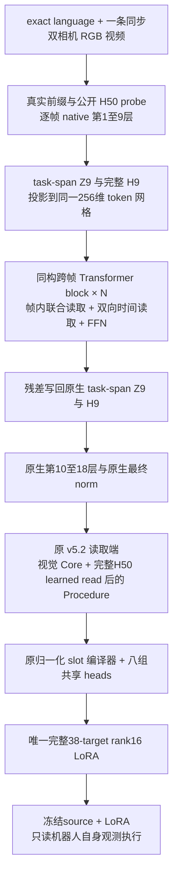

# 从 v5.2 证据推导的原生跨帧 Writer 设计

2026-09-17。本文交付 owner 要求的分析与架构设计；不是运行合同，不授权实现、训练、评测或恢复历史实验。
对应证据、预算、比较边界和原件见[证据审计](v52_evidence_audit_20260917.md)。

## 1. 结论与要解决的问题

本设计选择保留 v5.2 的视觉内容读取、归一化 Core/Procedure 编译器和八组共享完整 A/B 输出头，
把新的建模能力放在**原生视觉语言／Action Expert 中间：对真实视觉任务 token 与完整动作响应一起做跨帧计算，
同时写回两种原生 hidden，再让剩余原生层解释它们**。新增主干只有一种可堆叠的 Transformer block。
它不把视频压成动作目标后再经固定 Jacobian 编译，也不要求输出落在冻结 native X/Y 或 PCA 的子空间。

主要问题不是将 130 多的已有能力视作无用，而是：

1. **视频特异性没有可靠复现。** 旧 v5.2 曾有真实视频依赖正例；当前 A 的主图近等价、absolute 甚至更高，
   却没有复现旧强特异性。需要让过程知识更容易进入生成参数的主路径。
2. **对合理训练条件变化脆弱。** 同图换 task grouping／优化时钟会明显变化；当前 source、标签和采样纠正后也不能自动保持旧性质。
   需要解释具体学习机制，不能以“底座变了”免除方法责任。
3. **获取和保持是两个问题。** 分数上涨时仍有大量新旧成功交换；A 较晚训练保持而 validation 回落。
   新结构须尽量保留已有获取能力，但不把 residual、归一化或参数共享说成闭环保持保证。
4. **结构可扩展且与训练一致。** 全部 Writer／Meta fresh、纯同 task 跨 episode FM 共同训练；
   增加容量通过复制同构块，不依赖越来越多的专用监督、分段冻结或部署优化。

长期资格仍为 validation8 single-checkpoint strict paired correct **>145/400**，并满足相邻稳定、breadth、
四 suite、Goal/Long、换正确视频和最终因果 controls。本文没有将新设计的理论可行性写成这项资格已经成立。

## 2. 证据究竟允许得出什么

这里将“实测事实”“结构性质”“工作假设”分开。完整审计保留短窗口和负结果，不只挑最强 checkpoint。

| 证据 | 能支持的判断 | 对设计的约束 |
| --- | --- | --- |
| 旧 v5.2 132、v6 task-complete 143、当前 A 140，以及各自完整曲线 | 普通 FM 的合法视频到完整 LoRA 可以获得真实能力；尚无稳定资格 | 保留已成功完整组合的主要读取／输出机制，不以全面重启推翻它 |
| v5.2 old900/TC150 同 3,600 条件为132/51；v6 同曝光为95/111 | 配方影响很大，且与架构交互；曝光相同不是优化过程相同 | 保留 task-balanced 小组更新和实际优化时钟，不能只匹配样本总数 |
| 固定 native 因子投影损伤已知成功行为；P/Q 完整出口有局部正增益；Pullback free-A/B 行为优于 free-q | 若干固定出口确实排除了可取得的功能；具体干预不证明所有自由出口可学 | 输出保留可学习完整 A/B，不重新套固定 X/Y、PCA 或单一 q 的硬映射 |
| 完整 P/Q 已有真实视频、四层共享主干、完整 A/B 和 FM，却多任务弱；Semantic-Path 也有小型共享 heads 和调制却弱 | “完整 A/B＋共享 Transformer＋FM”不是 v5.2 优势的充分解释 | 解释具体内容路径、归一化、读取位置和共同训练，而不是通用流程 |
| G2 动态读出正；G3 共享编译弱；真纠正 G 有局部闭环增益，合法 RGB 预测场弱 | 有信息、存在可解更新、能共享获取、能闭环，是四件事 | 不用 oracle／probe 代替全链；本设计仍须由真实 FM 和闭环裁决 |
| 双相机 source t=1 输出在训练侧动作预测上优于任务均值；单相机在同诊断上弱 | 原生 source 在合法双视角下有可用动作先验；不是视频世界模型 | 用真实双路 RGB、真实前缀和完整 50 horizon，不增加没有证据的 denoise 深度 |
| 旧source上v5.2双相机/learned-H50 B完整1200步只有97→105→77→85，训练35→49→50→56；语义共现C600更弱 | 原生输入更完整及语义分组都不自动转为更强闭环；也存在source/标签/池变化的混杂 | 双相机/fullH是当前输入合同，不能充当新架构收益；需同读取条件的v5.2 matched基线 |
| 历史多层 native memory、Horizon 反复外部读写、native-reader 诊断已有不同程度交互 | 不能宣称首次使用原生层、多轮读取、完整 H 或真实 Value | 新假设严格限定为“跨帧结果写入真实中间 Z/H 并由原生后续层消费” |
| A1200→2700：validation135→108，train62→64；相邻大量交换 | 较长趋势有泛化回落；不能从净分或小参数距离判断保持 | 不将架构小改、低漂移或 norm 当保持证据，保留相邻逐行验证 |

这些证据**没有识别出唯一的 v5.2 成功原因**。最可信的解释是一个相互配合的组合：
保留绝对视觉内容、允许过程调制但不强制所有能力来自差分、少量共享且归一化的参数生成坐标、三个 Meta 的共同学习，
再加与之相容的优化过程。后继方法常同时改变其中数项；当前 A 又证明完整组合也不足以保证视频特异性。
把组合中的任意一项单独宣布为因果答案，会越过现有证据。

## 3. 从真实 task 到应学习的对象

本节只使用固定 train24 中的 specification 和合法 RGB。审读了四个任务的 BDDL 与 demo_0 双相机图像；
没有读取 teacher action/state、held action、reward 或 Test。所有视频按 stride5 并保留真实末帧。
task 来源是 [target manifest](../configs/pi05_target_data_v1/manifest.json)；RGB 来自其固定 revision 的 canonical HDF5。

| 训练 task | 原件事实 | 要迁移的知识；不能混淆的内容 |
| --- | --- | --- |
| Spatial global0：取盘子与 ramekin 之间的黑碗，放到盘子上 | 初始有两个同类黑碗；目标是指定 bowl 的 On(plate)。demo_0 显示选碗、抓取、搬运、放置 | 语言用于关系定位；图像提供实例、可接触部位和真实转换。不能仅靠“有一个黑碗”或复制 teacher 像素位置 |
| Goal global20：打开中层抽屉 | 目标是中层抽屉 Open；RGB 显示靠近把手、接触并拉出 | 需要将目标部件与允许的接触／移动方向联系起来。执行初态和接近姿态不同，不能复制视频时刻的动作 |
| Long global39：黄白杯放进微波炉并关门 | **初始微波炉已打开**；目标为 In(mug,microwave) 与 Close。demo_0 可见放入、撤手和关门 | 门可通行、杯子放入、手退出等关系约束有价值；不能杜撰此 task 必须先开门，也不能只学终态图像 |
| Long global37：汤罐和奶酪盒都放进篮子 | 目标是两个 In 的合取，没有指定两件物体的事件先后 | 一个 demonstration 展示一种完成顺序；不能把这个顺序提升为任务必须遵守的总序 |

已审 train24 的成功谓词有 19 个单原子目标、5 个合取目标；没有事件顺序计数器。
这不代表过程无用：可达性、接触、遮挡和物理前置关系仍限制成功轨迹；也不代表全部任务都必须模仿 teacher 顺序。
详见[信息可识别性分析](video_information_identifiability.md)。

令任务知识为 k，当前机器人观测为 o，任务条件策略为 π(o,L;k)。应从视频学习的是

\[
 (L,V)\longmapsto k\longmapsto\Delta W,
 \qquad a\sim\pi_{W_s+\Delta W}(o,L),
\]

其中 k 可以隐式包含目标实例关系、可执行接触、状态转换和部分顺序，不要求新增人工事件标签或显式符号图。
一个固定 task LoRA 可以编码随自身 o 变化的行为；固定参数不意味着固定动作序列。
teacher 时间 t、执行动作 chunk 的 horizon h、FM flow time τ、网络层 j 是四个不同坐标。
不能用 h 对齐 teacher 的绝对视频时刻，更不能用 teacher 的当前帧替代执行策略自己的状态。

### 3.1 为什么纯 FM 可以学，也可以走捷径

先考虑任务条件下teacher与action query独立的分布，例如历史不相交分池的独立抽样，或独立episode总体模型。
把合法LoRA w的期望FM风险记为R_T(w)。在这个明确前提下

\[
 \mathbb E_{V,Q}\ell_{FM}(W_\theta(L_T,V);Q)
 =\mathbb E_V R_T(W_\theta(L_T,V))\ge\inf_w R_T(w).
\]

若函数类能表示、优化能到达每个已知 L_T 的最优 w，同 task 各视频输出同一个 w 已可达到下界。
因此，跨 episode FM 不强制同 task 不同视频产生不同参数，也不强制学到顺序。
但新 task 没有训练动作；“语言唯一标识任务”不等于有限共享模型已经知道如何实现它。
视频仍可能提供可迁移的操作知识。旧 v5.2 的正例阻止我们把上式误读为视频必然无用。

**当前46池排除同episode的采样不能直接套用严格独立前提。** teacher为episode e时，query排除e，
所以有限经验分布实际为R_{T,−e}，目标是M^{-1}Σ_e R_{T,−e}(W(L,V_e))，这里M=46。
若episode等权、记各episode风险为R_{T,e}，有

\[
 R_{T,-e}(w)={M R_T(w)-R_{T,e}(w)\over M-1}.
\]

这个排除效应产生有限池依赖，不能把它说成严格为零，也不能在未给出损失界时宣称数值可忽略。
它主要改变“哪个训练episode不在query支持中”，并未提供必须理解物理顺序的监督约束。
因此精确结论是：独立总体下有上述静态最优解论证；当前经验训练仍允许强静态task映射，
但不能声称同一个w必然达到其逐teacher条件最优下界。两者都不能代替新task视频增量的实测。

本设计不新增错误视频训练、顺序判别、静态清零或 teacher/query 绑定去人为制造可识别性。
它尝试改善**有用动态证据进入有效参数更新的函数类与学习路径**；纯 FM 中的静态捷径仍是公开残余风险。

## 4. v5.2 的具体结构与可检验解释

每帧真实图文前缀和公开、固定的 Gaussian action suffix 经过完整原生网络，得到 patch X_t、task-span Z_t、
完整 H_t∈R^{50×1024}。旧结构随后才跨帧计算：

\[
 E_{t\ell}=W_Z Z_{t\ell}+\operatorname{Attn}(q_\ell^{text},W_ZX_t,W_ZX_t),
 \qquad C=\operatorname{LangBlocks}(\operatorname{FrameRead}(E)).
\]

FrameRead 对每个 task token 沿全部帧聚合，初始化约 95% 均匀＋5% 学习权重。
文本 q 用于寻址，没有直接进入这个 readout Value 的残差；但多模态 Z 本身含语言，故不构成视频必要性的保证。
旧 Procedure 为 H50 均值投影后两层 causal Transformer，使用真实 raw frame index 的 RoPE。

对 320 个 layer/rank slot，原编译器为

\[
 c_i=\operatorname{Attn}(r_i,N(C),C),\quad
 p_i=\operatorname{Attn}(r_i+N(c_i),N(P),P-\bar P),
\]
\[
 (\gamma_i,\beta_i)=W_m N(p_i),\quad
 s_i=(1+\gamma_i)\odot N(c_i)+\beta_i.
\]

之后有一次 slot self-attention／FFN 和最终 RMSNorm。八组 family/side heads 为
256→216→native width，生成所有 38-target rank16 的 A=A0+ΔA、B=ΔB。
总 head 参数 1,838,592，旧 Writer 共 10,237,704；三个 rank4 Meta 都属于 Writer 的可学习读取侧。

这比“video→backbone→LoRA”多出了以下实质解释，但证据强度不同：

1. **绝对内容与过程分工是确实存在的函数性质。** P 为零仍可从 C 生成有效 LoRA；
   差分路线则可能在禁止静态 Value 时连有用的目标内容和基线能力一起移除。
   这是保留内容路径的理由，不是证明所有视频内容都已被正确理解。
2. **归一化与调制提供条件化的共享坐标。** 对 RMSNorm，忽略 epsilon 的简写为
   J_N≈diag(g)/r·(I−xxᵀ/(d r²))，控制整体尺度并削弱径向变化。
   它可能改善 FM 优化条件；没有匹配删除实验，不能从此推出闭环优势。
3. **共享 heads 池化跨层信用。** 对一个 family，B_l=W_f Φ_lᵀ；不同层仍有不同 Φ_l，
   但共享学习到的输出坐标。它以较小参数规模训练许多条件化更新；Target-Owned 解开共享时同时改变了输入和归一化，
   因果归属并未隔离。Semantic-Path 的失败还说明“小 head＋调制”单独不够。
4. **完整 A/B 不等于无约束的任意矩阵。** 共享 head 仍有其学习到的有限列空间；优势在于这个空间由任务信用共同学习，
   而不是预先固定为某个 source X/Y/PCA span。它不是对任意 rank16 更新的完备性证明。
5. **共同学习不能省略。** v5.2 的 Text/VL/Action Meta 与输出共同更新；早期 P/Q 冻结 observer。
   但 later native-correction／field 联训仍弱，故共同训练也不是单独充分条件。

### 4.1 一个确切的结构弱点：Core 对时间置换不变

在旧逐帧 native 图中，E_t 独立计算，Core 的 FrameRead 是帧集合算子，因而在固定参数下

\[
 C(V_\pi)=C(V)
\]

对任何帧置换 π 成立（忽略正常浮点 reduction 差异）。Core 可以读整条视频的丰富多状态内容，但没有显式顺序。
所有显式顺序影响只能从 P 通过 W_m 的调制进入 slot。局部 Jacobian 为

\[
 {\partial s_i\over\partial p_i}
 =\left[\operatorname{diag}(N(c_i))W_\gamma+W_\beta\right]J_N(p_i).
\]

这不是整个Writer对顺序不敏感的定理，也不是P数学上只能作很小修正：β和γ训练后可以显著改变乃至主导slot。
旧v5.2的时序依赖正例正说明该通路能工作。这里确定的是“只有这一条晚期显式顺序入口”，
而不是已经证明它的容量不足或所有时序收益必然消失。

W_m 初始为零。B 输出末层也为零，原图通常第一步只学习 B 末层，第二步打开 Core／调制，第三步才打开 Procedure／Action Meta。
真实 A 日志与这个有限初始化过程一致。它能说明信用开启顺序，**不能解释数百步后所有差距**。
中心化 P 还会删除在各帧相同的公共分量；这有抑制静态旁路的作用，也可能丢掉被广播为公共上下文的过程知识。
不能据此断言 W_m 实际一直太小，或所有失败都由此产生。

当前 A 没有复现旧强特异性，与这个可忽略 P 的函数类相容，却不唯一证明它就是根因。
新设计针对的具体假设是：**不要让动态知识只能通过这一个晚期调制入口影响参数生成。**

### 4.2 为什么只向 H 写入时间信息不够

原生 block mask 使 prefix 只读 prefix，Action suffix 读 prefix 与 Action suffix。
所以只在中间 H_j 加跨帧消息，并继续原生计算，有

\[
 {\partial Z_{18}\over\partial H_j}=0,
 \qquad {\partial C\over\partial H_j}=0.
\]

它可能改进 P 的内容，却未改变上述 Core 顺序不变性。此前 H-only 候选不能被描述为已经解决主生成路径的消费问题。
因此，本设计把同一跨帧计算的结果**同时写回 task-span Z 和完整 H**。

## 5. 完整架构

部署前 Writer 一次运行，图中的读取侧 Meta、跨帧块和 Compiler 随后退出执行路径；
部署只有冻结 source 加这套 LoRA，没有第二个 adapter、teacher video 回看或任务局部优化。

### 5.1 输入与原生前半段

- K=1，真实同步 agentview＋wrist RGB，stride5、真实末帧，官方 rotation／224 模型预处理。
- exact task language；语言 span 的定位来自文本 tokenization，不使用 task ID 或文件名作为模型输入。
- 每帧同一个公开 Gaussian suffix，50×32，flow time=1；它是原生 flow 模型可接受的噪声输入，
  有完整真实前缀，不是 fake teacher action 或缺失图像的占位 forward。
- Text/VL/Action rank4 Meta 从合法 identity 初始化，与 Writer 共同训练；source 基础权重始终冻结。
- 先运行原生第1–9层，保留完整 prefix Z9∈R^{T×(512+L)×2048} 及 H9∈R^{T×50×1024}。
  512 是两相机各256 patch；原生 padding、位置、AdaRMS 条件和注意力合同不变。

**第9层是明确的工程选择，不是已测最优位置。** 它在前后各留下9层，避免直接把未读图的 embedding 当动作知识，
也留下原生层消费新上下文。最终 H 的预测正例没有证明 H9 已同样充分；这一点保留为方法风险，不安排层位置扫描来掩盖它。

### 5.2 唯一新增主干：联合跨帧块

每帧取实际 task-span 的 m 个 native token（不取 template／state token）及全部50个 H，分别线性投影：

\[
 R^0_{t,:}=\left[P_Z Z^9_{t,task};\ P_H H^9_t\right]
 \in\mathbb R^{(m+50)\times d},\qquad d=256.
\]

没有 H 均值、固定事件槽、人工动作阶段或额外 pair-MLP。真实图像 patch 仍在原生 prefix 中保留；
Z9_task 已从真实 patch 读取图文证据，原生后半段会继续读取完整 patch。

对 R∈R^{T×(m+50)×d}，一层依次沿两条轴读取，再做逐token FFN：

\[
 R^{mix}_{t,:}=R_{t,:}+\operatorname{MHA}_{role}(N_1(R_{t,:});a),
\]
\[
 R^{time}_{:,r}=R^{mix}_{:,r}+\operatorname{MHA}_{time}(N_2(R^{mix}_{:,r});t),
 \qquad R'=R^{time}+W_2\operatorname{GELU}(W_1N_3(R^{time})).
\]

帧内 MHA 在该帧全部 task-span／H50 token 间联合读取；时间 MHA 对每个 r 读取全部真实帧。
两者各有自己的Q/K/V/O，跨所有frame、token位置和task共享权重。N1–3为RMSNorm，8 heads，FFN expansion4，
attention dropout=0，无因果 mask；padding 无效 token 不参与读取。
帧内Q/K使用semantic/action类型地址及类型内language/horizon地址；时间Q/K使用真实raw-frame time的RoPE。
新增地址只进入Q/K，Value来自内容。horizon地址与视频time分开，不以h=t或h→未来帧建立硬对应。
全视频离线可用，因此允许跨前后帧读取；时间编码保留方向，不把双向理解误作无序集合。
具体取a_r为两个可学习type向量之一加类型内索引的固定sinusoidal位置向量，
帧内Q/K分别为W_Q(N(R)+a_r)、W_K(N(R)+a_r)，V为W_VN(R)；时间Q/K只对投影后内容施加raw-time RoPE。
两套attention和FFN线性层均无bias，RMSNorm尺度初始为1；type向量小随机初始化，其余非零投影按常规fan-in初始化。

**重复的是这个相同接口的 block；各层参数独立。** 首个具体实例 N=4，增加 N 可直接增加容量，
无需增加新的模块类型、标签或损失。N=4 与 d=256 是首个可审阅配置，不是规模最优定理。
不同 frame、task 和机器人执行状态共享所有权重，没有 task embedding 字典。

帧内混合使每个语义／horizon位置先接触同帧两种内容；时间读取随后传播这些联合特征，再次堆叠便可重新组合它们。
这没有要求同一个h在不同帧代表同一物体或同一动作阶段；h只是原生动作相对位置，跨h的信息在帧内算子中交换。
这些是可表达的运算，不能在训练前把attention head命名为已学会“抓取”“因果”或“前置条件”。

选择这种轴分解还有一个与任务有关的结构理由。若真实RGB完全重复，公开probe和语言也相同，则R^0各帧相同。
帧内算子不读frame位置，输出仍相同；时间attention的Value此时全部相同，无论RoPE怎样改变权重，加权结果仍相同。
FFN逐token共享，所以可归纳得所有层各帧输出相同。于是不会仅因视频长度／时间位置而制造一条变化轨迹，
但**保留非零静态内容和Core能力**，不强迫静态视频输出零LoRA。
直接展平所有time×role token的attention没有这个保证：不同role的Value不同，时间位置可以改变role混合比例。
这不是新增一个静态参照支路或静态清零loss；是同构block自身的性质。历史No-change实验已经提醒，
这种性质单独不保证行为增益，本设计仍须证明native消费和闭环价值。

### 5.3 同时写回，再让原生后半段解释

将 R^N 按原来的两种 token 拆开：

\[
 \widetilde Z^9_{t,task}=Z^9_{t,task}+U_ZR^N_{t,semantic},\qquad
 \widetilde H^9_t=H^9_t+U_HR^N_{t,action}.
\]

U_Z∈R^{2048×256}、U_H∈R^{1024×256} 初始为零；其它 prefix token 原样保留，
之后按原生第10–18层和最终 norm 继续计算。两个 up-projection 是同一个联合 block 栈的输出接口，没有额外动态 gate。
256维只是新增消息的宽度，完整原生Z与H保留在残差主路径中；没有把H50×1024替换成一个256维视频摘要。

零写回使它退化为**相同双相机、相同 H-read 配置的 v5.2 图**。这不是恢复旧训练 checkpoint 的性能保证，
也不是说 dual/learned 配置已经有旧单视角／均值分数。当前 A 与新实例的视角、H-read 也不同，比较时必须分清。
零初始化会使新增栈在 up-projection 学到非零前没有上游信用；这是有限的启动过程，不设计分段冻结课程。

写入 Z 的作用可由链式法则看清。令 F_> 为原生后半段，G_C 为原 Core 读取，则可能存在

\[
 {\partial C\over\partial H^9}
 =J_{G_C}\,J_{F_>,ZZ}\,U_Z\,
 {\partial R^N_{semantic}\over\partial H^9}\ne0.
\]

它不再必须经过旧 W_m 才影响 Core。零初始化时该式仍为零；训练后非零也只证明可消费，不能证明消费有益。
此外，Z 的变化会改变上层原生 Action 对视觉前缀的查询，H 的变化会继续经过原生 attention、MLP 和 time-conditioned norm。
这正是与“把最终 H 送入一个更大的外部 Transformer”不同的具体计算。

不能声称这条梯度更短：它多经过 J_F，可能放大、衰减或扭曲信息；中间消息也可能偏离 source 预训练分布。
新假设是 frozen native 后半段提供有用的图文／动作条件函数，联合训练能学出其可消费的上下文；不是 native 先验自动理解视频。
这里冻结的是source基础权重；后半段的读取侧Meta仍共同训练。缓解脆弱性的具体希望是，
过程信用与输出作用不再全部依赖晚期调制学到恰当的尺度／方向，Core和P均可消费同一过程上下文。
这增加一条可学习的功能路径，却不保证优化会选它；若新U一直被忽略或原生层消除其作用，假设仍会失败。

回到具体 task，这个接口要承担的职责是可说明的：

- 黑碗被拿走后，“在盘子与ramekin之间”可能已不再描述它的当前位置。逐帧独立grounding可能漂移到另一个黑碗；
  联合task-token/H读取可以把初始关系选出的实例与后续搬运状态联系起来，再让上层native在这个上下文下读真实patch。
  这是可学习的身份连续性假设，并没有暗中提供物体ID、pose或跟踪标签。
- 抽屉任务中，不同帧的把手接近、接触和抽屉位移共同约束“Open”如何实现；跨帧上下文可影响同一语义token及动作响应，
  而最终LoRA仍由执行时自己的把手位置、视角和state选择动作，不按teacher的第几帧执行。
- 微波炉任务中，后续放入／撤手／关门的上下文可以反过来帮助解释先前可通行的门与杯子关系。
  它应表达与状态有关的前置关系，而非为初始已开的门虚构开门阶段。
- 两物入篮时，两个对象的完成关系都要保留；双向跨帧表示不要求最终policy照抄demonstration的先后顺序。
  成功合取与物理可行性决定何种行为有效，时间编码只是提供观察到的顺序。

固定LoRA仍受source可观测状态与策略函数类限制；如果执行阶段本身存在无法由自身输入区分的状态，
离线视频上下文不能凭空补出部署时不可见的信息。本文没有额外加入进度标签或运行中视频读取来绕开这个限制。

### 5.4 保留的 v5.2 读取与生成端

原生最终 Z／patch 仍通过原 task-queried patch grounding、FrameRead 和两层 language block 得到 C；
不同的是，这些 Value 已允许包含有方向的全视频上下文。因此，最后的集合汇总不再迫使 C 对原视频置换不变。
这与先独立编码再丢顺序不同；也没有强制 C 只取变化量。

完整最终 H50 先做实际 learned attention read，再投影256，进入原两层 Procedure；
H 的每个位置在跨帧栈和该 learned read 前都保留，不用 horizon mean 冒充读取完整 H。
旧B的learned read在1200时单位置权重上界仅约3.42%，所以“它已塌缩到少数horizon”不是成立的解释。
新联合栈的作用应来自读取前的跨帧／跨类型非线性计算，不能只靠把同一个末端均值换一个名称。
原 Procedure 的 causal mask 保留，但其输入已包含全视频上下文，所以整个 Writer 是双向理解模型。
之后沿用§4的 centered-P／AdaLN、最终 slot RMSNorm 和八组 heads，不增加另一套 LoRA 或外部校准器。

为什么此处不把 Procedure 和调制一并删除：没有 matched 删除实验说明它们多余；
新增栈处理的是中层 native 状态，P 汇总的是经过原生后半段重新解释的最终动作响应，两者输入和功能并不等价。
保留它们是对完整正例的保守选择，**不是已经证明各部件必需、架构绝对最小或两次时序处理一定更好**。
本文也不把“只改一个变量”当禁止重构的教条：双向中层联合处理、Z/H 双写回已经实质改变了 v5.2 的表示和消费方式。

## 6. 为什么这种设计与实际 FM 训练相容

对于训练 query 的自身观测 o、state s、动作 chunk a，令 x_τ=τ ε+(1−τ)a，velocity target 为 ε−a；
实际代码继续使用已纠正的 observation/future-control offset1、source normalization 与 action mask。
主损失为

\[
 \mathcal L(\theta)=\mathbb E\bigl\|f_{W_s+\Delta W_\theta(L,V)}(o,s,L,x_\tau,\tau)
 -(\epsilon-a)\bigr\|^2_{valid\ action}.
\]

训练动作只来自合法另一 episode；teacher V 不提供 action/state。梯度穿过冻结执行 policy 的计算到唯一 ΔW，
再到所有 Writer 部件、联合跨帧块和三个读取侧 Meta。冻结权重不等于切断输入梯度。
实现可沿用现有“完整LoRA叶节点FM余切→同参数版本Writer重放”的链式求导，不要求保存一张巨大的执行与视频联合图。
原生两段的checkpoint重算须恢复对应Meta上下文和同一参数版本；不得把新中层Z/H作为可跨更新复用的冻结cache。

对某一被 LoRA 更新的执行线性层 y=(W_s+BA)x，若 G=∂L/∂y，则

\[
 \nabla_B\mathcal L=G(Ax)^T,\qquad
 \nabla_A\mathcal L=B^TGx^T.
\]

这是执行 query 的实际 x 和功能误差 G，给出了“视频表示应产生何种参数作用”的信用，
而不是要求 teacher observer 的 H 等于执行 x，或让观察侧 Meta 一同部署。
因此 retained free A/B heads 负责学习两种坐标之间的映射；相同 source 权重也不能使两侧 hidden 自动可交换。

新的共享规律假设是：类似的物体关系变化、接触和约束，经过同一套 native 条件函数后，应有可复用的参数修正模式。
联合栈提供学习这些规律的接口；24 个任务是否足以识别它、实际梯度是否会优先学习它，必须由实验回答。
不从非零梯度、attention 图、可解码动作或 FM 下降直接推出有效视频教学。

### 6.1 明确的训练实例与比较合同

以下是设计交付的建议合同，尚未成为已启动 active run；本次不执行。

- Source 使用已纠正 raw1000；train24/validation8/test8 不变。初轮不同时扩展 meta-task 数据。
- 所有 Writer／三个 Meta／联合栈 fresh，optimizer、scheduler、sampler、RNG fresh；source 参数始终冻结。
  A 使用原合法非零模板，B 为零；不复用旧 Writer 或阶段初始化。
- 同 task teacher 与 query 跨 episode，训练池0–45，46–49仅训练任务诊断；同 episode 排除，
  每更新4个等权 task、每条件21 queries，global84。执行采用真实自身双视角与8维 state。
- 沿用当前 A 的 AdamW 与 LR 时钟：lr3e−4、betas(.9,.95)、eps1e−8、weight_decay1e−4、clip1；
  warmup100、decay12000至1e−5。延长观察窗口不重启或压缩 LR 时钟。
- 首个预登记观察窗口为2400 updates＝9600 teacher conditions／201600 queries，均衡安排约400 conditions/task；
  correct400＋train96 节点为600/900/1200/1500/1800/2100/2400，每100保存完整状态。
  这覆盖旧 v5.2 主要学习曝光及 v6-TC 的9600条件尺度，同时保留足够相邻节点；它仍不等于数学收敛证明。
- 1200之前不因单次低分宣称架构失败。其后若两个相邻有信息量节点持续缺少获取，
  结合 train/validation 和逐任务记录可提前作本窗口 non-pass；如有持续能力增益且缺乏平台，可另登记连续扩展。
  不因 FM 下降单独续训，不因低分自动扫 rank/scale/seed/LR/层位置，也不无限等待 grokking。
- 监督仅纯 FM，不混 RL、privileged G/field loss、temporal margin、wrong/shuffle/reverse 训练或 trust 回滚。

为了回答**新中层消费是否有用**，必要的机制对照是同 dual／learned-H50 的 v5.2、关闭新增栈的 fresh 基线，
共享组件按组件初始化种子匹配，采样、更新次数、LR、source 和配对相同；历史单视角 A 只能作背景参照。
这个对照是实验中的 N=0 消融，不是保留第二套生产实现。首轮不再同时搜索 N、j 和输出头。
这里N=0明确指整个新增读写接口恒等旁路，不保留一组仍可训练的down/up残差；否则它不是原v5.2基线。

如果预算只允许一个正式方法窗口，可以获得候选本身的资格结论，却不能把它相对旧 A 的差额唯一归因于跨帧写回。
本文将这项可归因性限制提前写清，不用更多旧快照替代 matched 比较。

### 6.2 闭环保持与脆弱性为什么还需要单独证明

部署动力学可写成 x_{t+1}=F(x_t,π_θ(x_t))。小更新下

\[
 \delta x_{t+1}\approx(A_t+B_tJ_{\pi,x})\delta x_t+B_tJ_{\pi,\theta}\delta\theta.
\]

多步传播、接触边界和 teacher occupancy 之外的状态会使小参数变化造成大量成功交换。
FM 在训练分布的下降、BA cosine 很高或 residual 很小，都不提供成功集合保持的上界。
新设计保留内容与输出路径、共享坐标、归一化和 identity 起点，提供的是保持能力的合理偏置；
没有直接解决离线监督的分布偏移，也没有保证旧成功不丢。

因此要同时报告 retained/gained/lost、churn、Jaccard、per-task/per-suite、breadth 和 train/validation 走势。
一次训练通过也不能宣称“对训练条件鲁棒”；后续只有在预登记、合理条件改变下仍保持同一行为结论，才支持该主张。
不得以 source/source+LoRA 的裸分接近，推断它们给 Writer 的 native 表示或梯度几何也接近。

## 7. 复杂度、数据流与可扩展性

令 S=m+50、M=TS。每个新增 block 的主要参数约16d²，d256时约1.049M；N=4约4.194M。
两组 down/up projection 共约1.573M，另有少量 norm／地址参数。
因此首个实例在现有约10.24M Writer上新增约5.77M，总计约16M；这只是解析规模估计，不是假装已经profile的精确计数。
增深一层约增加1.049M，输入输出接口保持不变。

本block的attention计算约O(N(TS²+ST²)d)，投影／FFN另有O(NTSd²)，不能写成对视频长度线性。
105帧、假设m=25时，一层两条轴共约142万token pairs，全部展平则约6200万；m=25只是示例，实际取tokenizer真实长度。
采用高效attention kernel，正常BF16/TF32；解析计数不能替代端到端吞吐和峰值profile。

原生 source 总计仍跑18层，而不是两次完整18层：逐帧 chunk 先到9层，在条件内汇集 R，跨帧计算后再按 chunk 运行后9层。
中间真实 Z9/H9 必须保留或用同版本 activation checkpointing 重算；不能丢失 prefix、detach 训练路径，
也不能跨 optimizer 更新缓存已适配的 Z/H。冻结视觉 embedding 可按原缓存合同复用。
共享原生模块的两段和 text-only 查询仍属一次 Writer 调用；多卡只改变计算分片，不改变 task 权重。

原先 dual/learned-H50 profile 的29.00GiB和约25.41秒/condition仅能作背景，不能赋给新栈。
正式训练前必须用真实最长视频测完整 FM 更新、梯度、峰值显存、LoRA/s 和吞吐，再封存物理 batch。
如果上述默认规模不能运行，应先公开成本证据并修订设计；不能静默裁掉帧、horizon 或真实 prefix 来维持方法名称。

本轮只声称 K=1。未来 K>1 必须每视频先独立执行整个有序编码，再在单一参数生成前作集合聚合，并真实训练各 K；
这里不预留一个未经训练的“动态 K 已支持”标签，也不平均多套 LoRA。

## 8. 历史近似方案与未采用的替代方案

| 方案 | 与本设计的关系及不直接采用的理由 |
| --- | --- |
| 只加更大外部时序 Transformer | P/Q、layered、Horizon 已有全 H 和多轮外部读写。不能假定再加深就补上 native 消费；本设计把学习结果送回真实中层 |
| 展平全部time×role做一次全attention | 表达直接，但计算为(TS)²，也允许位置改变静态role的混合产生伪变化；采用帧内／时间两轴同构块，保留全H与跨帧传播 |
| H-only 原生中层桥 | 有后续 Action 消费，但∂Core/∂H=0；不足以解决晚期 P 调制是唯一显式顺序入口的问题 |
| 每帧 native memory 再跨帧聚合 | Dynamic-K/LMMPC/GOMQ 的 native memory 主要 one-way 读取，prefix/Action 不读取 memory；跨帧结果没有中层再入 |
| Horizon 的 P→U→下一轮 Z 取证 | 确有外部循环读取，不能说历史没有交互；其 U 是外部256维，未写回真实 native prefix 并续算 |
| 既有 layer10 native-reader | 是冻结视频表示向执行 AE 的逐层注入诊断，只训练小 reader、无联合 Writer 和 rollout；不等价于读取侧跨帧 Z/H 联训 |
| 直接删 P／AdaLN，改统一新 decoder | 结构可更短，但没有 matched 证据证明原尾端冗余，且同时丢掉完整正例的输出作用方式；本设计暂不作此第二次重构 |
| 强制只用时间差分／静态零输出 | 可能删除 absolute Core 能力；Dynamic-K 和受限 native 路线的负例限制了这条推断。顺序敏感也不等于成功增益 |
| 仅输出局部动作 q／field 再固定 pullback | 有原生函数解释，但共同 q／PCA／Jacobian 像有硬限制，合法获取也未建立；保留完整可学参数生成 |
| 按 G1→G2→G3 冻结分段 | 可定位局部接口，却与当前 fresh 联合纯 FM 合同不同；历史分段正例不能拼成一个成功系统 |

外部工作只提供可行性背景：[ST-Adapter](https://arxiv.org/html/2206.13559)在冻结图像预训练模型中插入时空 adapter，
说明原生层内增加时序计算是可实行的结构；它使用大型视频识别数据和分类目标，不证明本项目24任务下的 LoRA 编译可学。
[TimeSformer](https://proceedings.mlr.press/v139/bertasius21a.html)比较过block内分开的时间／空间attention；
本文是语义／动作响应两种token的轴分解，不能把其视频分类成绩当作本设计的验证。
[π0.5 原论文](https://arxiv.org/html/2504.16054v1)描述的动作策略也不能被直接称为预训练视频过程模型。
内部选择主要来自本仓库实际接口、正负实验和当前任务推导，不以外部论文替代 EMBER 证据。

## 9. 可证伪预测与裁决

| 待检验假设 | 支持它所需的观察 | 若不成立，必须承认什么 |
| --- | --- | --- |
| 中层 Z/H 写回让有用过程更易进入生成主路径 | matched dual/H50 基线上，完整训练后候选取得可重复的正确视频能力增量；机制检查与变化相符 | 只有梯度／order sensitivity 而无能力增益，不支持假设；不能再用“首次接通”解释 |
| 它保留 v5.2 获取能力 | train/validation 有广泛、四suite的学习，相邻分数与旧能力规模相容；不能只剩两个任务 | 若学习充分仍显著弱于匹配 v5.2，就必须淘汰该具体设计，不能靠内容仍存在来否认退化 |
| 视频教学具有必要增量且换正确视频稳健 | 合格后 same-task-other 保持；选定冻结单 checkpoint 后，正确视频对合法 language/static 参照及最终干预有行为证据 | no-video 使用零 LoRA 只回答相对 source 增益，不能替代 learned language-only 的捷径检验 |
| 增加 N 是有用的容量扩展 | 在数据和预算适当时，更深同构块提供真实能力或保持收益 | 参数更多不自动成立；本次设计只保证接口可加深，不预承诺 scaling 曲线 |
| 方法缓解合理条件变化的脆弱性 | 预登记的独立合理训练条件下，绝对能力及视频增量都复现 | 一次成功不能证明鲁棒；若仍消失，结构便利没有解决主要科学问题 |

正式选择只用 complete single-checkpoint correct400、相邻成功集合和登记 qualification arms；
每 task 的50次 init 必须用50条合法 teacher 各一次，跨 checkpoint 复用同一映射。
训练96面板固定并声明有限视频复用。other 在正确能力与相邻资格后执行；selected checkpoint 冻结后补 wrong/no-video/shuffled/reversed，
所有 controls 严格配对，shuffle/reverse 真正重排 RGB 后完整 forward。它们不参与 loss、checkpoint 选择或本轮架构返工。
Test 保留到方法最终冻结；旧 sealed 诊断仅作历史记录。

若要正式声称“动态视频具有相对语言／静态先验的必要增量”，参照须是学习所得的合法模型，不能只用零LoRA。
具体可审阅合同是：

- **language-only**：仅用现成真实text-only native分支、Text Meta与语言token块得到Core，Procedure恒零，
  仍由同320-slot归一化读取和8组完整heads生成LoRA；同一主FM、task/query事件、优化时钟和观察预算。
  不输入零图像、不构造假Action forward，也不让原视频分支替它提供隐含特征。
- **static**：输入该合法teacher视频的真实第一帧同步双视角及exact language，使用同一候选的完整读取／生成结构，
  仅时间长度T=1，fresh训练相同query预算。它能学习静态场景到完整LoRA，不是将训练好的视频模型突然喂黑图。
  此臂的单帧是明确的诊断合同，不能冒充canonical完整stride5视频方法。

这些参照及其选择节点须在各自训练前登记，独立充分学习后与冻结候选在同task/state/RNG和teacher ordinal上比较；
不为凸显视频而故意削弱其训练。它们不必与候选每一参数完全相同，但须报告参数／曝光差异。
不强制另训frame-set模型；相应地，最后shuffle/reverse退化只能支持固定模型的时序依赖，
不能声称已经胜过所有充分学习的无序全帧方法。只有正确能力与正确视频增量一起成立，才接受视频教学主张。

这里的最后一条边界尤其关键：**本设计解决了一个明确的表示／消费结构限制，尚未证明它就是特异性和脆弱性的主因。**
如果 full matched 实验不支持它，应保留 v5.2 已获能力和其它正证据，否定这项具体原生中层消费假设；
不能以本次失败宣称所有时序建模、所有视频教学或所有完整 A/B 路线都不可行。

## 10. 交付范围与复核

本次交付包含完整历史证据分类、可比较性与曝光审计、实际 train task 分析、v5.2 结构和优化推导、
明确的新架构／初始化／梯度／成本／训练／验证合同及反例边界。
没有新增训练、policy forward、闭环评测、held action 读取或源码实现；A3000和SFT仍按 owner 指令保持停止。
后续性能、资源峰值和中层语义适配均未验证；本文可完成的是设计目标，不是科研性能目标。
